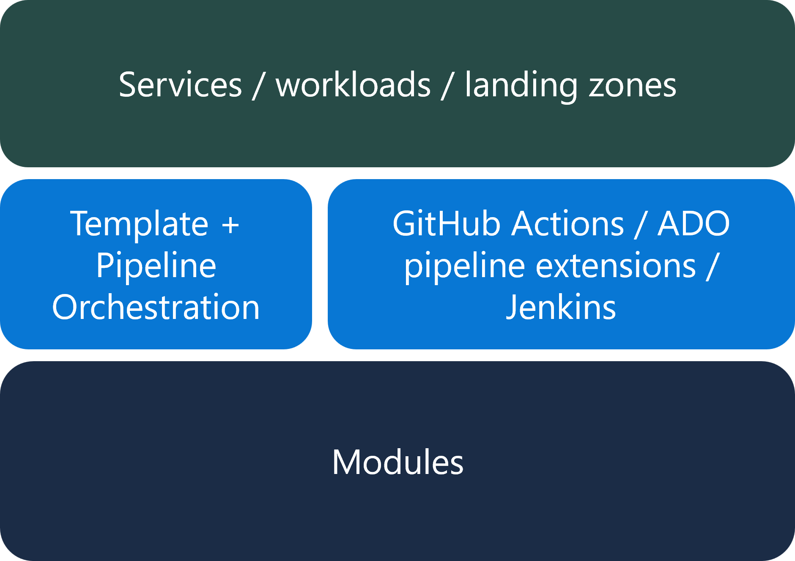
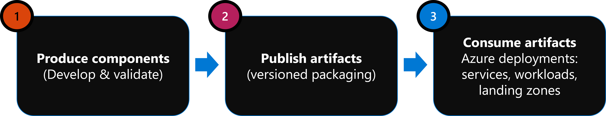
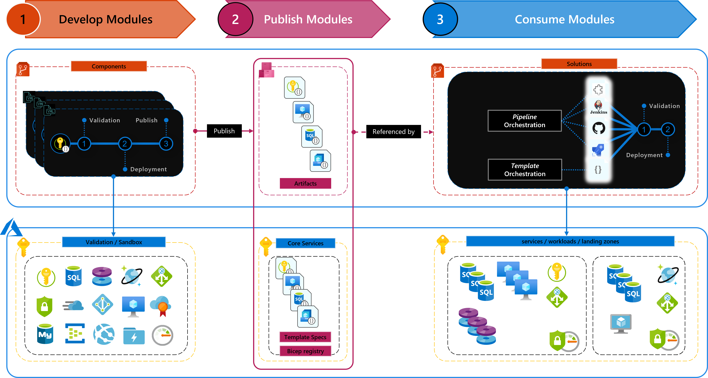
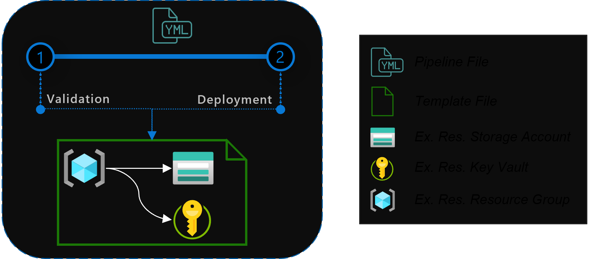
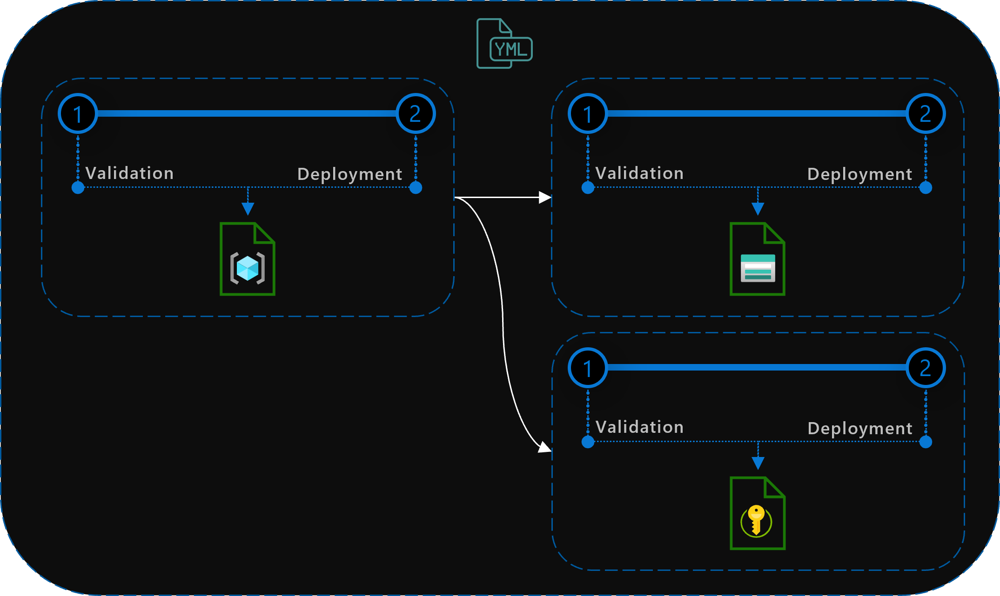
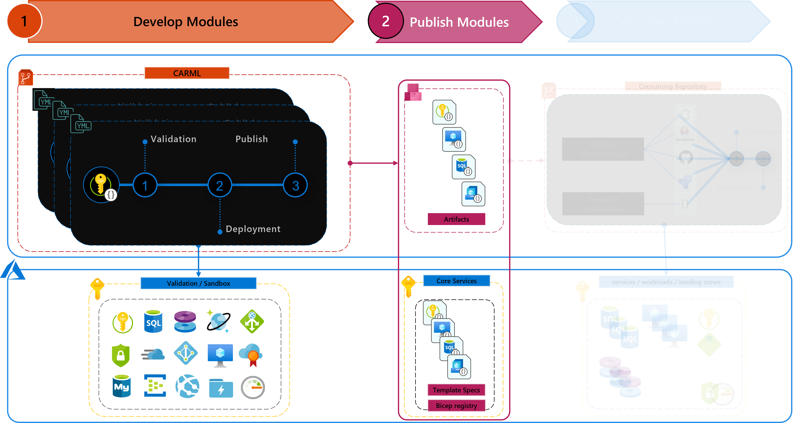

# Context

This section will give on an overview of the idea and approach of this platform.
Note, it will not elaborate every aspect of the subject but is intended to help you understand the design on a fundamental level.

Also, while we describe an entire end-to-end setup, CARML focuses only on a **[specific area](#where-does-this-platform-fit-in)** of it, i.e. phases 1 & 2 of the described deployment [model](#what-is-the-intended-the-deployment-model)/[flow](#what-is-the-intended-deployment-flow).

---

### _Navigation_
- [Infrastructure as Code (IaC)](#infrastructure-as-code-iac)
  - [What is IaC?](#what-is-iac)
  - [How do we define a module?](#how-do-we-define-a-module)
  - [What is the intended deployment model?](#what-is-the-intended-the-deployment-model)
  - [What is the intended deployment flow?](#what-is-the-intended-deployment-flow)
  - [Why use versioned modules?](#why-use-versioned-modules)
- [Where does this platform fit in?](#where-does-this-platform-fit-in)
---

## Infrastructure as Code (IaC)

In this first section we describe the fundamental ideas we are following in the design of this repository and subsequently describe where it fits inside this greater picture. This is important to understand, as ***not*** all concepts described below are in scope of this platform, but are described to set it in context as a building block of the sum of the concepts.

### What is IaC?

_'Infrastructure as Code (IaC)'_ describes a declarative approach towards resource deployment & management. Using configuration & template files that represent the deployed infrastructure has several benefits:
- You have a local representation of your deployed infrastructure
- The configuration applied is version controlled and hence enabled roll-backs & analysis
- You can deploy you infrastructure in a repeatable fashion - hence minimizing the possibility of manual errors
- You can use automation to deploy your infrastructure and establish for example a multi-stage deployment (i.e. continuous deployment) from a Sandbox environment, via integration to production using the same files

In context of bicep or ARM templates we usually leverage a combination of flexible templates that are deployed using different parameter files for different scenarios.

### How do we define a module?

In the context of _CARML_ we define a module as a reusable, template-based building block to deploy Azure resources. As such it is the foundation to apply _Infrastructure as Code_.

By default each module can deploy one instance of a resource and n-amount of its child-resources (for example `1` storage account and `n`-amount of containers). In some instances a module may also deploy strongly coupled resources (for example `1` virtual machine and `n`-amount of data discs).

Each module is generalized for maximum flexibility and optimized for easy usability. The idea is that the template should be able to cover as many resource-specific scenarios as possible and not restrict the user by making assumptions on the users behalf. Eventually the injected parameters should decide what the template does.

Furthermore, each module comes with meaningful default values for it's optional parameters, a detailed documentation for its usage and one or multiple parameter files to proof is correctness.

### What is the intended the deployment model?

When working with IaC you use 3 different components:
- The deployed **environments** that can be individual services, compositions such as workloads, or entire landing zones and the like
- The **orchestration** deploying the modules in the form of template/pipeline orchestration using for example GitHub actions or Azure DevOps pipelines
- The fundamental **modules** that each deploy a service, i.e. are the building blocks to deploy environments

To make each component a bit more tangible, let's take a look at the following example:

- Target Environment
  - A Virtual Machine connected to a Storage account
- Orchestration
  - Template-orchestration using GitHub actions
- Modules
  - Resource Group
  - Virtual Network
  - Virtual Machine
  - Storage Account

For this example we could create a GitHub workflow that signs into Azure and run's a single deployment using for example the PowerShell command `New-AzResourceGroupDeployment`.
Furthermore we'd then create an orchestration-template the deploys the above resources in the following parallel groups (using dependencies)
1. The Resource Group
1. The Virtual Network & Storage Account
1. The Virtual Machine

Then we'd only need to create a parameter file for the orchestration-template and have the workflow deploy both in combination.

### What is the intended deployment flow?

In this section we'll take a deeper look into the fundamental flow from source modules to target environments.

First things first, we would work towards the deployment of our environments in 3 phases:

In the **Develop modules** phase you add/implement/update your modules and validate them using one or multiple test-parameter files, run static, validation & deployment tests on the templates and ultimately prove their correctness.

The next phase, **Publish modules**, will take the tested and approved modules and publish them to a target location of your choice (for example _[template specs](https://docs.microsoft.com/en-us/azure/azure-resource-manager/templates/template-specs?tabs=azure-powershell)_ or the _[bicep registry](https://docs.microsoft.com/en-gb/azure/azure-resource-manager/bicep/private-module-registry)_). The publishing should publish at least the tested module template itself.
The target location should support versioning so that you only always publish new versions.

> Note: These first two phases are covered by the [CARML](#where-does-this-platform-fit-in) platform.

In the final phase we **Consume modules** and orchestrate them to deploy services, workloads or entire landing zones. Note that all deployments up to this phase only identified as test deployments and should be deleted after their deployment concluded. In contrast, the deployments we perform now are supposed to be 'sticky' and occur on an integration/production environment. We now reference the validated & published modules and only need to provide them with the correctly configured parameters and orchestrate their deployment in the correct order.

The diagram provides a high level view on how the different phases are interconnected:

The top row represents your orchestration environment (for example GitHub), the bottom row the _Azure_ environment.

From left to right you will find the phases we introduced before, _Develop modules_, _Publish modules_ & _consume modules_. However, in this illustration you can see how each interacts with the Azure environment.

Starting with _develop modules_, the top left box shows the test pipelines we have for each module, each validating, test-deploying and (if successful) publishing the module. The subscription on the bottom is intended to be a test/sandbox subscription without any link to production. Instead resources deployed here should be considered temporary and be removed after testing.

As described earlier, if all tests for a module succeed, the pipeline will _publish the modules_ to a given target location. In the center box you can see examples for _[template specs](https://docs.microsoft.com/en-us/azure/azure-resource-manager/templates/template-specs?tabs=azure-powershell)_, the _[bicep registry](https://docs.microsoft.com/en-gb/azure/azure-resource-manager/bicep/private-module-registry)_ as well as _[Azure DevOps artifacts](https://docs.microsoft.com/en-us/azure/devops/artifacts/concepts/feeds?view=azure-devops)_.

> Note: These first two phases are covered by the [CARML](#where-does-this-platform-fit-in) platform.

Finally, one the right you can see examples of the orchestration that deploys the environment using the published modules.
No matter the platform we can differentiate two different deployment approaches:
 - **_Template-orchestration_**: These types of deployments reference individual modules from a 'main/environment' bicep/ARM template and use its capabilities to pass parameters & orchestrate the deployments. By default, deployments are deployed in parallel by the Azure Resource Manager while accounting for all dependencies defined. Furthermore, the deploying pipeline only needs one deployment job that triggers the template's deployment.

   

 - **_Pipeline-orchestration_**: This approach uses the platform specific pipeline capabilities (for example pipeline jobs) to trigger the deployment of individual modules, where each job deploys one module. By defining dependencies in between jobs you can make sure your resources are deployed in order. Parallelization is achieved by using a pool of pipeline agents that execute the jobs, while accounting for all dependencies defined.
Both the _template-orchestration_ as well as _pipeline-orchestration_ may run a validation and subsequent deployment on the bottom-right _Azure_ subscription. This subscription, in turn, should be the subscription where you want to host your environment. However, you can extend the concept and for example deploy the environment first to an integration and then a production subscription.

   

### Why use versioned modules?
Deploying resources by referencing their corresponding modules from source control has one major drawback: If your deployments rely on what you have in your source repository then they will 'by definition' use the **latest** code. Applying software development lifecycle concepts like 'publishing build artifacts and versioning' enables you to have a point in time version of an Azure Resource Module. By introducing versions to your modules, the consuming orchestration can and should specify a module version it wants to use and deploy the Azure environment using them. If we now have the case that a breaking change is introduced and an updated version is published, no deployments are affected because they still reference the previously published version. Instead, they must make the deliberate decision to upgrade the module to reference newer versions.

## Where does this platform fit in?

The _CARML_ platform hosts a collection of [resource modules](./Modules) with the intend to cover as many Azure resources and their child-resources as possible.

As such, users can use the modules as they are, alter them and or use them to deploy their environments.

To ensure the modules are valid and can perform the intended deployments, the repository comes with a [validation & test](./Testing) [pipeline](./Pipelines) for each module. If successful it will also publish them in one or multiple target locations.

As such, _CARML_ covers the `bottom box` of the [deployment model](#what-is-the-intended-the-deployment-model) section and `Phase #1` & `Phase #2` of the [deployment flow](#what-is-the-intended-deployment-flow) section.

As we want to enable any user of this repository's content to not only leverage its modules but actually also re-use the platform, the platform itself is set up so that you can plug it into your own environment with just a few basic steps described in the [Getting Started](./GettingStarted) section. You may choose to add or remove modules, define your own locations you want to publish to and as such create your own open- or inner-source library.
