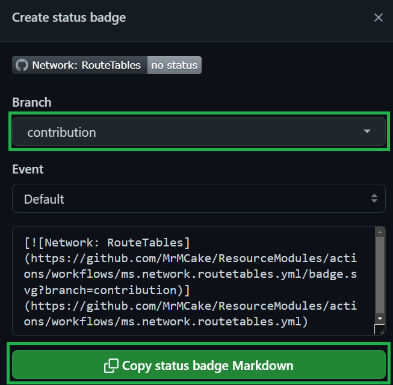

This section outlines the contribution flow to the CARML repository.

Depending on the nature of your contribution, the number and implementation of the required steps (detailed below) may vary.

---

### _Navigation_

- [Create or pick up an issue](#create-or-pick-up-an-issue)
- [Environment setup](#environment-setup)
- [Implement the contribution](#implement-the-contribution)
- [Validate the contribution](#validate-the-contribution)
- [Open a PR](#open-a-pr)

---

# Create or pick up an issue

We kindly ask you to have an issue mapped to the contribution you'd like to make.
How you proceed from here, depends on the scenario:

- If you just want to contribute to this project, but don't know yet where and how you should start, navigate to the '[Projects](https://github.com/Azure/ResourceModules/projects?query=is%3Aopen)' tab on the repository. You will find, that we have 2 projects: ['Bug board'](https://github.com/orgs/Azure/projects/364) & ['Backlog'](https://github.com/orgs/Azure/projects/363). In the CARML repository we apply the following priorities when selecting issues:
  1. The Bug board's `'High Priority'` column
  1. The Bug board's `'Low Priority'` column
  1. The Backlog's `'To do'` column, which has its items sorted by priority from the top 

  For the biggest impact, you can help us by following the same path. However, if none of the items speak to you, feel free to self-assign any other item of the `'To do'` column that you feel comfortable with. In this case you should assign the item to yourself / or reach out to discuss its content & priority.

  > Note: For starters, we suggest to search for issues labelled with `good first issue`.

- If you find a bug or have an idea that you'd also like to work on, create an issue in the corresponding GitHub section, assign it to yourself and to the project, and get started.

  > Note: If you don't prefer working on an issue alone, you can label the issue with `help wanted` to let the community know.

# Environment setup

The preferred method of contribution requires you to create your own fork and create pull requests into the source repository from there. To set the fork up, please follow the process described [here](./Getting%20started%20-%20Scenario%202%20Onboard%20module%20library%20and%20CI%20environment).

The approach you should take, depends on your scenario:

- In case you want to contribute to the documentation, you can limit the setup to forking the repository and cloning your fork locally.

- In case your contribution involves changes to the library (the modules) and/or to the CI environment (the pipelines), you need to setup the full environment, such as service principals and secrets. This will allow you to test your changes in your environment before requesting to merge them to the main repo.

# Implement the contribution

How you proceed from here, depends on your scenario:

- In case you want to contribute to the CARML wiki, your updates need to happen through the main repo under the [docs/wiki](https://github.com/Azure/ResourceModules/tree/main/docs/wiki) folder. A dedicated pipeline included in the repository will perform a sync to the CARML wiki, once your contribution is merged.

- In case your contribution involves changes to the library (the modules) and/or to the CI environment (the pipelines), we kindly ask you to first review the [Module design](./The%20library%20-%20Module%20design) and/or the [Pipeline design](./The%20CI%20environment%20-%20Pipeline%20design) sections respectively, to make sure your contribution complies with the repository's design and principles.

- If your contribution involves the creation of a new module or an update to an existing module:
  - Make sure you also reflect your changes in the module's `README.md` file. Refer to the [Generate module Readme](./Contribution%20guide%20-%20Generate%20module%20Readme) section for details on how to leverage the Readme generator utility to support you with this task.
  - Regenerate/update the `main.json` template using either the command `bicep build '<bicep-template-file-path>'` or `az bicep build -f '<bicep-template-file-path>'`
  - If you are adding or updating role assignments to resources deployable by the module, refer to the [Get formatted RBAC roles](./Contribution%20guide%20-%20Get%20formatted%20RBAC%20roles) section for details on how to leverage the RBAC roles formatting utility to support you with this task.
  - If applicable, make sure you set or update the major and minor versions in the corresponding module `version.json` file.

# Validate the contribution

Once the contribution is implemented and the changes are pushed to your forked repository, how you proceed, depends on your scenario:

- In case you want to contribute to the documentation, you can skip this step.

- In case your contribution involves changes to the library (the modules) and/or to the CI environment (the pipelines), we kindly ask you to validate your updates in your own cloud environment before requesting to merge them to the main repo. Test your code leveraging the CARML CI environment, as detailed in the [Pipeline usage](./The%20CI%20environment%20-%20Pipeline%20usage) section.
   > **Note**: In case your contribution involves changes to a module, you can also optionally leverage the [Validate module locally](./Contribution%20guide%20-%20Validate%20module%20locally) utility to validate the updated module from your local host before validating it through its pipeline.

# Open a Pull Request (PR)

Finally, once your contribution is implemented and validated, open a PR for the CARML maintainers to review. Make sure you:

- Provide a meaningful title in the following format: `[<Category>] <PR title>`. For `[<Category>]` use one of the following, depending on which one is the primary improvement your PR intends to make:
  - `[Modules]`: For improvements to the CARML library.
  - `[CI environment]`: For improvements to the CI environment pipelines.
  - `[Wiki]`: For improvements to the documentation.
  - `[Utilities]`: For improvements to the tools in the utilities.
  - `[Fixes]`: For bug fixes when not specifically related to any of the above categories.
- Provide a meaningful description.
- Follow instructions you find in the PR template.
- Reference the issue number as per the [Create or pick up an issue](#create-or-pick-up-an-issue) step.
- If applicable, please reference the badge status of your pipeline run. This badge will show the reviewer that the code changes were successfully validated & tested in your environment. To create a badge, first select the three dots (`...`) at the top right of the pipeline, and then chose the `Create status badge` option.

    

  In the opening pop-up, you first need to select your branch and then click on the `Copy status badge Markdown`

    
