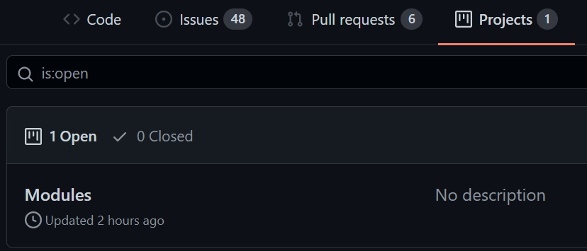
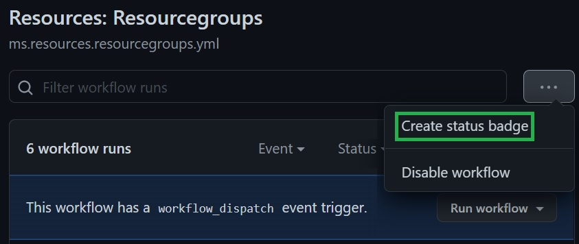

# Contribution

This section outlines how you can contribute to the repository.

---

### _Navigation_

- [Set your environment up](#set-your-environment-up)
- [How to contribute?](#how-to-contribute)

---

# Set your environment up

The preferred method of contribution requires you to create your own fork and create pull requests into the source repository from there. To set the fork up, please follow the process described in the ['Getting Started'](./GettingStarted.md#Option-1-Use-it-as-a-basis-to-set-up-your-own-inner-source-project) section.

# How to contribute?

You can contribute to the Wiki in different ways depending on your own interests, bugs you see or IP you want to add.

For starters it is highly recommended to consult and understand the ['Modules Design'](./ModulesDesign.md) section of the wiki.

How you proceed from here depends on your particular situation:

- If you just want to contribute to this project, but don't know yet where and how, feel free to navigate the the 'Projects' tab on the repository, check what items are currently still in the 'to-do' swim lane and pick one that speaks to you. In this case you should assign the item to yourself / or reach out to discuss its content & priority.

   

- If you found an issue / or have an idea that you'd also like to work on, feel free to create an issue in the corresponding GitHub section, assign it to yourself and the project and get started.
- If you want to contribute to the Wiki, please perform any updates in your fork.

For any update you want to bring back to the source repository, please open a Pull-Request from your fork back to the source repository.

To contribute to the modules, set your environment up, test the updated/added module in your fork using pipelines and attach a status badge to the PR (available in the `Actions` tab).

Please make sure to set your environment up and also consult the ['Pipeline Design'](./PipelinesDesign.md) and ['Pipeline Usage'](.\PipelinesUsage) sections.
