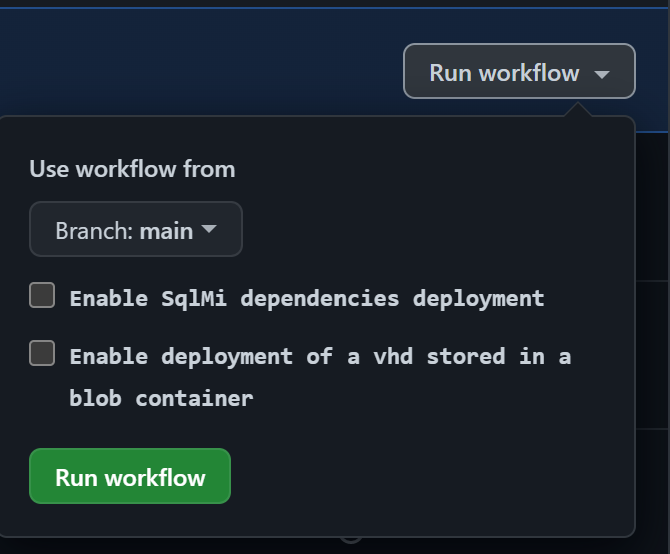

In order to successfully deploy and test all ARM/Bicep modules in your desired environment some modules require certain Azure resources to be deployed beforehand.

> **Note:** If we speak from **modules** in this context we mean the **services** which get created from these modules.

---

### _Navigation_

- [Resources deployed by the dependency workflow](#resources-deployed-by-the-dependency-workflow)
- [Required secrets and keys](#required-secrets-and-keys)

---

# Resources deployed by the dependency workflow

Together with the resource modules pipelines, we are providing a dependency pipeline (GitHub workflow: `.github\workflows\platform.dependencies.yml`), leveraging resource parameters from the `utilities\dependencies` subfolder.

The resources deployed by the dependency workflow need to be in place before testing all the modules. Some of them (e.g. [storage account], [key vault] and [event hub namespace]) require a globally unique resource name. Before running the dependency workflow, it is required to update those values and their corresponding references in the resource modules parameters.

Alternatively, you can leverage the token replacement utility we integrate by default by setting up your `\<<namePrefix\>>` token. Refer to [Parameter File Tokens Design](./ParameterFileTokens) for more details.

Some of the resources integrated with the full dependency pipeline are disabled by default as they require more time to be deployed or because they may cause issues when running in parallel with some of our module validation pipelines. Those are the sqlmi dependencies and the resources needed to build and distribute a VHD in a storage account. We suggest to enable them explicitly in case you need to onboard the modules requiring them, i.e. respectively [SQL managed instance], [compute disks] and [compute images].

  

Since also dependency resources are in turn subject to dependencies with each other, resources are deployed in the following grouped order.

<b>1st</b> level resources

  1. Resource Groups: Leveraged by all modules. Multiple instances are deployed:
     - 'validation-rg': The resource group to which resources are deployed by default during the test deployment phase. This same resource group is also the one hosting the dependencies.

<b>2nd</b> level resources

This group of resources has a dependency only on the resource group which will host them. Resources in this group can be deployed in parallel.

  1. Storage account: This resource is leveraged by all resources supporting diagnostic settings on a storage account.
      >**Note**: This resource has a global scope name.
  1. Event hub namespace and Event hub: This resource is leveraged by all resources supporting diagnostic settings on an event hub.
      >**Note**: This resource has a global scope name.
  1. Log analytics workspaces: These resources are leveraged by all resources supporting diagnostic settings on LAW. Multiple instances are deployed:
      - '_adp-\<<namePrefix\>>-az-law-x-001_': Default LAW.
      - '_adp-\<<namePrefix\>>-az-law-aut-001_': Dedicated LAW to be leveraged by the [automation account] resource.
      - '_adp-\<<namePrefix\>>-az-law-appi-001_': Dedicated LAW to be leveraged by the [application insights] resource.
  1. User assigned identity: This resource is leveraged by the [role assignment], [key vault] and [recovery services vault] dependency resources.
      > **Note**: The object ID of the [user assigned identity] is needed by several dependency parameter files. However, before running the dependency pipeline for the first time, the [user assigned identity] resource does not exist yet, thus its object ID is unknown. For this reason, instead of the object ID value, some dependency parameter files contain the `"<<msiPrincipalId>>"` token, for which the correct value is retrieved and replaced by the pipeline at runtime.
  1. Shared image gallery and definition: These resources are leveraged by the [image template] resource.
  1. Route table: This resource is leveraged by the virtual network subnet dedicated to test [SQL managed instance].
      >**Note**: This resource is deployed and configured only if sqlmi dependency resources are enabled.
  1. Route table: This resource is leveraged by a test subnet deployment of the [Virtual Network] module.
  1. Action group: This resource is leveraged by [activity log alert] and [metric alert] resources.
  1. Application security group: This resource is leveraged by the [network security group] resource.
  1. Policy assignment: This resource is leveraged by the [policy exemption] resource.
  1. Proximity placement group: This resource is leveraged by a test deployment of the [Availability set] module.

<b>3rd</b> level resources

This group of resources has a dependency on one or more resources in the group above. Resources in this group can be deployed in parallel.

  1. Storage Account Upload: An upload job to populate the storage account configured in `parameters.json` with a test script that can be referenced
  1. AVD host pool: This resource supports monitoring, hence it has a dependency on the [storage account], [log analytics workspace] and [event hub] deployed in the group above. This resource is leveraged by the [AVD application group] resource.
  1. Network Security Groups: This resource supports monitoring, hence it has a dependency on the [storage account], [log analytics workspace] and [event hub] deployed in the group above. This resource is leveraged by different virtual network subnets. Multiple instances are deployed:
      - '_adp-\<<namePrefix\>>-az-nsg-x-apgw_': NSG with required network security rules to be leveraged by the [application gateway] subnet.
      - '_adp-\<<namePrefix\>>-az-nsg-x-ase_': NSG with required network security rules to be leveraged by the [app service environment] subnet.
      - '_adp-\<<namePrefix\>>-az-nsg-x-bastion_': NSG with required network security rules to be leveraged by the [bastion host] subnet.
      - '_adp-\<<namePrefix\>>-az-nsg-x-sqlmi_': NSG with required network security rules to be leveraged by the [sql managed instance] subnet.
        >**Note**: This resource is deployed and configured only if sqlmi dependency resources are enabled.
      - '_adp-\<<namePrefix\>>-az-nsg-x-001_': default NSG leveraged by all other subnets.
  1. Application insight: This resource supports monitoring, hence it has a dependency on the [storage account], [log analytics workspace] and [event hub] deployed in the group above. This resource is leveraged by the [machine learning service] resource.
  1. Automation account: This resource supports monitoring, hence it has a dependency on the [storage account], [log analytics workspace] and [event hub] deployed in the group above. This resource is leveraged by the [log analytics workspace] resource.
  1. Public IP addresses: This resource supports monitoring, hence it has a dependency on the [storage account], [log analytics workspace] and [event hub] deployed in the group above. Multiple instances are deployed:
      - '_adp-\<<namePrefix\>>-az-pip-x-apgw_': Leveraged by the [application gateway] resource.
      - '_adp-\<<namePrefix\>>-az-pip-x-bas_': Leveraged by the [bastion host] resource.
      - '_adp-\<<namePrefix\>>-az-pip-x-lb_': Leveraged by the [load balancer] resource.
      - '_adp-\<<namePrefix\>>-az-pip-min-lb_': Leveraged by the [load balancer] resource.
      - '_adp-\<<namePrefix\>>-az-pip-x-fw_': Leveraged by the [Azure firewall] resource.
  1. Role assignment: This resource assigns the '_Contributor_' role on the subscription to the [user assigned identity] deployed as part of the group above. This is needed by the [image template] deployment.
  1. Key vault: This resource supports monitoring, hence it has a dependency on the [storage account], [log analytics workspace] and [event hub] deployed in the group above. Multiple instances are deployed:
      - '_adp-\<<namePrefix\>>-az-kv-x-001_': KV with required secrets, keys, certificates and access policies to be leveraged by all resources requiring access to a key vault key, secret and/or certificate, i.e. [application gateway], [azure NetApp file], [azure SQL server], [disk encryption set], [machine learning service], [virtual machine], [virtual machine scale set], [virtual network gateway connection].
      - '_adp-\<<namePrefix\>>-az-kv-x-pe_': KV to be leveraged by the [private endpoint] resource.
      - '_adp-\<<namePrefix\>>-az-kv-x-sqlmi_': KV with required secrets, keys and access policies to be leveraged by the [SQL managed instance] resource.
        >**Note**: This resource is deployed and configured only if sqlmi dependency resources are enabled.
      >**Note**: This resource has a global scope name.
  1. Recovery services vault: This resource supports monitoring, hence it has a dependency on the [storage account], [log analytics workspace] and [event hub] deployed in the group above. This resource is leveraged by the [virtual machine] resource when backup is enabled.

<b>4th</b> level resources

This group of resources has a dependency on one or more resources in the groups above. Resources in this group can be deployed in parallel.

  1. AVD application group: This resource is leveraged by the [AVD workspace] resource.
  1. Virtual Networks: This resource is depending on the route table and network security groups deployed above. Multiple instances are deployed:
      - '_adp-\<<namePrefix\>>-az-vnet-x-peer01_': Leveraged by the [virtual network peering] resource.
      - '_adp-\<<namePrefix\>>-az-vnet-x-peer02_': Leveraged by the [virtual network peering] resource.
      - '_adp-\<<namePrefix\>>-az-vnet-x-azfw_': Leveraged by the [azure firewall] resource.
      - '_adp-\<<namePrefix\>>-az-vnet-x-aks_': Leveraged by the [azure kubernetes service] resource.
      - '_adp-\<<namePrefix\>>-az-vnet-x-sqlmi_': Leveraged by the [sql managed instance] resource.
        >**Note**: This resource is deployed and configured only if sqlmi dependency resources are enabled.
      - '_adp-\<<namePrefix\>>-az-vnet-x-001_': Hosting multiple subnets to be leveraged by [virtual machine], [virtual machine scale set], [service bus], [azure NetApp files], [azure bastion], [private endpoints], [app service environment] and [application gateway] resources.
  1. Azure Image Builder template: This resource triggers the build and distribution of a VHD in a storage account. The VHD file is copied to a known storage account blob container and leveraged by [compute disks] and [compute images] resources.
    >**Note**: This resource is deployed and configured only if the 'Enable deployment of a vhd stored in a blob container' option is selected.

<b>5th</b> level resources

This group of resources has a dependency on one or more resources in the groups above.

  1. Virtual Machine: This resource is depending on the [virtual networks] and [key vault] deployed above. This resource is leveraged by the [network watcher] resource.
  1. Private DNS zone: This resource is depending on the [virtual networks] deployed above. This resource is leveraged by the [private endpoint] resource.

# Required secrets and keys

The following secrets, keys and certificates need to be created in the key vaults deployed by the dependency workflow.

- Shared key vault '_adp-\<<namePrefix\>>-az-kv-x-001_'
  1. Key vault secrets:
      - _administratorLogin_: For [azure SQL server] .
      - _administratorLoginPassword_: For [azure SQL server].
      - _vpnSharedKey_: For [virtual network gateway connection].
      - _adminUserName_: For [virtual machine].
      - _adminPassword_: For [virtual machine].
  1. Key vault keys:
      - _keyEncryptionKey_: For [disk encryption set].
  1. Key vault certificate:
      - _applicationGatewaySslCertificate_: For [application gateway].

- SQL Mi key vault '_adp-\<<namePrefix\>>-az-kv-x-sqlmi_'
  1. Key vault secrets:
      - _administratorLogin_: For [SQL managed instance].
      - _administratorLoginPassword_: For [SQL managed instance].
  1. Key vault keys:
      - _keyEncryptionKeySqlMi_: For [SQL managed instance].
