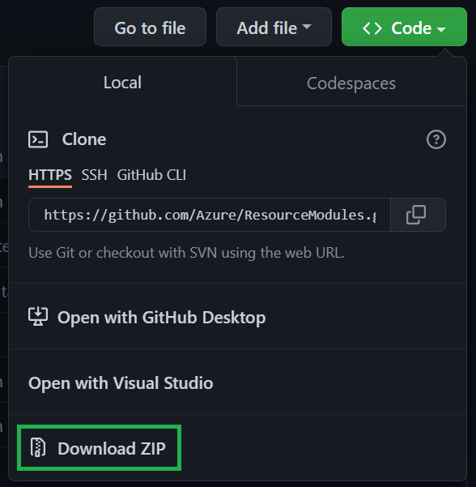

In case you want to simply consume the modules of the library to build a solution, you only have to perform a few simple steps:

1. [Download the library](#1-download-the-library)
1. [(Optional) Convert library to ARM](#2-optional-convert-library-to-arm)
1. [Test and publish modules](#3-test-and-publish-modules)
1. [Build a solution](#4-build-a-solution)

# 1. Download the library

To gather a local copy of the library, you have a few options to choose from:

<details>
<summary>Download a release</summary>

To download a specific release version of the repository:
1. Navigate to the [releases](https://github.com/Azure/ResourceModules/releases) page.
1. Scroll to the `'Assets'` section at the bottom end of the release you'd like to download.
1. Here, you will find a packaged version of the repository (as it was when the release was created) and can download it with a simple click on the `'Source code'` package (e.g., `Source code (zip)`) itself. This will download the file in your default download folder.

    

1. Finally, you need to unpack the downloaded file to a location of your choice.

</details>

<details>
<summary>Download latest</summary>

To download the latest version of the repository
1. Navigate to the main page of [CARML](https://aka.ms/CARML).
1. On the overview page, select the `<> Code` button to the top right, and select the `Download ZIP` button in the opening pop-up to trigger the repository to be downloaded as a compressed file into your default download folder.

    

1. Finally, you need to unpack the downloaded file to a location of your choice.

</details>

<details>
<summary>Clone latest</summary>

To clone the latest version of the repository
1. On your local machine, open a PowerShell session.
1. Navigate to the location you want to clone the repository into.
1. Run

    ```PowerShell
    git clone 'https://github.com/Azure/ResourceModules.git'
    ```

</details>

<p>

# 2. (Optional) Convert library to ARM

Note that in case you don't want to use Bicep, you always have the option to use the utility `ConvertTo-ARMTemplate`  we provide in path `utilities/tools`, to convert the repository to an ARM-only repository. For further information on how to use the tool, please refer to the tool-specific [documentation](./Interoperability%20-%20Bicep%20to%20ARM%20conversion).

# 3. Test and publish modules

If you have customized your library without contributing on the public CARML repository, public modules are not tested with your customization, so you'll need to manage the test of your updated and customized modules.

To automate the import of new code and speed up the test process we recommend to adopt [module library with the CI environment](./Getting%20started%20-%20Scenario%202%20Onboard%20module%20library%20and%20CI%20environment).

If you are not using a local repository, you'll also need to publish the modules. Different procedures can apply, depending on where your version of the library is stored:

<details>
<summary>Modules publishing in Template Spec</summary>

The preferred method to publish modules to template-specs is to leverage CARML ready [CI environment](./The%20CI%20environment), however there maybe specific requirements for which this option is not applicable. As an alternative, the same [Publish-ModuleToTemplateSpecsRG.ps1](https://github.com/Azure/ResourceModules/blob/main/utilities/pipelines/resourcePublish/Publish-ModuleToPrivateBicepRegistry.ps1) script leveraged by the publishing step of the CI environment pipeline can be executed locally.

To publish a module by running the script:
 1. Let's suppose your updated library location is `'D:\ResourcesModules'`, open a PowerShell session on your machine
 1. Navigate to `'D:\ResourcesModules\utilities\pipelines\resourcePublish'` location
 1. Load the script `'Publish-ModuleToTemplateSpecsRG.ps1'` executing:

        ```PowerShell
        . .\Publish-ModuleToTemplateSpecsRG.ps1
        ```
 1. Run the script for the modules you need to publish, using the opportune parameters:
     - TemplateFilePath = the absolute path of the module to be published
     - ModuleVersion = the version of the module
     - TemplateSpecsRgName = the resource group that will contain the Template Spec
     - TemplateSpecsRgLocation = the location of the Template Spec
     - TemplateSpecsDescription = The description of the Template Spec

    To publish the Keyvault module with version 0.4.740 on a Template Spec that will be created in the resource group 'artifact-rg' you can execute the following example:

         ```PowerShell
        Publish-ModuleToTemplateSpecsRG -TemplateFilePath "D:\ResourcesModules\modules\key-vault\vaults\main.bicep" -ModuleVersion "0.4.740" -TemplateSpecsRgName 'artifact-rg'  -TemplateSpecsRgLocation 'West Europe' -TemplateSpecsDescription 'CARML KV Template Spec'
        ```
    If you need to publish more than one module, you could use the following PowerShell script that calls the `'Publish-ModuleToTemplateSpecsRG'` function for each of the modules:

         ```PowerShell
         $modules = Get-ChildItem -Path '<pathToModulesFolder>' -Recurse -Filter 'main.bicep'
         $modules.FullName | ForEach-Object -Parallel {
            . '<pathToPublishScript>\Publish-ModuleToTemplateSpecsRG.ps1'
            Publish-ModuleToTemplateSpecsRG -TemplateFilePath $_ -ModuleVersion '<moduleVersion>' -TemplateSpecsRgName '<templateSpecsRgName>' -TemplateSpecsRgLocation 'West Europe' -TemplateSpecsDescription 'CARML KV Template Spec'
            } -ThrottleLimit 4
        ```

 1. Update your master template in order to use the new version of the published modules.

    For the [Template Specs' example in Solutions](./Solution%20creation#examples) page, supposing you have published version '0.4.740' of modules, you need to replace all the occurences of '0.4.735' with '0.4.740'.
</details>
<p>

<details>
<summary>Modules publishing in Bicep Registry</summary>

The preferred method to publish modules to Bicep Registry is to leverage CARML ready [CI environment](./The%20CI%20environment), however there maybe specific requirements for which this option is not applicable. As an alternative, the same [Publish-ModuleToPrivateBicepRegistry.ps1](https://github.com/Azure/ResourceModules/blob/main/utilities/pipelines/resourcePublish/Publish-ModuleToPrivateBicepRegistry.ps1) script leveraged by the publishing step of the CI environment pipeline can be executed locally.

To publish a module by running the script:
 1. Let's suppose your updated library location is `'D:\ResourcesModules'`, open a PowerShell session on your machine
 1. Navigate to `'D:\ResourcesModules\utilities\pipelines\resourcePublish'` location
 1. Load the script `'Publish-ModuleToPrivateBicepRegistry.ps1'` executing:

        ```PowerShell
        . .\Publish-ModuleToPrivateBicepRegistry.ps1
        ```
 1. Run the script for the modules you need to publish, using the opportune parameters:
     - TemplateFilePath = the absolute path of the module to be published.
     - ModuleVersion = the version of the module.
     - BicepRegistryName =  Name of the private bicep registry to publish to.
     - BicepRegistryRgName = the resource group of the private bicep registry to publish to.

    To publish the Keyvault module with version 0.4.740 on a Bicep Registry called 'adpsxxazacrx001' that will be created in the resource group 'artifact-rg' you can execute the following command:

         ```PowerShell
        Publish-ModuleToPrivateBicepRegistry -TemplateFilePath "D:\ResourcesModules\modules\key-vault\vaults\main.bicep" -ModuleVersion "0.4.740" -BicepRegistryName 'adpsxxazacrx001'  -BicepRegistryRgName 'artifact-rg'
        ```
    If you need to publish more than one module, you could use the following PowerShell script that calls the `'Publish-ModuleToPrivateBicepRegistry'` function for each of the modules:

         ```PowerShell
         $modules = Get-ChildItem -Path '<pathToModulesFolder>' -Recurse -Filter 'main.bicep'
         $modules.FullName | ForEach-Object -Parallel {
            . '<pathToPublishScript>\Publish-ModuleToPrivateBicepRegistry.ps1'
            Publish-ModuleToPrivateBicepRegistry -TemplateFilePath $_ -ModuleVersion '<moduleVersion>' -BicepRegistryName '<registryName>' -BicepRegistryRgName '<bicepRGName>'
        } -ThrottleLimit 4
        ```
 1. Update your master template in order to use the new version of the published modules.

    For the [Private Bicep Registry's example in Solutions](./Solution%20creation#examples) page, supposing you have published version '0.4.740' of modules, you need to replace all the occurences of '0.4.735' with '0.4.740'.
</details>
<p>

<details>
<summary>Modules publishing to Azure DevOps artifact feed</summary>

The preferred method to publish modules to Azure DevOps artifact feed is to leverage CARML ready [CI environment](./The%20CI%20environment), however there maybe specific requirements for which this option is not applicable. As an alternative, the same [Publish-ModuleToUniversalArtifactsFeed.ps1](https://github.com/Azure/ResourceModules/blob/main/utilities/pipelines/resourcePublish/Publish-ModuleToUniversalArtifactsFeed.ps1) script leveraged by the publishing step of the CI environment pipeline can be executed locally.

To publish a module by running the script:
 1. Let's suppose your updated library location is `'D:\ResourcesModules'`, open a PowerShell session on your machine
 1. Navigate to `'D:\ResourcesModules\utilities\pipelines\resourcePublish'` location
 1. Load the script `'Publish-ModuleToUniversalArtifactsFeed.ps1'` executing:

        ```PowerShell
        . .\Publish-ModuleToUniversalArtifactsFeed.ps1
        ```
 1. Run the script for the modules you need to publish, using the opportune parameters:
     - TemplateFilePath = the absolute path of the module to be published.
     - ModuleVersion = the version of the module.
     - VstsOrganizationUri =  name of Azure DevOps organization URL hosting the artifacts feed.
     - VstsFeedProject = name of the project hosting the artifacts feed.
     - VstsFeedName = name to the feed to publish to.

    To publish the Keyvault module with version 0.4.740 on an artifact feed called 'Artifacts', in the project 'IaC' on organization 'fabrikam' you can execute the following command:

         ```PowerShell
        Publish-ModuleToUniversalArtifactsFeed -TemplateFilePath "D:\ResourcesModules\modules\key-vault\vaults\main.bicep" -ModuleVersion "0.4.740" -VstsOrganizationUri 'https://dev.azure.com/fabrikam' -VstsFeedProject 'IaC' -VstsFeedName 'Artifacts'
        ```
    If you need to publish more than one module, you could use the following PowerShell script that calls the `'Publish-ModuleToUniversalArtifactsFeed'` function for each of the modules:

         ```PowerShell
         $modules = Get-ChildItem -Path '<pathToModulesFolder>' -Recurse -Filter 'main.bicep'
         $modules.FullName | ForEach-Object -Parallel {
            . '<pathToPublishScript>\Publish-ModuleToUniversalArtifactsFeed.ps1'
            Publish-ModuleToUniversalArtifactsFeed -TemplateFilePath $_ -ModuleVersion '<moduleVersion>' VstsOrganizationUri 'https://dev.azure.com/fabrikam' -VstsFeedProject 'IaC' -VstsFeedName 'Artifacts'
            } -ThrottleLimit 4
        ```


 1. Update your master template in order to use the new version of the published modules.

</details>


# 4. Build a solution

With the codebase ready, you can now start to build a solution. For examples on how to do so, please refer to the corresponding [solution creation](./Solution%20creation) section.
