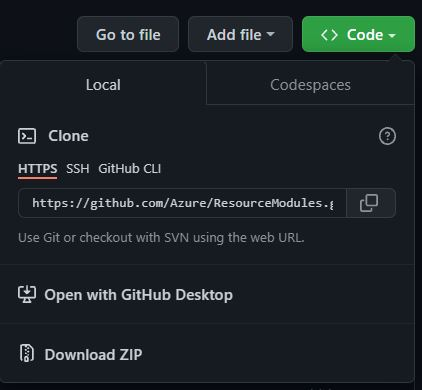
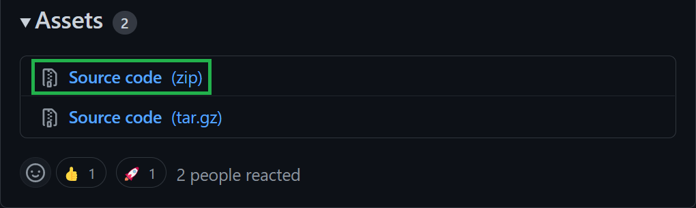
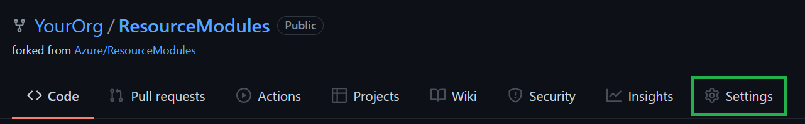
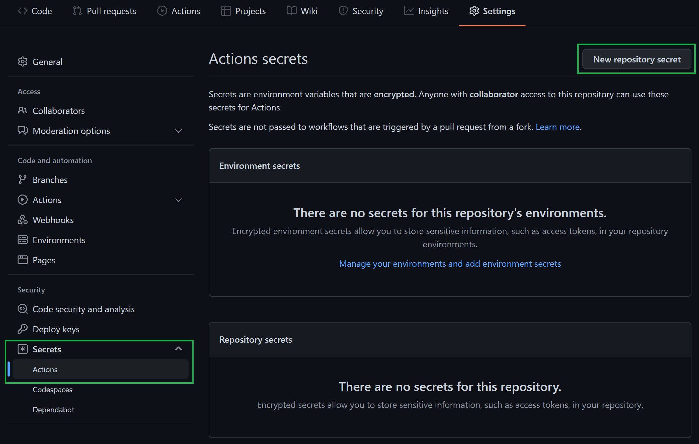
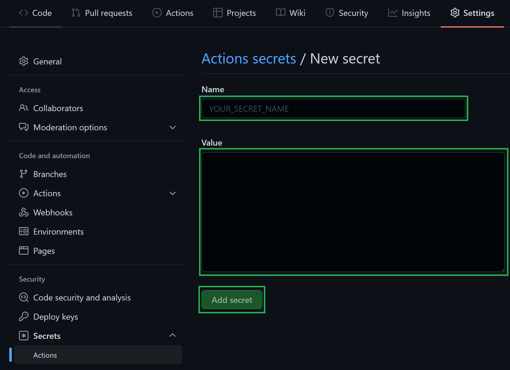
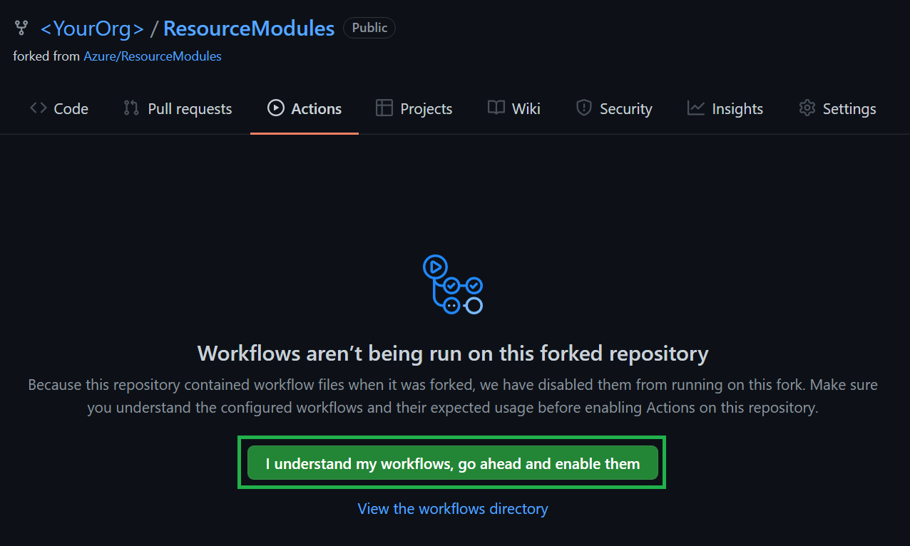
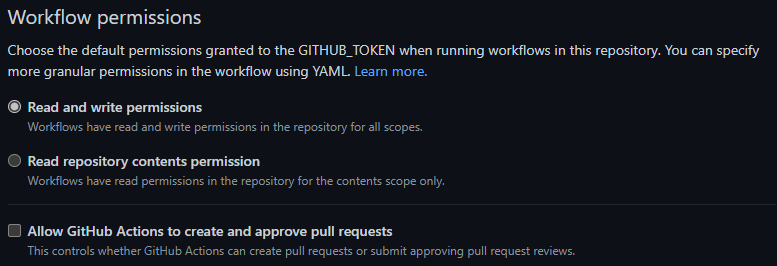

The repository is built so that you can create your own 1:1 instance and thus reuse the same concepts and features in your own environment, such as GitHub.

This requires several steps:

1. [Configure your Azure environment](#1-configure-your-azure-environment)
1. [Fork/clone the repository into your DevOps environment](#2-forkclone-the-repository-into-your-devops-environment)
1. [Configure the CI environment](#3-configure-the-ci-environment)
1. [Manual dependencies](#4-manual-dependencies)
1. [(Optional) Convert library to ARM](#5-optional-convert-library-to-arm)

Depending on the DevOps environment you choose (GitHub or Azure DevOps), make sure you also account for the specific requirements outlined below.

# 1. Configure your Azure environment

CARML tests the deployments and stores the module artifacts in an Azure subscription. To do so, it requires a service principal with access to it.

In this first step, make sure you
- Have/create an Azure Active Directory Service Principal with at least `Contributor` & `User Access Administrator` permissions on the Management-Group/Subscription you want to test the modules in. You might find the following links useful:
  - [Create a service principal (Azure Portal)](https://learn.microsoft.com/en-us/azure/active-directory/develop/howto-create-service-principal-portal)
  - [Create a service principal (PowerShell)](https://learn.microsoft.com/en-us/azure/active-directory/develop/howto-authenticate-service-principal-powershell)
  - [Find Service Principal object ID](https://cloudsight.zendesk.com/hc/en-us/articles/360016785598-Azure-finding-your-service-principal-object-ID)
  - [Find managed Identity Service Principal](https://learn.microsoft.com/en-us/azure/active-directory/managed-identities-azure-resources/how-to-view-managed-identity-service-principal-portal)
- Note down the following pieces of information
  - Application (Client) ID
  - Service Principal Object ID (**not** the object ID of the application)
  - Service Principal Secret (password)
  - Tenant ID
  - Subscription ID
  - Parent Management Group ID

> **Note:** The Service Principal must be able to query its own details in the Azure Active Directory (AAD). To that end, ensure it has at least the (default) role 'Cloud application administrator'.

# 2. Fork/clone the repository into your DevOps environment

Next, you'll want to create your own copy of the code. Depending on the repository environment you want to use (GitHub or Azure DevOps), the setup will be slightly different.

> **Note:** Whether you chose GitHub or Azure DevOps as your repository's environment, it does not affect your options when registering the pipelines.

> **Note:** If you don't want to use all modules, you can remove those that should not be part of your library. However, when doing so, make sure you use the utility [`Get-CrossReferencedModuleList`](./Getting%20started%20-%20Get%20module%20cross-references) with the switch parameter `PrintLocalReferencesOnly` to check for any cross-module references. For example, you may find that when you'd remove the 'Microsoft.Network/privateEndpoints', that it is still referenced by some of the modules you may want to use (for example, 'Microsoft.KeyVault/vaults'). In those cases, make sure to not accidentally delete required references.

<details>
<summary>GitHub Repository</summary>

For GitHub, you have two choices depending on your planned repository visibility:
- In case of a **public** repository, we recommend to create a simple fork into the target organization. As the CARML source repository is public, a fork must be public too.
- If you need a **private** version instead, we recommend you create your target repository, download/clone the CARML repository (ref. 'how to' below) and upload the content to the created target repository
  > **Note:** This disables the feature to 'fetch' from the upstream (CARML) repository. As a result, you have to port upstream updates manually.

</details>

<details>
<summary>Azure DevOps Repository</summary>

For a **private** Azure DevOps git, we recommend you create your target repository, download/clone the CARML repository (ref. 'how to' below) and upload the content to the created target repository.
> **Note:** This disables the feature to 'fetch' from the upstream (CARML) repository. As a result, you have to port upstream updates manually.

</details>

<p><p>

<details>
<summary><b>How to:</b> Clone/download the repository</summary>
To save a local copy of the repository, you can either clone the repository or download it as a `.zip` file.
A clone is a direct reference to the source repository which enables you to pull updates as they happen in the source repository. To achieve this, you have to have `Git` installed and run the following command:

```PowerShell
  git clone 'https://github.com/Azure/ResourceModules.git'
```

from a command-line of your choice (e.g., PowerShell).

If you just want to have a copy of the repository's content, you can instead download it in `.zip` format. You can do this by navigating to the repository folder of your choice (for example, root), then select the `<> Code` button on the top left and click on `Download ZIP` on the opening blade.

 

Alternatively, you can also do the same with a specific release by navigating to the [releases](https://github.com/Azure/ResourceModules/releases) page, scroll to the `'Assets'` section at the bottom end of the release you'd like to get and download the packaged release (as it was when the release was created) with a simple click on the `'Source code'` package (e.g., `Source code (zip)`) itself.

  

To update your copy with the latest changes in CARML, you would need to download, for example, the latest CARML release the same way you did during your initial setup, copy its folder content to your repository's location, and upload the changes.

As some files may have changed names or were removed in upstream CARML, you may further want to replace your entire folder to get to a 'clean' state. However, this is only recommended if you did not perform changes on any of the same files of upstream CARML. For reference, please refer to the changes shown by git.

For more information, see the Wiki section ['Fetching latest changes'](./Fetching%20latest%20changes).

</details>

<p>

# 3. Configure the CI environment

CARML uses a single ([`settings.yml`](https://github.com/Azure/ResourceModules/blob/main/settings.yml)) file for configuring the CI environment, which is located in the root of the repository. To replicate the CI environment locally on your machine, and perform local modules tests and validations, you must install the ([powershell-yaml](https://www.powershellgallery.com/packages/powershell-yaml/0.4.2)) module from the PowerShell gallery by executing the following on your PowerShell CLI:

```powershell
Install-Module -Name powershell-yaml
```

To configure the CI environment you have to perform several steps:
- [3.1 Update default `namePrefix`](#31-update-default-nameprefix)
- [3.2 Set up CI-environment-specific configuration](#32-set-up-ci-environment-specific-configuration)

> **Note:** While you can use the browser, we recommend that you clone all files to your local machine and update them using, for example, Visual Studio Code.

## 3.1 Update default `namePrefix`

To lower the barrier to entry and allow users to easily define their own naming conventions, we introduced a default `'name prefix'` for all deployed resources.

> **Note:** This prefix is only used by the CI environment you validate your modules in, and doesn't affect the naming of any resources you deploy as part of any multi-module solutions (applications/workloads) based on the modules.

Each pipeline in CARML deploying resources uses a logic that automatically replaces "tokens" (i.e., placeholders) in any module test file. Tokens are stored in only a few central locations to facilitate maintenance (e.g., local `settings.yml`, repository secrets or variable groups).

To update the `namePrefix`, perform the following steps:

1. Open the `settings.yml` file in the repository's root directory.

1. Replace the value of the `localToken_namePrefix` with a different value:

    ```yml
    localToken_namePrefix: 'cntso'
    ```

    > **Note:** The value should be a 3-5 character long string like `cntso`. Longer strings are not recommended as they may conflict with Azure resource name length restrictions.

    > **Note:** The CI pipelines automatically removes the `localToken_` prefix from the name when processing the tokens replacement.

    > **Note:** We highly encourage you to use the 'Check namePrefix availability' script ([see the documentation here](./Getting%20started%20-%20Check%20NamePrefix%20availability)) to check if the intended resource name will be available, based on the provided prefix.

 For further information on the token replacement logic, please refer to the corresponding [Token replacement](./The%20CI%20environment%20-%20Token%20replacement) section.

 If you do not prefer to set the `namePrefix` locally for your CI environment. You can optionally set it as a GitHub Secret or add it to the ADO variable group as the key `TOKEN_NAMEPREFIX` and its value `your name prefix value`, and this is only applied if the `localToken_namePrefix` in the [settings.yml](https://github.com/Azure/ResourceModules/blob/main/settings.yml) is left empty.

## 3.2 Set up CI-environment-specific configuration

While the concepts are the same, the configuration of the CI environment can differ drastically depending on the DevOps environment in which you want to register and run your pipelines. Following, you can find instructions on how to perform the remaining configuration in the corresponding DevOps environment:

<details>
<summary>GitHub</summary>

For _GitHub_, you have to perform the following environment-specific steps:
- [3.2.1 Set up secrets](#321-set-up-secrets)
- [3.2.2 Set up variables file](#322-set-up-variables-file)
- [3.2.3 Enable actions](#323-enable-actions)
- [3.2.4 Set R/W Workflow permissions](#324-set-rw-workflow-permissions)

### 3.2.1 Set up secrets

To use the environment's pipelines you should use the information you gathered during the [Azure setup](#1-configure-your-azure-environment) to set up the following repository secrets:

| Secret Name | Example | Description |
| - | - | - |
| `ARM_MGMTGROUP_ID` | `11111111-1111-1111-1111-111111111111` | The group ID of the management group to test-deploy modules in. |
| `ARM_SUBSCRIPTION_ID` | `22222222-2222-2222-2222-222222222222` | The ID of the subscription to test-deploy modules in. |
| `ARM_TENANT_ID` | `33333333-3333-3333-3333-333333333333` | The tenant ID of the Azure Active Directory tenant to test-deploy modules in. |
| `AZURE_CREDENTIALS` | `{"clientId": "44444444-4444-4444-4444-444444444444", "clientSecret": "<placeholder>", "subscriptionId": "22222222-2222-2222-2222-222222222222", "tenantId": "33333333-3333-3333-3333-333333333333" }` | The login credentials of the deployment principal used to log into the target Azure environment to test in. The format is described [here](https://github.com/Azure/login#configure-deployment-credentials). |
| `PLATFORM_REPO_UPDATE_PAT` | `<placeholder>` | A private access token (PAT) with enough permissions assigned to it to push into the main branch. This PAT is leveraged by pipelines that automatically generate ReadMe files to keep them up to date. |
| `TOKEN_NAMEPREFIX` | `cntso` | Optional. If you specify the name prefix token here, it is only applied if the `localToken_namePrefix` specified in the [settings.yml](https://github.com/Azure/ResourceModules/blob/main/settings.yml) is left empty.  |

<p>

<details>
<summary><b>How to:</b> Add a repository secret to GitHub</summary>

1. Navigate to the repository's `Settings`.

    

1. In the list of settings, expand `Secrets` and select `Actions`. You can create a new repository secret by selecting `New repository secret` on the top right.

    

1. In the opening view, you can create a secret by providing a secret `Name`, a secret `Value`, followed by a click on the `Add secret` button.

    

</details>

<p>

> Special case: `AZURE_CREDENTIALS`,
> This secret represent the service connection to Azure, and its value is a compressed JSON object that must match the following format:
>
> ```JSON
> {"clientId": "<client_id>", "clientSecret": "<client_secret>", "subscriptionId": "<subscriptionId>", "tenantId": "<tenant_id>" }
> ```
>
> **Make sure you create this object as one continuous string as shown above** - using the information you collected during [Step 1](#1-configure-your-azure-environment). Failing to format the secret as above, causes GitHub to consider each line of the JSON object as a separate secret string. If you're interested, you can find more information about this object [here](https://github.com/Azure/login#configure-deployment-credentials).

### 3.2.2 Set up settings file

The primary pipeline settings file ([`settings.yml`](https://github.com/Azure/ResourceModules/blob/main/settings.yml)) hosts the fundamental pipeline configuration. In the file you will find and can configure settings such as:

<details>
<summary>General</summary>

| Variable Name | Example Value | Description |
| - | - | - |
| `location` | `"WestEurope"` | The default location to deploy resources to and store deployment metadata at. If no location is specified in the deploying module test file, this location is used. |

</details>

<details>
<summary>General (publishing)</summary>

| Variable Name | Example Value | Description |
| - | - | - |
| `useApiSpecsAlignedName` | `'false'` |  Publish a module not using its folder path, but the matching name in the REST API (i.e., the classic naming). For example: `bicep/modules/microsoft.keyvault.vaults.secrets` instead of `bicep/modules/key-vault.vault.secret`. For more information, please refer to the [Publishing guidelines](./The%20CI%20environment%20-%20Publishing#Module-identifiers). |

</details>

<details>
<summary>Template-specs specific (publishing)</summary>

| Variable Name | Example Value | Description |
| - | - | - |
| `publishLatest` | `'true'` |  Publish an absolute latest version. Note: This version may include breaking changes and is not recommended for production environments. |
| `templateSpecsRGName` | `"artifacts-rg"` | The resource group to host the created template-specs. |
| `templateSpecsRGLocation` | `"WestEurope"` | The location of the resource group to host the template-specs. Is used to create a new resource group if not yet existing. |
| `templateSpecsDescription` | `"This is a module from the [Common Azure Resource Modules Library]"` | A description to add to the published template specs. |
| `templateSpecsDoPublish` | `"true"` | A central switch to enable/disable publishing to template-specs. |

</details>

<details>
<summary>Private Bicep registry specific (publishing)</summary>

| Variable Name | Example Value | Description |
| - | - | - |
| `publishLatest` | `'true'` |  Publish an absolute latest version. Note: This version may include breaking changes and is not recommended for production environments. |
| `bicepRegistryName` | `"adpsxxazacrx001"` | The container registry to publish Bicep templates to. <p> **NOTE:** Must be globally unique. |
| `bicepRegistryRGName` | `"artifacts-rg"` | The resource group of the container registry to publish Bicep templates into. It is used to create a new container registry if not yet existing. |
| `bicepRegistryRgLocation` | `'West Europe'` | The location of the resource group of the container registry to publish Bicep templates into. Is used to create a new resource group if not yet existing. |
| `bicepRegistryDoPublish` | `"true"` | A central switch to enable/disable publishing to the private Bicep registry. |

</details>

<p>

> **NOTE:** If you plan to use the private container registry for Bicep, make sure to update its value in `bicepRegistryName`, as it must be globally unique.

> **NOTE:** If you are uncertain which publishing option to choose, [this section](./Solution%20creation#publish-location-considerations) may be of help.

### 3.2.3 Enable actions

Finally, 'GitHub Actions' are disabled by default and hence, must be enabled first.

To do so, perform the following steps:

1. Navigate to the `Actions` tab on the top of the repository page.

1. Next, select '`I understand my workflows, go ahead and enable them`'.

    

### 3.2.4 Set R/W Workflow permissions

To let the workflow engine publish their results into your repository, you have to enable the read / write access for the GitHub actions.

1. Navigate to the `Settings` tab on the top of your repository page.

1. Within the section `Code and automation` click on `Actions` and `General`

1. Make sure to enable `Read and write permissions`

    

</details>

<p>

<details>
<summary>Azure DevOps</summary>

For _Azure DevOps_, you have to perform the following environment-specific steps:
- [3.2.1 Set up service connection](#321-set-up-service-connection)
- [3.2.2 Set up secrets in variable group](#322-set-up-secrets-in-variable-group)
- [3.2.3 Set up variables file](#323-set-up-variables-file)
- [3.2.4 Register pipelines](#324-register-pipelines)
- [3.2.5 Azure Artifacts Universal Packages](#325-azure-artifacts-universal-packages)

### 3.2.1 Set up service connection

The service connection must be set up in the project's settings under _Pipelines: Service connections_ (a step by step guide can be found [here](https://learn.microsoft.com/en-us/azure/devops/pipelines/library/service-endpoints?view=azure-devops&tabs=yaml)).

It's name must match the one configured as `serviceConnection` in the [setting.yml file](#323-set-up-settings-file)'s 'General' section. For example: `serviceConnection: 'CARML-Tenant-Connection'`.

### 3.2.2 Set up secrets in variable group

The variable group `PLATFORM_VARIABLES` must be set up in Azure DevOps as described [here](https://learn.microsoft.com/en-us/azure/devops/pipelines/library/variable-groups?view=azure-devops&tabs=classic#create-a-variable-group).

Based on the information you gathered in the Azure setup [above](#1-configure-your-azure-environment), you must configure the following secrets in the variable group:

| Secret Name | Example | Description |
| - | - | - |
| `ARM_MGMTGROUP_ID` | `11111111-1111-1111-1111-111111111111` | The group ID of the management group to test-deploy modules in. |
| `ARM_SUBSCRIPTION_ID` | `22222222-2222-2222-2222-222222222222` | The ID of the subscription to test-deploy modules in. |
| `ARM_TENANT_ID` | `33333333-3333-3333-3333-333333333333` | The tenant ID of the Azure Active Directory tenant to test-deploy modules in. |
| `TOKEN_NAMEPREFIX` | `<cntso>` | Optional. If you specify the name prefix token here, it is only applied if the `localToken_namePrefix` specified in the [settings.yml](https://github.com/Azure/ResourceModules/blob/main/settings.yml) is left empty.  |

Make sure its name matches the `group` reference used in the module pipelines. For example

```yaml
variables:
  - group: 'PLATFORM_VARIABLES'
```

> **Note:** If you need to use different name than `PLATFORM_VARIABLES`, make sure to search & replace all references with the new name. You will find these primarily in the module pipelines files in path `.azuredevops/modulePipelines/*.yml`

### 3.2.3 Set up settings file

The primary pipeline settings file ([`settings.yml`](https://github.com/Azure/ResourceModules/blob/main/settings.yml)) hosts the fundamental pipeline configuration. In the file, you will find and can configure information such as:

<details>
<summary>General</summary>

| Variable Name | Example Value | Description |
| - | - | - |
| `location` | `'WestEurope'` | The default location to deploy resources to. If no location is specified in the deploying module test file, this location is used. |
| `serviceConnection` | `'Contoso-Connection'` | The service connection that points to the subscription to test in and publish to. |

</details>

<details>
<summary>General (publishing)</summary>

| Variable Name | Example Value | Description |
| - | - | - |
| `useApiSpecsAlignedName` | `'false'` |  Publish a module not using its folder path, but the matching name in the REST API (i.e., the classic naming). For example: `bicep/modules/microsoft.keyvault.vaults.secrets` instead of `bicep/modules/key-vault.vault.secret`. For more information, please refer to the [Publishing guidelines](./The%20CI%20environment%20-%20Publishing#Module-identifiers).  |

</details>

<details>
<summary>Template-specs specific (publishing)</summary>

| Variable Name | Example Value | Description |
| - | - | - |
| `publishLatest` | `'true'` |  Publish an absolute latest version. Note: This version may include breaking changes and is not recommended for production environments. |
| `templateSpecsRGName` | `'artifacts-rg'` | The resource group to host the created template-specs. </p> Will be automatically created if not yet existing in the target subscription. |
| `templateSpecsRGLocation` | `'WestEurope'` | The location of the resource group to host the template-specs. Is used to create a new resource group if not yet existing. |
| `templateSpecsDescription` | `'This is a module from the [Common Azure Resource Modules Library]'` | A description to add to the published template specs. |
| `templateSpecsDoPublish` | `'true'` | A central switch to enable/disable publishing to template-specs. |

</details>

<details>
<summary>Private Bicep registry specific (publishing)</summary>

| Variable Name | Example Value | Description |
| - | - | - |
| `publishLatest` | `'true'` |  Publish an absolute latest version. Note: This version may include breaking changes and is not recommended for production environments. |
| `bicepRegistryName` | `'adpsxxazacrx001'` | The container registry to publish Bicep templates to. </p> **NOTE:** Must be globally unique. </p> Will be automatically created if not yet existing in the target subscription. |
| `bicepRegistryRGName` | `'artifacts-rg'` | The resource group of the container registry to publish Bicep templates to. Is used to create a new container registry if not yet existing. </p> Will be automatically created if not yet existing in the target subscription. |
| `bicepRegistryRgLocation` | `'West Europe'` | The location of the resource group of the container registry to publish Bicep templates to. Is used to create a new resource group if not yet existing. |
| `bicepRegistryDoPublish` | `'true'` | A central switch to enable/disable publishing to the private Bicep registry. |

</details>

<details>
<summary>Universal packages specific (publishing)</summary>

| Variable Name | Example Value | Description |
| - | - | - |
| `vstsFeedName` | `'carml'` | The name of the Azure DevOps universal packages feed to publish to. Must be created before running the pipelines. |
| `vstsFeedProject` | `'$(System.TeamProject)'` | The project that hosts the feed. The feed must be created in Azure DevOps ahead of time. |
| `vstsFeedToken` | `'$(System.AccessToken)'` | The token used to publish universal packages into the feed above. |
| `artifactsFeedDoPublish` | `'true'` | A central switch to enable/disable publishing to Universal packages. |

</details>

<p>

> **NOTE:** If you plan to use the private container registry for Bicep, make sure to update its value in `bicepRegistryName` as it must be globally unique.

> **NOTE:** If you are uncertain which publishing option to choose, [this section](./Solution%20creation#publish-location-considerations) may be of help.

### 3.2.4 Register pipelines

To use the pipelines that come with the environment in Azure DevOps, you need to register them first. You can either do this manually, or, run the utility `Register-AzureDevOpsPipeline` we provide in `utilities/tools/AzureDevOps`. For further information, please refer to the corresponding [documentation](./Interoperability%20-%20Register%20Azure%20DevOps%20Pipelines).

### 3.2.5 Azure Artifacts Universal Packages

This section will explain what is required to publish the modules to [Azure Artifacts Universal Packages](https://learn.microsoft.com/en-us/azure/devops/artifacts/quickstarts/universal-packages?view=azure-devops). It will also assume you are publishing from Azure DevOps Pipelines.

<h4><b>The dependent components are</b></h4>

1. An Azure DevOps organization and project
1. An Azure DevOps artifacts feed
   > **Note:** The official guidance to set up a feed can be found [here](https://learn.microsoft.com/en-us/azure/devops/artifacts/concepts/feeds?view=azure-devops#create-public-feeds). The default feed name is `carml` as configured in the [`settings.yml`](https://github.com/Azure/ResourceModules/blob/main/settings.yml) file's variable `vstsFeedName`. Update the value here if you want to use a different name, but make sure it matches the name of the artifact feed created in Azure DevOps.
   >
   > **Note:** It's also very important that the feed's 'Permissions' (Artifact Feed -> Feed settings -> Permissions) are set up so that the project's 'Build Service' has at least the role 'Contributor' to be able to publish artifacts ([ref](https://learn.microsoft.com/en-us/azure/devops/artifacts/feeds/feed-permissions?view=azure-devops#permissions-table)).
1. An Azure DevOps project to host the artifact feed
   > **Note:** There are a couple options to consider when setting up an Azure Artifact feed. For example, organization-scoped feeds vs project-scoped feeds. Please see what option suits your needs by reviewing the [feeds](https://learn.microsoft.com/en-us/azure/devops/artifacts/concepts/feeds?view=azure-devops) document first.
1. If you chose the feed to be project-scoped, you will need the Project Build Service account to have `Contributor` access to publish to the Azure Artifacts feed. To set this, follow the [Pipeline permission](https://learn.microsoft.com/en-us/azure/devops/artifacts/feeds/feed-permissions?view=azure-devops#pipelines-permissions) steps.

<h4><b>Implementation Guidance</b></h4>

Each `./azuredevops/modulePipelines` YAML pipeline invokes the [`/.azuredevops/pipelineTemplates/jobs.publishModule.yml`](https://github.com/Azure/ResourceModules/blob/main/.azuredevops/pipelineTemplates/jobs.publishModule.yml) template. This YAML template contains a method to `Publish module to artifacts feed` via the [`utilities\pipelines\resourcePublish\Publish-ModuleToUniversalArtifactsFeed.ps1`](https://github.com/Azure/ResourceModules/blob/main/utilities\pipelines\resourcePublish\Publish-ModuleToUniversalArtifactsFeed.ps1) script, which ultimately publishes the modules.

</details>

<p>

# 4. Manual dependencies

In order to successfully deploy and test all modules in your desired environment, some modules require resources to be deployed beforehand.

Those resources are generally deployed by the module test files before the module to validate, so that you don't need to worry about setting up dependencies for each test and clean them up afterwards.

In special cases, manual actions may be required to provision certain resources whose deployment is not covered by the module test files. In the following, you can find an overview of which modules require special attention before being validated.

### Microsoft.Web/sites

To successfully deploy the sites module using the `functionAppCommon/main.test.bicep` test, you need to create an Azure Active Directory App with its API endpoint enabled (e.g., `api://<app id>`) and add a secret. The secret value needs then to be stored in a Key Vault secret.

Finally, the elements described above must further be configured in the following files:

| File | Parameter | Notes |
| - | - | - |
| `modules/Web/sites/.test/common/main.bicep` | `appSettingsKeyValuePairs.EASYAUTH_SECRET` | Key Vault secret URI without version (e.g., 'https://Test-KeyVault.vault.azure.net/secrets/aBcDeFghIjK69Ln') |
| `modules/Web/sites/.test/common/main.bicep` | `authSettingV2Configuration.identityProviders.azureActiveDirectory.registration.clientId` | App ID from the Azure Active Directory App (e.g., '11111111-1111-1111-1111-11111111111') |
| `modules/Web/sites/.test/common/main.bicep` | `authSettingV2Configuration.identityProviders.azureActiveDirectory.validation.allowedAudiences` | API endpoint from the Azure Active Directory app (e.g., 'api://11111111-1111-1111-1111-11111111111') |

# 5. (Optional) Convert library to ARM

Note that in case you don't want to use Bicep, you always have the option to use the utility `ConvertTo-ARMTemplate` we provide in path `utilities/tools` to convert the repository to an ARM-only repository. Due to the way Bicep works and the CI environment is set up, you should be able to use it with ARM templates in the same way as you would when using Bicep. For further information on how to use the tool, please refer to the tool-specific [documentation](./Interoperability%20-%20Bicep%20to%20ARM%20conversion).
