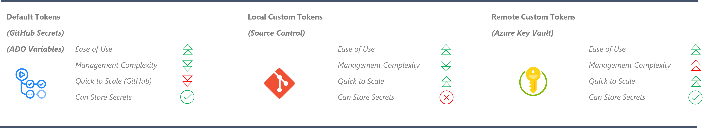
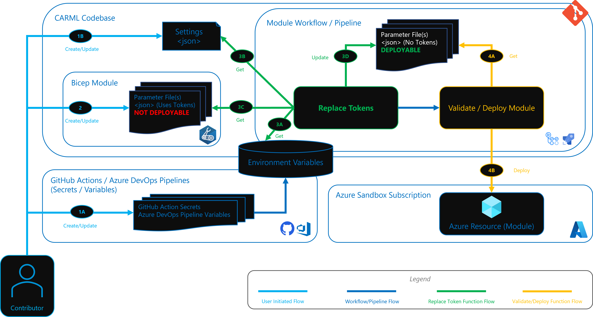

# Parameter File Tokens

This section provides details on the Tokens Replacement Functionality that enables the use of tokens inside template Parameter Files instead of plain text strings.

---

### _Navigation_

- [Description](#description)
- [How it works](#how-it-works)
  - [Token Types](#token-types)
    - [1. Default Tokens (Environment Variables) [Default]](#1-default-tokens-environment-variables-default)
    - [2. Local Custom Tokens (Source Control) [Optional]](#2-local-custom-tokens-source-control-optional)
  - [How Tokens are replaced in a Parameter File](#how-tokens-are-replaced-in-a-parameter-file)

---
## Description

The Resource Modules Library Pipelines contains a Token replacement function that enables Parameter files to contain tokens (i.e. `<<subscriptionId>>`, `<<tenantId>>`) instead of using static values. This helps with the following:

- Allows the repository to be portable without having static values from where it was cloned.
- Enables dynamic updates of the tokens from single locations without having to modify all files.
- Not adding more environment variables to workflows/pipelines whenever new tokens are required for the environment.

## How it works

### Token Types

There are (2) Token types that can be applied on a Parameter File:

#### 1. Default Tokens (Environment Variables) [Default]

These are tokens constructed from Environment Variables, which are defined in the Workflow (Pipeline). Review [Getting Started - GitHub specific prerequisites](./GettingStarted) for more information on these Environment Variables.

#### 2. Local Custom Tokens (Source Control) [Optional]

These are tokens defined in the Git Repository inside a [Settings.json](https://github.com/Azure/ResourceModules/blob/main/settings.json) file. This allows creating tokens that are local and updatable via Source Control mechanisms. Here is an example on where these tokens are stored. You can add key-value pairs as required:

```json
"localTokens": {
    "tokens": [
        {
            "name": "tokenName",
            "value": "tokenValue"
        }
    ]
}
```

---
**Note**: Do not store sensitive information in this location as they will be present in your Git History. Follow best [practices and guidelines](https://docs.microsoft.com/en-us/azure/azure-resource-manager/templates/best-practices#security-recommendations-for-parameters) on how to handle secrets in template deployments.

---

The below image compares the different token types that can be used for parameter file tokens:



### How Tokens are replaced in a Parameter File

The below diagram illustrates the Token Replacement Functionality via the [Validate](https://github.com/Azure/ResourceModules/blob/main/.github/actions/templates/validateModuleDeploy/action.yml) and [Deploy](https://github.com/Azure/ResourceModules/blob/main/.github/actions/templates/deployModule/action.yml) Actions/Templates.



- **1A.** The user creates default tokens as [GitHub Secrets](https://docs.github.com/en/actions/security-guides/encrypted-secrets#creating-encrypted-secrets-for-a-repository) or [Azure DevOps Pipeline Variables](https://docs.microsoft.com/en-us/azure/devops/pipelines/library/?view=azure-devops), that are injected as environment variables.
- **1B.** The user can also create local custom Parameter File Tokens in the [Settings.json](https://github.com/Azure/ResourceModules/blob/main/settings.json) under the `localTokens` - `tokens` property.
- **2.** The parameter files can now be tokenized as per required value. And the token format can look like `<<tokenName>>`. Example:

  ```json
  "adminPassword": {
    "reference": {
        "keyVault": {
            "id": "/subscriptions/<<subscriptionId>>/resourceGroups/validation-rg/providers/Microsoft.KeyVault/vaults/<<exampleLocalToken>>-keyVault"
        },
        "secretName": "<<exampleLocalToken>>"
    }
  }
  ```
- **3A.** The Replace Tokens function gets the default tokens from the environment variables.
  > Default Tokens are harder to scale as they are explicitly defined in deploy/validate task, workflows and pipelines, and requires updating these components as you create more tokens.

- **3B.** The Replace Tokens function gets local custom tokens from the [Settings.json](https://github.com/Azure/ResourceModules/blob/main/settings.json).
  > Local Tokens are easier to scale as you just need to define them in this file without adding new environment variables or modifying workflows or tasks.

- **3C.** The Replace Tokens function gets the Module Parameter file (tokenized and not deployable) and then all tokens are processed for replacement.

- **3D.** The updated Module Parameter file is then saved, replacing the tokenized version. This file is now 'deployable'.

- **4A.** The Validate/Deploy function retrieves the latest updated module Parameter file.

- **4B.** The Validate/Deploy function validates the deployment artifacts for the module before deploying it to the Azure Sandbox Subscription.
