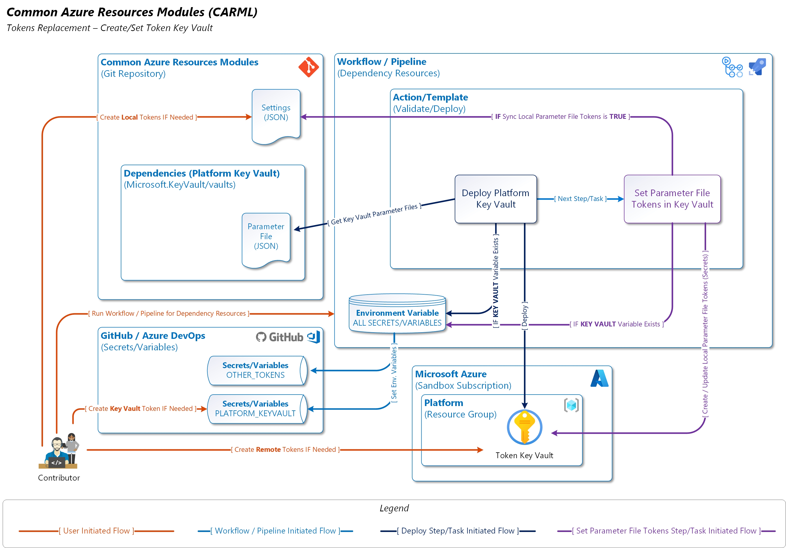
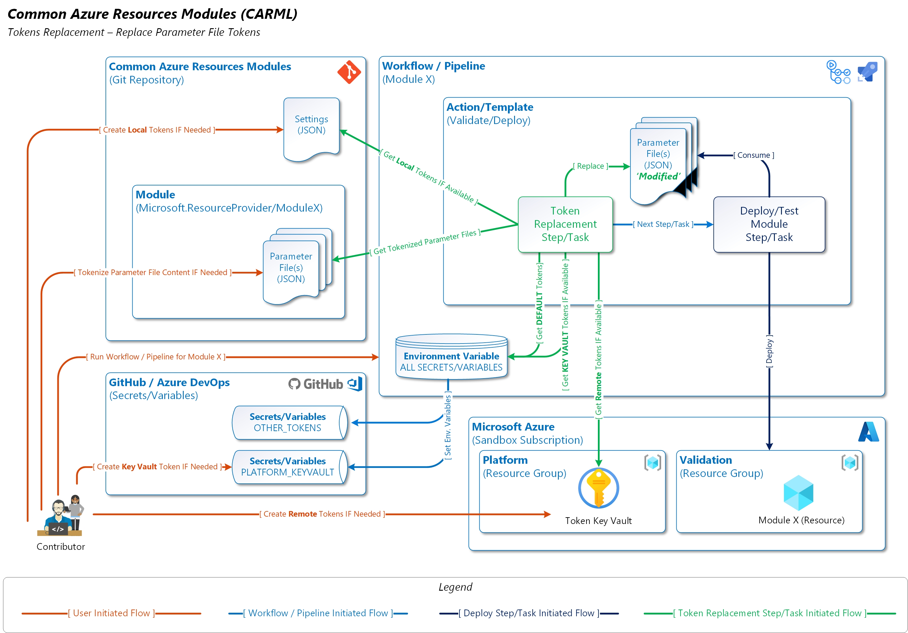

# Parameter File Token

This section provides details on the Tokens Replacement Functionaliy that enables the use of tokens inside template Parameter Files instead of plain text.

---

### _Navigation_

- [Parameter File Token](#parameter-file-token)
    - [_Navigation_](#navigation)
  - [Description](#description)
  - [How it works](#how-it-works)
    - [Token Types](#token-types)
      - [1. Default Tokens (Environment Variables) [Default]](#1-default-tokens-environment-variables-default)
      - [2. Local Custom Tokens (Source Control) [Optional]](#2-local-custom-tokens-source-control-optional)
      - [3. Remote Custom Tokens (Key Vault) [Optional]](#3-remote-custom-tokens-key-vault-optional)
    - [Set / Create Azure Key Vault Token Logic](#set--create-azure-key-vault-token-logic)
    - [Get Parameter File Tokens](#get-parameter-file-tokens)

---

## Description

The Resource Modules Library Pipelines contains a Token replacement function that enables Parameter files to contain tokens (i.e. `<<subscriptionId>>`, `<<tenantId>>`) instead of using static values. This helps with the following:

- Allows the repository to be portable without having static values from where it was cloned.
- Enables dynamic updates of the tokens from single locations without having to modify all files.
- Not adding more environment variables to workflows/pipelines whenever new tokens are required for the environment.

## How it works

### Token Types

There are (3) Token types that can be applied on a Parameter File:

#### 1. Default Tokens (Environment Variables) [Default]

These are tokens constructed from Environment Variables, which are defined in the Workflow (Pipeline). Review [Getting Started - GitHub specific prerequisites](./GettingStarted.md##github-specific-prerequisites) for more information on these Environment Variables.

---
**Note**: Avoid updating tokens as Environment Variables as they do require changes to Workflows in order to add them to the Agent at runtime.

**Note**: Only use secure tokens in a parameter that is of type `secureString` and not regular strings. These tokens will be replaced at runtime and will be available in the deployment data if the Parameter type is not secure. Follow best [practices and guidelines](https://docs.microsoft.com/en-us/azure/azure-resource-manager/templates/best-practices#security-recommendations-for-parameters) on how to handle secrets in template deployments.

---

#### 2. Local Custom Tokens (Source Control) [Optional]

These are tokens defined in the Git Repository inside a [Settings.json](../../settings.json) file. This allows creating tokens that are local and updatable via Source Control mechanisms. Here is an example on where these tokens are stored. You can add key value pairs as required:

```json
"localCustomParameterFileTokens": {
    "tokens": [
        {
            "name": "namePrefix",
            "value": "carml"
        }
    ]
}
```

---
**Note**: Do not store sensitive information in this location as they will be present in your Git History. Follow best [practices and guidelines](https://docs.microsoft.com/en-us/azure/azure-resource-manager/templates/best-practices#security-recommendations-for-parameters) on how to handle secrets in template deployments.

---

#### 3. Remote Custom Tokens (Key Vault) [Optional]

These are tokens that are stored in Azure Key Vault as Secrets. This allows creating tokens that are not considered to be sensitive information, but are specific to the environment (i.e. Principal IDs for Security Principals, Tenant ID).

The Key Vault here is enabled by adding a Secret to GitHub called `PLATFORM_KEYVAULT` and providing a name of a Key Vault that is unique and hasn't been used in Azure before. This can be done by attempting to deploy a Key Vault via the Azure Portal and seeing if the name is unique, or by using the [Check Name Availability API](https://docs.microsoft.com/en-us/rest/api/keyvault/vaults/check-name-availability).

---
**Note**: The use of this Key Vault is Optional, and is only deployed, and checked for tokens if the `PLATFORM_KEYVAULT` is not empty.

**Note**: Only use secure tokens in a parameter that is of type `secureString` and not regular strings. These tokens will be replaced at runtime and will be available in the deployment data if the Parameter type is not secure. Follow best [practices and guidelines](https://docs.microsoft.com/en-us/azure/azure-resource-manager/templates/best-practices#security-recommendations-for-parameters) on how to handle secrets in template deployments.

---

> You can also sync Local Custom Parameter File Tokens by setting the `syncLocalCustomParameterFileTokens` property to `true` in the [Settings.json](../../settings.json) file. </br>
> You can also specify a custom prefix for the Secret Name in Azure Key Vault. This is done by modifying the `keyVaultSecretNamePrefix` property in the [Settings.json](../../settings.json) file.

### Set / Create Azure Key Vault Token Logic

 ---
**Note**: The use of this Key Vault is Optional, and is only deployed, and checked for tokens if the `PLATFORM_KEYVAULT` is not empty.

---

The Token Replacement Functionality comes with the ability to store Parameter File Tokens in Azure Key Vault. This is performed by creating a Secret in GitHub Actions called `PLATFORM_KEYVAULT`, which then automtically flows as an Environment Variable in Workflows.The below diagram shows the flow in more detail:



1- The user can create the Secret called `PLATFORM_KEYVAULT`. This must be a unique Key Vault name across Azure.

2- The user then triggers the [Dependency Workflow](../../.github/workflows/platform.dependencies.yml) to instantiate the Platform Token Key Vault.

  > To customize the Key Vault Configuration, you can modify the [Platform Key Vault Parameter File](../../utilities/dependencies/Microsoft.KeyVault/vaults/parameters/platform.parameters.json).

3- Once the Key Vault is deployed, the 'Set Parameter File Tokens in Key Vault' task optionally runs to sync Local Custom Parameter File Tokens stored in the [Settings.json](../../settings.json)

  > You can disable the sync process from Local Tokens (in Source Control) to Remote Tokens (in Key Vault) by modifying the `keyVaultSecretNamePrefix` property in the [Settings.json](../../settings.json) file and setting it to `false`.

### Get Parameter File Tokens

 ---
**Note**: This Step is always enabled even if you do not use Local/Remote Custom Parameter File Tokens. Default Tokens are always required and are Pester Tested if they do not exist in a Parameter file where they should.

---

The below diagram illustrates the Token Replacement Functionality via the [Validate](../../.github/actions/templates/validateModuleDeploy/action.yml) and [Deploy](../../actions/../.github/actions/templates/deployModule/action.yml) Actions/Templates.



1- The user creates Local Custom Parameter File Tokens in the [Settings.json](../../settings.json) under the `localCustomParameterFileTokens` - `tokens` property.
2- The user can also create Remote Custom Parameter File Tokens in the Key Vault with the right naming standards inside [Settings.json](../../settings.json) under `remoteCustomParameterFileTokens`, using the `keyVaultSecretNamePrefix` Prefix for the Secret Name. Here is an example on how to perform that using PowerShell:

```powershell
### Remote Tokens
$Settings = Get-Content './settings.json' | ConvertFrom-Json
$KeyVaultSecretNamePrefix = $Settings.parameterFileTokens.remoteCustomParameterFileTokens.keyVaultSecretNamePrefix
Add-AzAccount -SubscriptionId '12345678-1234-1234-1234-123456789012'
$TokensKeyVault = Get-AzKeyVault
@(
    @{ Name = 'myCustomTokenName'; Value = 'myCustomTokenNameValue' }
) | ForEach-Object {
    $TokenName = -join ($KeyVaultSecretNamePrefix, $PSItem.Name)
    Set-AzKeyVaultSecret -Name $TokenName -SecretValue (ConvertTo-SecureString -AsPlainText $PSItem.Name) -VaultName $TokensKeyVault.VaultName -ContentType 'ParameterFileToken'
}
```

