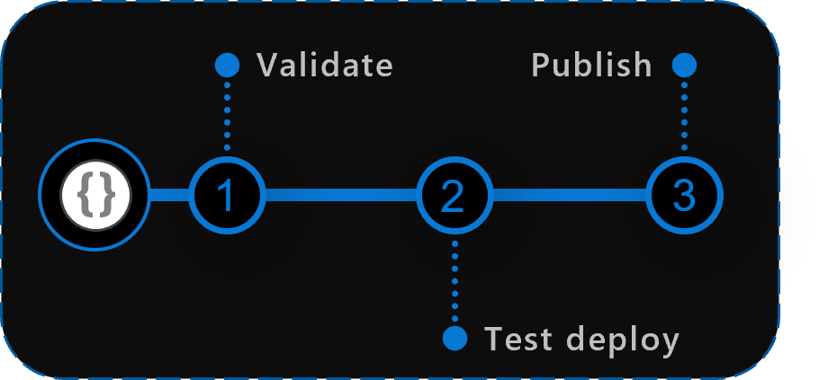

# Pipelines Design

This section gives you an overview of the design principals the pipelines follow.

---

### _Navigation_

- [Module Pipelines](#module-pipelines)
  - [Module pipeline inputs](#module-pipeline-inputs)
  - [Pipeline phases](#pipeline-phases)
    - [Validate](#validate)
    - [Test deploy](#test-deploy)
      - [Removal](#removal)
    - [Publish](#publish)
  - [Shared concepts](#shared-concepts)
    - [Prerequisites](#prerequisites)
    - [Pipeline secrets](#pipeline-secrets)
    - [Pipeline variables](#pipeline-variables)
    - [Tokens Replacement](#tokens-replacement)
- [Platform pipelines](#platform-pipelines)
  - [Dependencies pipeline](#dependencies-pipeline)
  - [ReadMe pipeline](#readme-pipeline)
  - [Wiki pipeline](#wiki-pipeline)
- [DevOps-Tool-specific considerations](#devops-tool-specific-considerations)
  - [GitHub Workflows](#github-workflows)
    - [Component: GitHub secret](#github-component-github-secrets)
    - [Component: Variable file](#github-component-variable-file)
    - [Component: Composite actions](#github-component-composite-actions)
    - [Component: Workflows](#github-component-workflows)
  - [Azure DevOps Pipelines](#azure-devops-pipelines)
    - [Component: Service connection](#azure-devops-component-service-connection)
    - [Component: Variable group](#azure-devops-component-variable-group)
    - [Component: Variable file](#azure-devops-component-variable-file)
    - [Component: Pipeline templates](#azure-devops-component-pipeline-templates)
    - [Component: Pipelines](#azure-devops-component-pipelines)

---

# Module Pipelines

This section will give you an overview of the different phases and shared logic the module pipelines use.

- [Inputs](#inputs)
- [Pipeline phases](#pipeline-phases)
- [Shared concepts](#shared-concepts)

## Module pipeline inputs

Note that the pipeline comes with 4 runtime parameters you can provide when you trigger it:

- `'Branch' dropdown`: A dropdown to select the branch to run the pipeline from
- `'Remove module' switch`: Can be set to 'true' or 'false' and controls whether the test-deployed resources are removed after testing
- `Versioning mode`: This option allows you to control the publishing behavior. Depending on the mode you select, a different part of the version is incremented (for example [major|minor|patch]), if no custom version is provided. For further information of how the input is processed see [publishing](#publish).
- `Custom version`: Allows you to provide a custom version to publish the module with. For further information of how the input is processed see [publishing](#publish).

## Pipeline phases

To "build"/"bake" the modules, a dedicated pipeline is used for each module to validate their production readiness, by:

1. **Validate**:
   1. Running a set of static Pester tests against the template
   1. Validating the template by invoking Azure’s validation API (Test-AzResourceGroupDeployment – or the same for other scopes)
1. **Test deploy**: we deploy each module by using a predefined set of parameters to a ‘sandbox’ subscription in Azure to see if it’s really working
   1. **Removal**: The test suite is cleaned up by removing all deployed test resources again
1. **Publish**: the proven results are copied/published to a configured location such as template specs, the bicep registry, Azure DevOps artifacts, etc.



Using this flow, validated modules can be consumed by other any consumer / template / orchestration to deploy a service, workload, or entire environment such as a landing zone.

These 'ad-hoc' test pipelines are important since every customer environment might be different due to applied Azure Policies or security policies, modules might behave differently or naming conventions need to be tested and applied beforehand.

### Validate

The validation phase performs all test outside of a test deployment. This includes [static tests](#static-module-validation) regarding for example a proper documentation, as well as [simulated deployments](#simulated-deployment-validation).

#### Static module validation

This static validation executes the tests documented in the [testing](./Testing) section. Without diving into to much detail, we test aspects like a proper ReadMe documentation, a proper module folder structure, a minimum number of refresh of the leveraged of API versions and the like. For example, each resource's API version is compared with those currently available on Azure. Accepted are both the latest 5 versions (including preview versions) as well as the latest 5 non-preview versions.

#### Simulated deployment validation

This test executes validation tests such as `Test-AzResourceGroupDeployment` using both the module's template, as well as each specified parameter file. The intention of this test is to fail fast, before we even get to the later deployment test.

However, even for such a simulated deployment we have to account for certain [prerequisites](#prerequisites) and also consider the [tokens replacement](#tokens-replacement) logic we leverage on this platform.

### Test deploy

The deployment phase uses a combination of both the module's template file as well as each specified parameter file to run a parallel deployment towards a given Azure environment.

The parameter files used in this stage should ideally cover as many scenarios as possible to ensure we can use the template for all use cases we may have when deploying to production eventually. Using the example of a CosmosDB module we may want to have one parameter file for the minimum amount of required parameters, one parameter file for each CosmosDB type to test individual configurations and at least one parameter file that tests the supported providers such as RBAC & diagnostic settings.

Note that, for the deployments we have to account for certain [prerequisites](#prerequisites) and also consider the [tokens replacement](#tokens-replacement) logic we leverage on this platform.

#### Removal

The removal phase takes care of removing all resources deployed as part of the previous deployment phase. The reason is twofold: keeping validation subscriptions costs down and allow deployments from scratch at every run.

For additional details on how removal works please refer to the dedicated [Removal action](PipelineRemovalAction) page.

### Publish

The publish phase concludes each module's pipeline. If all previous tests succeeded (i.e. no phase failed) and the pipeline was executed in the `main` or `master` branch, a new module version is published to all configured target locations. Currently we support the following target locations:

- _template specs_
- _private bicep registry_
- _universal artifacts_ (_Azure DevOps_ only)

Besides the execution of a publish, there is also the possibility to set the switch `Publish prerelease module`. This switch makes it possible to publish a pre-release version in every workflow run that is not based on main or master.

> **Note**<br>
> The `version` used for publishing any artifact will be the same in all three target locations which reduces the maintenance effort.

The publishing works as follows:

1. The script `utilities/pipelines/resourcePublish/Get-ModulesToPublish.ps1` gets all changed module files including child modules and handles the logic of propagating the appropriate module version to be used:
   1. The major (`x.0`) and minor (`0.x`) version are set based on the file `version.json` in the module folder.
   2. The patch (`0.0.x`) version is calculated based on the number of commits on the `HEAD` ref (aka. git height). This will cause the patch version to never reset to 0 with major and/or minor increment, as specified for [semver](https://semver.org/).
   3. The module is published with a patch specific version (`x.y.z`). For Template Specs and Bicep Registry a major (`x`) and minor (`x.x`) version is also updated, allowing a consumer to use the latest version of any major or minor version.
   1. For a changed child module, the direct parent hierarchy is also registered for an update, following the same procedure as above.
   1. The list of module files paths and their versions are passed on as a array list.
2. The different publishing scripts run (Artifact, Template Spec or Bicep Registry) and publish the module to the respective target location for each item on the list.

**Example scenario**

Lets look at an example run where we would do a patch change on the `fileShares` module:
1. A new branch is created for further development of the `fileShare` module. Let's assume the new branch started from commit `500` on the default branch and the `version.json` of the `fileShare` module contains major and minor `0.3`.
2. Bug-fixes, documentation, and security updates are added to the `fileShare` module by the author. The `version.json` file is not changed in either the child or parent module folders.
3. The author runs a manual workflow based on their development branch, with the 'publish pre-release' option enabled.
4. A prerelease run of publishing triggers after test and validation of the module.
   - For the child and parent modules, the module version's major and minor version is read from the `version.json` file in the module folder respectively. Being unchanged, it still contains the version `0.3`.
   - The patch is calculated based on the total number of commits in history on the branch (independent on the module). The new branch started from commit `500` on the default branch and 1 commit has been pushed, so the total number of commits on the new branch is `501`.
   - As the pipeline is not running based on the 'default branch', a prerelease segment (`-prerelease`) is added to the version.
   - The version results in being `0.3.501-prerelease`. The child and parent modules may have different major and minor versions, but the patch version will be the same in this case. Other unmodified child modules of `storageAccount` will not be republished and remain with the existing version.
5. Sequential commits on the branch and runs of the module pipeline, with the 'publish pre-release' option enabled results in the following versions being published:
   - `0.3.502-prerelease`
   - `0.3.503-prerelease`
   - ...
   - `0.3.506-prerelease`
6. When the branch is merged to the default branch, the only thing that changes is the patch version and the removal of the `-prerelease` segment.
   - The number of commits will at this point be calculated based on the number of commits on the default branch.
   - Assuming the development branch started from commit 500 on the default branch, and the author added 6 commits on the development branch, the prerelease versions will reach `0.3.506-prerelease`.
   - Meanwhile, there can be changes (let's say 2 squashed PR merges) on the default branch that is pushing its number of commits in history further.
   - If the PR for the changes to `fileShare` is squash merged as commit number 503, the patch version on the child and parent module is then `503`, resulting in a version `0.3.503` being published.
7. The merge triggers cascading updates in the following way:
   - The module is published with a `major.minor.patch` version as well as a `major.minor` and `major` version updates, allowing consumers to target the latest major or minor version with ease.
   - All parent module are published following the steps mentioned above.
```
                  \         \
C499 -> C500 ---> C501 ---> C502 ---> C503 (503)
        \                            /
         D1 --> D2 --> D3 ... --> D6
        (501)  (502)  (503)      (506)
```
`Cx` - Commits on main,
`Dx` - Commits on development branch,
`(x)` - Calculated patch version

## Shared concepts

There are several concepts that are shared among the phases. Most notably

- [Prerequisites](#prerequisites)
- [Pipeline secrets](#pipeline-serets)
- [Pipeline variables](#pipeline-variables)
- [Tokens Replacement](#tokens-replacement)

### Prerequisites

For both the [simulated deployment validation](#simulated-deployment-validation) as well as the [test deployment](#test-deployment) we should account for the following prerequisites:

- A _"Sandbox"_ or _"Engineering"_ **validation subscription** (in Azure) has to be used to test if the modules (or other components) are deployable. This subscription must not have connectivity to any on-premises or other Azure networks.
- An Azure Active Directory [service principal](https://docs.microsoft.com/en-us/azure/active-directory/develop/app-objects-and-service-principals#service-principal-object) (AAD SPN) to authenticate to the validation subscription and run the test deployments of the modules.

### Pipeline secrets

To use the platform pipelines you need several secrets set up in your DevOps platform. Contrary to the pipeline variables we describe in the [subsequent section](#pipeline-variables) these following variables are considered sensitive.

| Secret Name | Example | Description |
| - | - | - |
| `ARM_MGMTGROUP_ID` | `de33a0e7-64d9-4a94-8fe9-b018cedf1e05` | The group ID of the management group to test deploy modules of that level in. |
| `ARM_SUBSCRIPTION_ID` | `d0312b25-9160-4550-914f-8738d9b5caf5` | The subscription ID of the subscription to test deploy modules of that level in. |
| `ARM_TENANT_ID` | `9734cec9-4384-445b-bbb6-767e7be6e5ec` | The tenant ID of the tenant to test deploy modules of that level in. |
| `DEPLOYMENT_SP_ID` | `de33a0e7-64d9-4a94-8fe9-b018cedf1e05` | This is the Principal (Object ID) for the Service Principal used as the Azure service connection. It is used for Default Role Assignments when Modules are being deployed into Azure |

The location where to set these secrets up depends on the DevOps platform you use. Also, there may be additional platform-specific secrets to set up. For further information please refer to [this section](#devops-tool-specific-considerations).

### Pipeline variables

The primary pipeline variable file hosts the fundamental pipeline configuration and is stored in a different location, based on the [DevOps platform](#devops-tool-specific-considerations). In here you will find and can configure information such as:

#### **_General_**

| Variable Name | Example Value | Description |
| - | - | - |
| `defaultLocation` | "WestEurope" | The default location to deploy resources to. If no location is specified in the deploying parameter file, this location is used |
| `resourceGroupName` | "validation-rg" | The resource group to deploy all resources for validation to |

#### **_Template-specs specific (publishing)_**

| Variable Name | Example Value | Description |
| - | - | - |
| `templateSpecsRGName` | "artifacts-rg" | The resource group to host the created template-specs |
| `templateSpecsRGLocation` | "WestEurope" | The location of the resource group to host the template-specs. Is used to create a new resource group if not yet existing |
| `templateSpecsDescription` | "This is a module from the [Common Azure Resource Modules Library]" | A description to add to the published template specs |
| `templateSpecsDoPublish` | "true" | A central switch to enable/disable publishing to template-specs |

#### **_Private bicep registry specific (publishing)_**

| Variable Name | Example Value | Description |
| - | - | - |
| `bicepRegistryName` | "adpsxxazacrx001" | The container registry to publish bicep templates to |
| `bicepRegistryRGName` | "artifacts-rg" | The resource group of the container registry to publish bicep templates to. Is used to create a new container registry if not yet existing |
| `bicepRegistryRGName` | "artifacts-rg" | The location of the resource group of the container registry to publish bicep templates to. Is used to create a new resource group if not yet existing |
| `bicepRegistryDoPublish` | "true" | A central switch to enable/disable publishing to the private bicep registry |

### Tokens Replacement

The validation or deploy actions/templates includes a step that replaces certain strings in a parameter file with values that are provided from the module workflow. This helps achieve the following:

Dynamic parameters that do not need to be hardcoded in the parameter file, and the ability to reuse the repository as a fork, where users define the same tokens in their own "repository secrets", which are then available automatically to their parameter files.

For example, some modules require referencing Azure resources with the Resource ID. This ID typically contains the `subscriptionId` in the format of `/subscriptions/<<subscriptionId>>/...`. This task substitutes the `<<subscriptionId>>` with the correct value, based on the different token types.

Please review the Parameter File Tokens [Design](./ParameterFileTokens) for more details on the different token types and how you can use them to remove hardcoded values from your parameter files.

---

# Platform pipelines

Outside of the previously described platform pipelines we implemented several additional pipelines to help us with some additional tasks.

- [Dependencies pipeline](#dependencies-pipeline)
- [ReadMe pipeline](#readme-pipeline)
- [Wiki pipeline](#wiki-pipeline)

## Dependencies pipeline

As the modules we test often times have dependencies to other services, we created a pipeline to deploys several standard services like VirtualNetworks and KeyVaults (alongside dummy secrets) for the modules to use. This _dependency_ pipeline should be prepared and executed before you start running any pipelines on your own. In case you need to rename any services there (for example because a certain globally unique resource name was already taken) make sure to update any references to this name in the module parameter files. You can find further details about this pipeline [here](./TestingDesign#Module-Dependencies).

### Dependencies pipeline inputs

Note that the pipeline comes with 2 runtime parameters you can provide when you trigger it:

- `'Branch' dropdown`: A dropdown to select the branch to run the pipeline from
- `'Enable SQL MI dependency deployment' switch`: Can be set to 'true' or 'false' and controls whether the dependencies for the SQL-MI are deployed during execution or not

## ReadMe pipeline

We have two major ReadMe files that we want to stay in sync with the modules in the repository. The first can be found in root (`README.md`) and the second in the modules folder (`arm/README.md`). The pipeline is triggered each time changes are pushed to the `main` branch and only if a template in the `arm` folder was altered.

Once triggered it will crawl through the library and update the tables in each corresponding ReadMe, creating links to the pipelines, adding/removing entries and so on.

## Wiki pipeline

The purpose of this pipeline is to sync any files from the `docs/wiki` folder to the GitHub wiki repository. It is triggered each time changes are pushed to the `main` branch and only if files in the `docs/wiki` folder were altered.

> **Note:** any changes performed directly on the Wiki via the UI will be overwritten by this pipeline.

---

# DevOps-Tool-specific considerations

Depending on what DevOps tool you want to use to host the platform you will find the corresponding code in different locations. This section will give you an overview of these locations and what they are used for.

- [GitHub Workflows](#github-workflows)
- [Azure DevOps Pipelines](#azure-devops-pipelines)

## GitHub Workflows

[GitHub actions & workflows](https://docs.github.com/en/actions) are the CI/CD solution provided by GitHub. To get the platform going, we use the following elements:

- **[GitHub secrets:](#github-component-github-secrets)** We leverage GitHub repository secrets to store central and potentially sensitive information we need to perform deployments and other platform specific actions
- **[Variable file:](#github-component-variable-file)** This file contains the configuration for all module pipelines in this repository.
- **[Composite actions:](#github-component-composite-actions)** Composite actions bundle a set of actions for a specific purpose together. They are referenced by module pipelines.
- **[Workflows:](#github-component-workflows)** GitHub workflows make up all our pipelines and leverage the _composite actions_. We have one workflow per module, plus several platform pipelines.

In the following sub-sections we will take a deeper look into each element.

### **GitHub Component:** GitHub secrets

The GitHub repository secrets can be set up in the repositories _'Settings'_ as described [here](https://docs.github.com/en/actions/security-guides/encrypted-secrets).

For _GitHub_ in particular we need the following secrets in addition to those described in the shared [pipeline secrets](#pipeline-secrets) section:

| Secret Name | Example | Description |
| - | - | - |
| `AZURE_CREDENTIALS` | `{"clientId": "4ce8ce4c-cac0-48eb-b815-65e5763e2929", "clientSecret": "<placeholder>", "subscriptionId": "d0312b25-9160-4550-914f-8738d9b5caf5", "tenantId": "9734cec9-4384-445b-bbb6-767e7be6e5ec" }` | The login credentials of the [deployment principal](./GettingStarted#platform-principal) to use to log into the target Azure environment to test in. The format is described [here](https://github.com/Azure/login#configure-deployment-credentials). |
| `PLATFORM_REPO_UPDATE_PAT` | `<placeholder>` | A PAT with enough permissions assigned to it to push into the main branch. This PAT is leveraged by pipelines that automatically generate ReadMe files to keep them up to date |

### **GitHub Component:** Variable file

The [pipeline configuration file](#pipeline-variables) can be found at `.github/variables/global.variables.json`.

### **GitHub Component:** Composite Actions

We use several composite actions to perform various tasks shared by our module workflows:

| Composite Action | Description |
| - | - |
| **validateModulePester** | This action performs [static tests](#static-module-validation) for a module using Pester, including API versions focused tests to avoid those become stale overtime. |
| **validateModuleDeployment:** | This action performs the following tasks: <li> A [simulated deployment](#simulated-deployment-validation) using a provided parameter file. <li>An [actual deployment](#test-deploy) to Azure using a provided parameter file. <li>The [removal](#removal) of the test-deployed resources |
| **publishModule:** | This action is capable of [publishing](#publish) the given template to a location specified in the pipeline [variable file](#github-component-variable-file). |
| **getWorkflowInput:** | This action allows us to fetch workflow input values from the module's workflow file, even if the pipeline was not triggered via a `workflow_dispatch` action. Without it we would not be able to process the contained information and would need to duplicate the configuration as workflow variables. Such input values are for example the removal switch `removeDeployment`. |

### **GitHub Component:** Workflows

These are the individual end-to-end workflows we have for each module. Leveraging the [composite actions](#github-component-composite-actions) described before, they orchestrate the testing & publishing of their module.

Comparing multiple workflows you'll notice they are almost identical, yet differ in a few important areas:

- The **_[path filters](https://docs.github.com/en/actions/learn-github-actions/workflow-syntax-for-github-actions)_** of the workflow trigger:
  | Purpose | Example |
  | - | - |
  | Include the composite actions | `- '.github/actions/templates/**'` |
  | Include the relative path to the workflow itself | `- '.github/workflows/ms.network.virtualwans.yml'` |
  | Include the relative path to the module folder | `- 'arm/Microsoft.Network/virtualWans/**'` |
  | Exclude any ReadMe | `- '!*/**/readme.md'` |

  Full example

  ```yaml
  push:
    branches:
      - main
    paths:
      - '.github/actions/templates/**'
      - '.github/workflows/ms.network.virtualwans.yml'
      - 'arm/Microsoft.Network/virtualWans/**'
      - '!arm/Microsoft.Network/virtualWans/readme.md'
  ```

- The **_environment variables_**
  The environment variables are leveraged by the workflow to fundamentally process the module. We need:
  | Variable | Description | Example |
  | - | - | - |
  | `modulePath` | Relative path to the module folder | `modulePath: 'arm/Microsoft.Network/virtualWans'` |
  | `workflowPath` | Relative path to the workflow itself | `workflowPath: '.github/workflows/ms.network.virtualwans.yml'` |

  Full example

  ```yaml
  env:
    modulePath: 'arm/Microsoft.Network/virtualWans'
    workflowPath: '.github/workflows/ms.network.virtualwans.yml'
  ```

## Azure DevOps Pipelines

[Azure DevOps pipelines](https://docs.microsoft.com/en-us/azure/devops/pipelines/get-started/what-is-azure-pipelines?view=azure-devops) are the CI/CD solution provided by Azure DevOps. To enable the CARML platform to function, we use the following components in Azure DevOps:

- **[Service connection:](#azure-devops-component-service-connection)** The [service connection](https://docs.microsoft.com/en-us/azure/devops/pipelines/library/service-endpoints?view=azure-devops&tabs=yaml) is a wrapper for the [deployment principal](./GettingStarted#platform-principal) that performs all actions in the target SBX/DEV/TEST subscription
- **[Variable group:](#azure-devops-component-variable-group)** [Variable groups](https://docs.microsoft.com/en-us/azure/devops/pipelines/library/variable-groups?view=azure-devops&tabs=yaml) allow us to store both sensitive as well configuration data securely in Azure DevOps.
- **[Variable file:](#azure-devops-component-variable-file)** The [variable file](https://docs.microsoft.com/en-us/azure/devops/pipelines/yaml-schema?view=azure-devops&tabs=example%2Cparameter-schema#variable-templates) is a version controlled variable file that hosts pipeline configuration data such as the agent pool to use.
- **[Pipeline templates:](#azure-devops-component-pipeline-templates)** [Pipeline templates](https://docs.microsoft.com/en-us/azure/devops/pipelines/process/templates?view=azure-devops) allow us to re-use pipeline logic across multiple referencing pipelines
- **[Pipelines:](#azure-devops-component-pipelines)** The [pipelines](https://docs.microsoft.com/en-us/azure/devops/pipelines/?view=azure-devops) contain all logic we execute as part of our platform and leverage the _pipeline templates_.

### **Azure DevOps Component:** Service Connection

The service connection must be set up in the project's settings under _Pipelines: Service connections_ (a step by step guide can be found [here](https://docs.microsoft.com/en-us/azure/devops/pipelines/library/service-endpoints?view=azure-devops&tabs=yaml)).

It's name must match the one configured as `serviceConnection` in the [variable file](#azure-devops-component-variable-file).

### **Azure DevOps Component:** Variable group

The variable group can be set up under _Pipelines: Library_ as described [here](https://docs.microsoft.com/en-us/azure/devops/pipelines/library/variable-groups?view=azure-devops&tabs=classic#create-a-variable-group). Make sure you set up all secrets described [here](#pipeline-secrets) and that its name matches the `group` reference used in the [module pipelines](#azure-devops-component-pipelines). For example

```yaml
variables:
  - group: 'PLATFORM_VARIABLES'
```

### **Azure DevOps Component:** Variable file

The variable file is a source controlled configuration file to control the behavior of the pipeline. The file is stored in path `.azuredevops/pipelineVariables/global.variables.yml`.

This file is divided into multiple categories of variables used in the pipelines:

| Section | Description |
| - | - |
| **Agent settings** | Contains information of the agent and service connection to use |
| **Source** | Contains information about the Azure DevOps instance itself, including some important folder paths |
| **Validation deployment settings** | Contains the default deployment information to use in the pipeline. For example, the default location to deploy resources to |
| **Publish: Template-Spec settings** | Contains the required information to publish to template-specs, including a switch to toggle the publishing to template specs on or off |
| **Publish: Universal packages settings** | Contains the required information to publish to universal packages, including a switch to toggle the publishing to universal packages on or off |
| **Publish: Private Bicep Registry settings** | Contains the required information to publish to the private bicep registry, including a switch to toggle the publishing to the private bicep registry on or off |
| **Azure PowerShell Version** | Contains information about the default PowerShell version to use in the pipeline |

More information about the contained variables can be found in the linked file itself.

### **Azure DevOps Component:** Pipeline templates

To keep the amount of pipeline code at a minimum we make heavy use of pipeline templates. Following you can find an overview of the ones we use and what they are used for:

| Template Name | Description |
| - | - |
| **jobs.validateModulePester.yml** | This template perform all [static tests](#static-module-validation) for a module using Pester. |
| **jobs.validateModuleDeployment.yml** | This template performs a [test deployment](#simulated-deployment-validation) followed by an [actual deployment](#test-deploy) to Azure using a provided parameter file. Once a deployment completed it [removes](#removal) the resource |
| **jobs.publishModule.yml** | This template is capable of [publishing](#publish) the given template to a location specified in the pipeline [variable file](#azure-devops-component-variable-file) |

Each file can be found in path `.azuredevops/pipelineTemplates`.

### **Azure DevOps Component:** Pipelines

These are the individual end-to-end pipelines we have for each module. Leveraging the [templates](#azure-devops-component-pipeline-templates) described before, they orchestrate the testing & publishing of their module.

While they look very similar they have specific areas in which they differ:

- The **_path filters_** of the pipeline trigger:
  | Purpose | Example |
  | - | - |
  | Include the templates | `- '/.azuredevops/pipelineTemplates/module.*.yml'` |
  | Include the relative path to the pipeline itself | `- '/.azuredevops/modulePipelines/ms.analysisservices.servers.yml' ` |
  | Include the relative path to the module folder | `- '/arm/Microsoft.AnalysisServices/servers/*'` |
  | Exclude any readme | `- '/**/*.md'` |

  Full example:

  ```yaml
  trigger:
    batch: true
    branches:
      include:
        - main
    paths:
      include:
        - '/.azuredevops/modulePipelines/ms.analysisservices.servers.yml'
        - '/.azuredevops/pipelineTemplates/module.*.yml'
        - '/arm/Microsoft.AnalysisServices/servers/*'
      exclude:
        - '/**/*.md'
  ```

  > **_Note:_** By the time of this writing, wildcards are temporarily not supported by Azure DevOps

- The **_variables_**
  The variables are leveraged by the pipelines to fundamentally process the module. We need:
  | Variable | Description | Example |
  | - | - | - |
  | `template: (...)` | Reference to the [shared variable file](#azure-devops-component-variable-file) | `- template: '/.azuredevops/pipelineVariables/global.variables.yml'` |
  | `group: (...)` | Reference to the [variable group](#azure-devops-component-variable-group) with the platform secrets | `- group: PLATFORM_VARIABLES` |
  | `modulePath` | Relative path to the module folder | <code>- name: modulePath<p>&nbsp;&nbsp;value: '/arm/Microsoft.AnalysisServices/servers'</code> |

  Full example:

  ```yaml
  variables:
    - template: '/.azuredevops/pipelineVariables/global.variables.yml'
    - group: 'PLATFORM_VARIABLES'
    - name: modulePath
      value: '/arm/Microsoft.AnalysisServices/servers'
  ```

#### Azure DevOps Artifacts

For _Azure DevOps_ we offer also the option to publish to _Azure DevOps_ universal packages. As the code is already available in the pipeline's publish template (`.azuredevops/pipelineTemplates/jobs.publishModule.yml`) you only have to specify the required information in the shared global variables file (`.azuredevops/pipelineVariables/global.variables.yml`) to enable the feature. For detailed information please refer to the variable file's `Publish: Universal packages settings` section.
