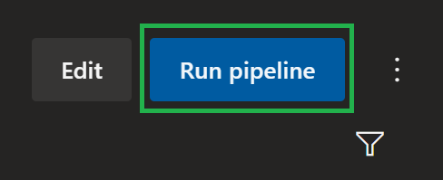
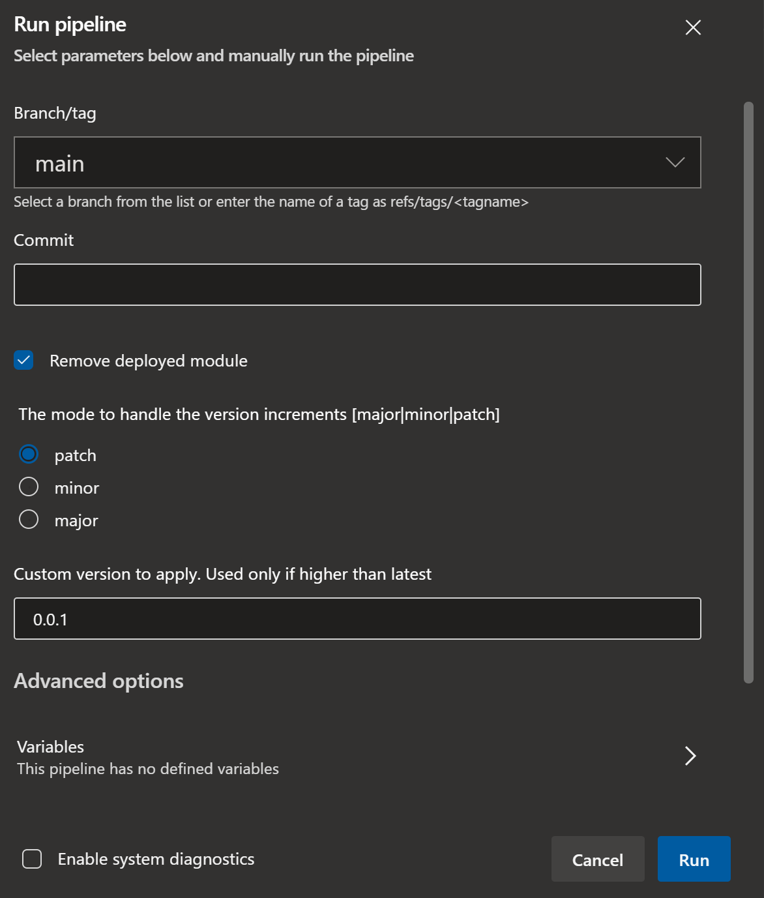
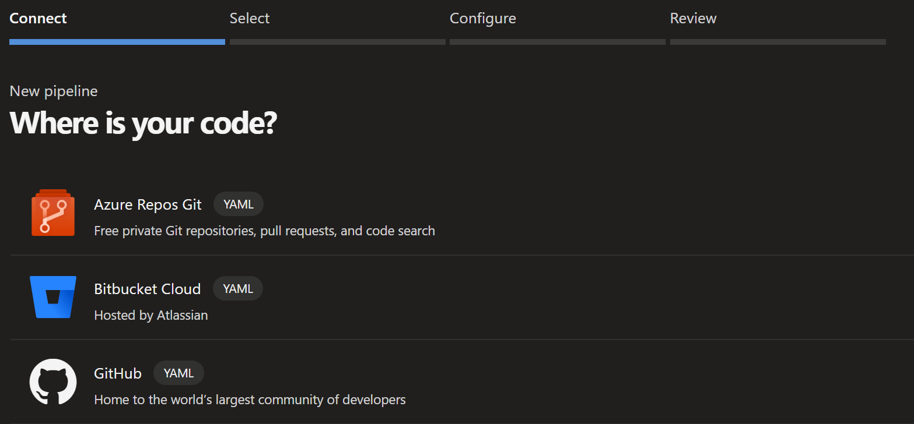
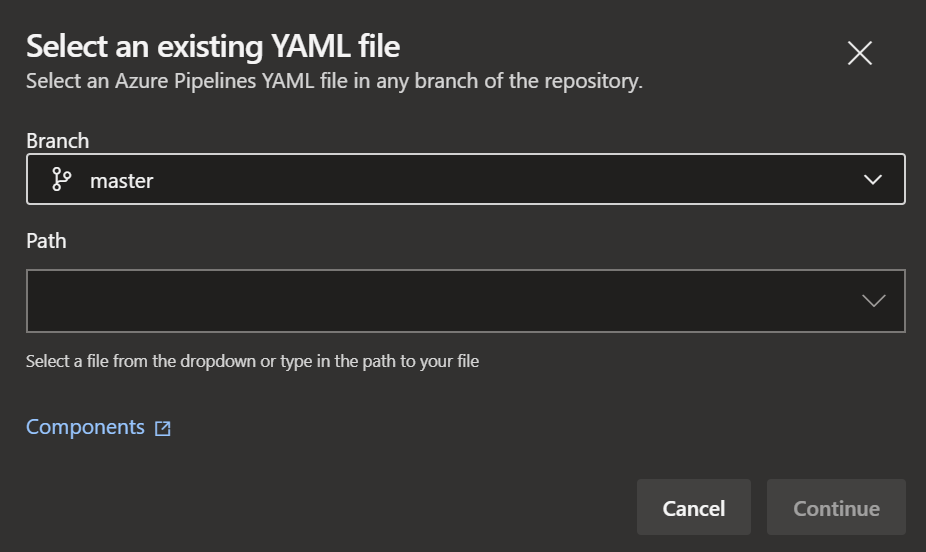

# Pipelines Usage

This section gives you an overview of how to interact with the platform pipelines.

---

### _Navigation_

- [General](#general)
- [How to](#how-to)
  - [Operate the module pipelines](#operate-the-module-pipelines)
  - [Operate the dependency pipelines](#operate-the-dependency-pipeline)
- [DevOps-Tool-specific](#devops-tool-specific-guidance)
  - [GitHub workflows](#github-workflows)
  - [Azure DevOps pipelines](#azure-devops-pipelines)

---

# General

When working with this platform's pipelines it is important to understand first which pipelines serve which purpose, when they are triggered and how you can use them to test your modules.

As described in the [Pipelines Design](./PipelinesDesign) section we offer the following pipelines:

| Pipeline | Target | Trigger | Notes |
| - | - | - | - |
| [Module Pipelines](./PipelinesDesign#module-pipelines) | Module | Changes to [module\|workflow] files in branch [main\|master] or manual | Used to test & publish modules. This is the most common pipeline you will interact with when working on modules. |
| [Dependencies pipeline](./PipelinesDesign#dependencies-pipeline) | All required dependency resources | Manual | Deploys resources we reference in the module tests. Should be run once before testing modules. |
| [ReadMe pipeline](./PipelinesDesign#readme-pipeline) | `README.md` in `<root>` & `<root>/arm` | Changes to [template files] in branch [main\|master] | Keeps the target ReadMe files aligned with the modules in the repository.  |
| [Wiki pipeline](./PipelinesDesign#wiki-pipeline) | Wiki | Changes in [docs/wiki] in branch [main\|master] | Keeps the Wiki-repository in sync with the wiki folder in the modules repository |

---

# How to

This section will give you instructions on how to use our interactive pipelines - independent of the DevOps tooling.

- [Operate the module pipelines](#operate-the-module-pipelines)
- [Operate the dependency pipelines](#operate-the-dependency-pipeline)

## Operate the module pipelines

If not executing tests locally, the module pipelines are your tool of choice to validate the templates current performance.

To validate any updates you did to a module template you can perform the following steps:
1. (optionally) Update the module's parameter files
1. Push the local changes to the repository (using a branch that is not [main\|master])
1. On the DevOps platform, navigate to your pipelines and select the pipeline that was registered for the module you updated
1. Trigger the pipeline, and when doing so, select the branch with your updated template. Optionally adjust the `removal` flag in case you don't want to apply the default behavior, and want to for example not delete the test-deployed resource.

Once the pipeline concluded, it will either be in a green (success) or red (failed) state, depending on how the module performed.

If you open the pipeline's run, you should be able to investigate the logs and investigate the execution. In case any of the [validation](./PipelinesDesign#Validate) steps failed, the pipeline should give you detailed information of any error. In some cases in which Pester tests failed, you may only see the failed test and need to `expand` the error message. How this looks like depends on the [DevOps platform](#devops-tool-specific-considerations) you use.

## Operate the dependency pipeline

As described previously, the dependency pipeline must be triggered manually and deploys a set of resources we reference as part of our module tests (for example Virtual Networks, Log Analytics Workspace, Key Vaults, etc.).

Triggering the pipeline is as easy as navigating to it in your corresponding DevOps tool and running the pipeline. No additional steps or input parameters are required.

> **Note:** While operating the dependency pipeline is simple, make sure to set it up in the way it is described [here](./GettingStarted#Dependencies). Especially the globally unique names must be accounted for, before executing the pipeline.

Depending on what you want to test in your module pipeline, you may want to add additional dependencies to your dependency pipeline. If so, make sure to add an additional parameter file for each service you require under `utilities/pipelines/dependencies`. Once done, you just need to add the deployment to the pipeline itself in the correct location in the pipeline. The different deployment waves are documented [here](./TestingDesign#module-dependencies). The implementation depends on the [DevOps tool](#devops-tool-specific-considerations) you're using.

## Add a new module pipeline

To add a new module pipeline we recommend to create a copy of a currently existing module pipeline and adjust all module-specific properties documented [here](./PipelinesDesign#component-workflows). The registration of the pipeline will differ depending on the DevOps tool you're using. For further information, please review the [DevOps-Tool-specific guidance](#devops-tool-specific-guidance) below.

---

# DevOps-Tool-specific guidance

This section will give you guidance on how to operate the pipelines on a specific DevOps platform (for example GitHub or Azure DevOps).

## GitHub workflows

This section focuses on _GitHub_ Actions & Workflows.

### Trigger a pipeline

To trigger a pipeline in _GitHub_, first navigate to the 'Actions' tab in your repository.

then select the pipeline of your choice from the list on the left, followed by 'Run workflow' to the right. You can then select the branch of your choice and confirm the execution by clicking on the green 'Run workflow' button.

Depending on the pipeline you selected you may have additional input parameters you can provide aside from the branch. An outline can be found [here](./PipelinesDesign#module-pipeline-inputs).

### Register a pipeline

To register a workflow in _GitHub_ you have to create the workflow file (`.yml`) and store it inside the folder `.github/workflows`.
> ***Note:*** Once merged to [main\|master], GitHub will automatically list the new workflow in the 'Actions' tab.

## Azure DevOps pipelines

This sections focuses on _Azure DevOps_ pipelines.

### Trigger a pipeline

To trigger a pipeline in _Azure DevOps_, first navigate to the 'Pipelines' section (blue rocket) and select the pipeline you want to trigger.

Once selected, click on the 'Run pipeline' button on the top right.

Now you can trigger the pipeline by selecting the 'Run' button on the bottom right.

Depending on the pipeline you selected you may have additional input parameters you can provide aside from the branch. An outline can be found [here](./PipelinesDesign#module-pipeline-inputs).

### Register a YAML pipeline

To register a pipeline in _Azure DevOps_ you first have to create a workflow file (.yml) and upload it to a repository of your choice (e.g. in _Azure DevOps_ or _GitHub_).

Then, navigate to the 'Pipelines' section (blue rocket) and select the 'New pipeline' button on the top right.

Next, select the repository-type you stored your template in. _Azure DevOps_ will then try to fetch all repositories you have access to.

Now we have to select the particular repository to get the pipeline file from.

Following, choose 'Existing Azure Pipelines YAML file' on the bottom of the list.

The previous action will open a new blade that asks you for the branch you stored the pipeline file in (e.g. `master`) and then asks for the relative path (from root of the repository) of the pipeline file.

Finally, _Azure DevOps_ should show you the pipeline file you created. The last thing you have to do is to either select 'Run' on the top right (which will save & run the pipeline), or click the little arrow next to it and just save the pipeline.

Once saved you can also re-name / move the pipeline in the same view. However, this only works once you saved the pipeline at least once.

