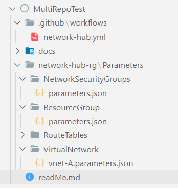
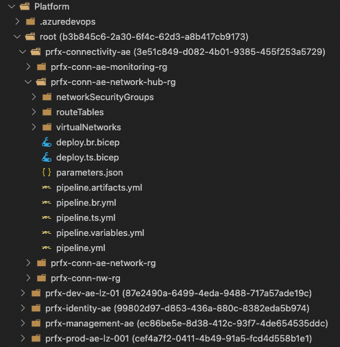

This section shows you how you can orchestrate a deployment using multiple resource modules.

> **Note:** In the below examples, we assume you leverage Bicep as your primary DSL (domain specific language).

---

### _Navigation_

- [Upstream workloads](#upstream-workloads)
- [Orchestration overview](#orchestration-overview)
  - [Publish-location considerations](#publish-location-considerations)
    - [Outline](#outline)
    - [Comparison](#comparison)
- [Template-orchestration](#template-orchestration)
  - [To be considered](#to-be-considered)
  - [Local files](#local-files)
  - [Bicep Registry](#bicep-registry)
  - [Template Specs](#template-specs)
- [Pipeline-orchestration](#pipeline-orchestration)
  - [GitHub Samples](#github-samples)
    - [Using Multi-repository](#using-github-multi-repository-approach)
  - [Azure DevOps Samples](#azure-devops-samples)
    - [Using Multi-repository](#using-azure-devops-multi-repository-approach)
    - [Using Azure Artifacts](#using-azure-devops-artifacts)
- [General solution creation](#general-solution-creation)

---

# Upstream workloads

There are several open-source repositories that leverage the CARML library today. Alongside the examples, we provide you with below, the referenced repositories are a good reference on how you can leverage CARML for larger solutions.

| Repository | Description |
| - | - |
| [AVD Accelerator](https://github.com/Azure/avdaccelerator) | AVD Accelerator deployment automation to simplify the setup of AVD (Azure Virtual Desktop) |
| [AKS Baseline Automation](https://github.com/Azure/aks-baseline-automation) | Repository for the AKS Landing Zone Accelerator program's Automation reference implementation |
| [DevOps Self-Hosted](https://github.com/Azure/DevOps-Self-Hosted) | - Create & maintain images with a pipeline using the Azure Image Builder service <p> - Deploy & maintain Azure DevOps Self-Hosted agent pools with a pipeline using Virtual Machine Scale Set |

# Orchestration overview

When it comes to deploying multi-module solutions (applications/workloads/environments/landing zone accelerators/etc.), we can differentiate two types of orchestration methods:

- **_Template-orchestration_**: These types of deployments reference individual modules from a 'main' Bicep or ARM/JSON template and use the capabilities of this template to pass parameters & orchestrate the deployments. By default, deployments are run in parallel by the Azure Resource Manager, while accounting for all dependencies defined. With this approach, the deploying pipeline only needs one deployment job that triggers the template's deployment.

   

    _Advantages_
    - The deployment of resources in parallel is handled by Azure which means it is generally faster
    - Passing information in between resource deployments is handled inside a single deployment
    - The pipeline remains relatively simple as most complexity is handled by the resource template </p>

    _Limitations_
    - As per Azure [template limits](https://learn.microsoft.com/en-us/azure/azure-resource-manager/management/azure-subscription-service-limits#template-limits), the compiled (i.e., ARM/JSON) resource template file size may not exceed 4 MB in size. This limitation is more likely to be encountered in a template orchestrated approach.
    - As per Azure [template limits](https://learn.microsoft.com/en-us/azure/azure-resource-manager/management/azure-subscription-service-limits#template-limits), it is not possible to perform more than 800 deployments using a single resource template. This limitation is more likely to be encountered in a template orchestrated approach.
    - Not all deployments can be done using the resource template, or only using workarounds (for example, the upload of files, the deployment of AAD resources, etc.)
    - The deploying principal must have permissions of all resource deployments that are part of the resource template

</p>

- **_Pipeline-orchestration_**: This approach uses the platform specific pipeline capabilities (for example, pipeline jobs) to trigger the deployment of individual modules, where each job deploys one module. By defining dependencies in between jobs you can make sure your resources are deployed in order. Parallelization is achieved by using a pool of pipeline agents that run the jobs, while accounting for all dependencies defined.

   

    _Advantages_
    - The deployment of an individual resource is very simple
    - Most CI/CD systems provide you with a visual representation of the deployment flow
    - If deployments fail, you can re-run them individually
    - The split into individual jobs make them easier to troubleshoot
    - Different deployment jobs can use different principals </p>

    _Limitations_
    - Each deployment needs its own job, and in turn its own agent. As a consequence, parallel resource deployments require multiple agents.
    - Passing information from one deployment to another requires passing information from one agent to another
    - As each agent job has to start up and check out the code first, it generally runs slower

</p>

Both the _template-orchestration_, as well as _pipeline-orchestration_ may run a validation and subsequent deployment in the same _Azure_ subscription. This subscription should be the subscription where you want to host your production solution. However, you can extend the concept and for example, deploy the solution first to an integration and then a production subscription.

## Publish-location considerations

For your solution, it is recommended to reference modules from a published location, to leverage versioning and avoid the risk of breaking changes.

CARML supports publishing to different locations, either through the use of the CI environment or by locally running the same scripts leveraged by the publishing step of the CI environment pipeline, as explained next.

In either case, you may effectively decide to configure only a subset of publishing locations as per your requirements.

To help you with the decision, the following content provides you with an overview of the possibilities of each target location.

### Outline
- **Template Specs**<p>
  A [Template Spec](https://learn.microsoft.com/en-us/azure/azure-resource-manager/templates/template-specs?tabs=azure-powershell) is an Azure resource with the purpose of storing & referencing Azure Resource Manager (ARM) templates. <p>
  When publishing Bicep modules as Template Specs, the module is compiled - and the resulting ARM template is uploaded as a Template Spec resource version to a Resource Group of your choice.
  For deployment, it is recommended to apply a [template-orchestrated](#Orchestration-overview) approach. As Bicep supports the Template-Specs as linked templates, this approach enables you to fully utilize Azure's parallel deployment capabilities.
  > **Note:** Even though the published resource is an ARM template, you can reference it in you Bicep template as a remote module like it would be native Bicep.
  > **Note:** Template Spec names have a maximum of 90 characters

- **Bicep Registry**<p>
  A [Bicep Registry](https://learn.microsoft.com/en-us/azure/azure-resource-manager/bicep/private-module-registry) is an Azure Container Registry that can be used to store & reference Bicep modules.<p>
  For deployment, it is recommended to apply a [template-orchestrated](#Orchestration-overview) approach. As Bicep supports the Bicep registry as linked templates, this approach enables you to fully utilize Azure's parallel deployment capabilities.

- **Azure DevOps Universal Packages**<p>
  A [Universal Package](https://learn.microsoft.com/en-us/azure/devops/artifacts/quickstarts/universal-packages) is a packaged folder in an Azure DevOps artifact feed.<p>
  As such, it contains the content of a CARML module 'as-is', including the template file(s), ReadMe file(s) and test file(s). <p>
  For deployment, it is recommended to use Universal Packages only for a [pipeline-orchestrated](#Orchestration-overview) approach - i.e., each job would download a single package and deploy it. <p>
  Technically, it would be possible to also use Universal Packages for the template-orchestrated approach, by downloading all packages into a specific location first, and then reference them. Given the indirect nature of this approach, this is however not recommended. (:large_orange_diamond:)
  > **Note:** Azure DevOps Universal Packages enforce _semver_. As such, it is not possible to overwrite an existing version.

### Comparison

The following table provides you with a comparison of the locations described above:

| Category | Feature | Template Specs | Bicep Registry | Universal Packages |
| - | - | - | - | - |
| Portal/UI |
| | Template can be viewed |:white_check_mark: | | |
| | Template can be downloaded | | | |
| |
| Deployment |
| | Supports [template-orchestration](./Solution%20creation#Orchestration-overview) | :white_check_mark: | :white_check_mark: | :large_orange_diamond: |
| | Supports [pipeline-orchestration](./Solution%20creation#Orchestration-overview) | :white_check_mark: | :white_check_mark: | :white_check_mark:  |
| | Supports single endpoint | | :white_check_mark: | :white_check_mark: |
| |
| Other |
| | Template can be downloaded/restored via CLI | :white_check_mark: | :white_check_mark: | :white_check_mark: |
| | Allows referencing latest [minor](./The%20CI%20environment%20-%20Publishing#how-it-works) | :white_check_mark: | :white_check_mark: | |
| | Allows referencing latest [major](./The%20CI%20environment%20-%20Publishing#how-it-works) | :white_check_mark: | :white_check_mark: | :white_check_mark: |

# Template-orchestration

The _template-orchestrated_ approach means using a _main_ or so-called _master template_ for deploying resources in Azure. This template will only contain nested deployments, where the modules - instead of directly embedding their content into the _master template_ - will be referenced by the _master template_.

With this approach, modules need to be stored in an available location, where the Azure Resource Manager (ARM) can access them. This can be achieved by storing the module templates in an accessible location like _local_, _Template Specs_ or the _Bicep Registry_.

In an enterprise environment, the recommended approach is to store these _master templates_ in a private environment, only accessible by enterprise resources. Thus, only trusted authorities can have access to these files.

## To be considered

Once you start building a solution using this library, you may wonder how best to start. Following, you can find some points that can accelerate your experience:

- Use the [VS-Code extension](https://marketplace.visualstudio.com/items?itemName=ms-azuretools.vscode-bicep) for Bicep to enable DSL-native features such as auto-complete. Metadata implemented in the modules are automatically loaded through the extension.
- Use the readme
  - If you don't know how to use an object/array parameter, you can check if the module's ReadMe file specifies any 'Parameter Usage' block for the given parameter ([example](https://github.com/Azure/ResourceModules/blob/main/modules/analysis-services/server/README.md#parameter-usage-tags)) - or - check the module's `Deployment Examples` ([example](https://github.com/Azure/ResourceModules/blob/main/modules/analysis-services/server/README.md#deployment-examples)).
  - In general, take note of the `Deployment Examples` specified in each module's ReadMe file, as they provide you with rich & tested examples of how a given module can be deployed ([example](https://github.com/Azure/ResourceModules/blob/main/modules/analysis-services/server/README.md#deployment-examples)). An easy way to get started is to copy one of the examples and then adjust it to your needs.
- Note the outputs that are returned by each module.
  - If an output you need isn't available, you have 2 choices:
    1. Add the missing output to the module
    1. Reference the deployed resource using the `existing` keyword (Note: You cannot reference the same resource as both a new deployment & `existing`. To make this work, you have to move the `existing` reference into it's own `.bicep` file).

<details>
<summary>Referencing <b>local files</b></summary>

## Local files

The following example shows how you could orchestrate a deployment of multiple resources using local module references. In this example, we will deploy a resource group with a Network Security Group (NSG), and use them in a subsequent VNET deployment.

```bicep
targetScope = 'subscription'

// ================ //
// Input Parameters //
// ================ //

// RG parameters
@description('Optional. The name of the resource group to deploy')
param resourceGroupName string = 'validation-rg'

@description('Optional. The location to deploy into')
param location string = deployment().location

// =========== //
// Deployments //
// =========== //

// Resource Group
module rg 'modules/resources/resource-group/main.bicep' = {
  name: 'registry-rg'
  params: {
    name: resourceGroupName
    location: location
  }
}

// Network Security Group
module nsg 'modules/network/network-security-group/main.bicep' = {
  name: 'registry-nsg'
  scope: resourceGroup(resourceGroupName)
  params: {
    name: 'defaultNsg'
  }
  dependsOn: [
    rg
  ]
}

// Virtual Network
module vnet 'modules/network/virtual-network/main.bicep' = {
  name: 'registry-vnet'
  scope: resourceGroup(resourceGroupName)
  params: {
    name: 'defaultVNET'
    addressPrefixes: [
      '10.0.0.0/16'
    ]
    subnets: [
      {
        name: 'PrimarySubnet'
        addressPrefix: '10.0.0.0/24'
        networkSecurityGroupName: nsg.name
      }
      {
        name: 'SecondarySubnet'
        addressPrefix: '10.0.1.0/24'
        networkSecurityGroupName: nsg.name
      }
    ]
  }
}
```

</details>

<details>
<summary>Referencing a <b>Bicep Registry</b></summary>

## Bicep Registry

The following sample shows how you could orchestrate a deployment of multiple resources using modules from a private Bicep Registry. In this example, we will deploy a resource group with a Network Security Group (NSG), and use them in a subsequent VNET deployment.

> **Note**: the preferred method to publish modules to the Bicep registry is to leverage the [CI environment](./The%20CI%20environment) provided in this repository. However, this option may not be applicable to all scenarios (ref e.g., the [Consume library](./Getting%20started%20-%20Scenario%201%20Consume%20library) section). As an alternative, the same [`Publish-ModuleToPrivateBicepRegistry.ps1`](https://github.com/Azure/ResourceModules/blob/main/utilities/pipelines/resourcePublish/Publish-ModuleToPrivateBicepRegistry.ps1) script leveraged by the publishing step of the CI environment pipeline can also be run locally.

```bicep
targetScope = 'subscription'

// ================ //
// Input Parameters //
// ================ //

// RG parameters
@description('Optional. The name of the resource group to deploy')
param resourceGroupName string = 'validation-rg'

@description('Optional. The location to deploy into')
param location string = deployment().location

// =========== //
// Deployments //
// =========== //

// Resource Group
module rg 'br/modules:resources.resource-group:1.0.0' = {
  name: 'registry-rg'
  params: {
    name: resourceGroupName
    location: location
  }
}

// Network Security Group
module nsg 'br/modules:network.network-security-group:1.0.0' = {
  name: 'registry-nsg'
  scope: resourceGroup(resourceGroupName)
  params: {
    name: 'defaultNsg'
  }
  dependsOn: [
    rg
  ]
}

// Virtual Network
module vnet 'br/modules:network.virtual-network:1.0.0' = {
  name: 'registry-vnet'
  scope: resourceGroup(resourceGroupName)
  params: {
    name: 'defaultVNET'
    addressPrefixes: [
      '10.0.0.0/16'
    ]
    subnets: [
      {
        name: 'PrimarySubnet'
        addressPrefix: '10.0.0.0/24'
        networkSecurityGroupName: nsg.name
      }
      {
        name: 'SecondarySubnet'
        addressPrefix: '10.0.1.0/24'
        networkSecurityGroupName: nsg.name
      }
    ]
  }
}
```

The example assumes you are using a [`bicepconfig.json`](https://learn.microsoft.com/en-us/azure/azure-resource-manager/bicep/bicep-config) configuration file like:

```json
{
    "moduleAliases": {
        "br": {
            "modules": {
                "registry": "<registryName>.azurecr.io",
                "modulePath": "bicep/modules"
            }
        }
    }
}
```

</details>

<details>
<summary>Referencing <b>Template-Specs</b></summary>

## Template Specs

The following example shows how you could orchestrate a deployment of multiple resources using template specs. In this example, we will deploy a resource group with a Network Security Group (NSG), and use them in a subsequent VNET deployment.

> **Note**: the preferred method to publish modules to template-specs is to leverage the [CI environment](./The%20CI%20environment) provided in this repository. However, this option may not be applicable to all scenarios (ref e.g., the [Consume library](./Getting%20started%20-%20Scenario%201%20Consume%20library) section). As an alternative, the same [Publish-ModuleToTemplateSpecsRG.ps1](https://github.com/Azure/ResourceModules/blob/main/utilities/pipelines/resourcePublish/Publish-ModuleToTemplateSpecsRG.ps1) script leveraged by the publishing step of the CI environment pipeline can also be run locally.

```bicep
targetScope = 'subscription'

// ================ //
// Input Parameters //
// ================ //

// RG parameters
@description('Optional. The name of the resource group to deploy')
param resourceGroupName string = 'validation-rg'

@description('Optional. The location to deploy into')
param location string = deployment().location

// =========== //
// Deployments //
// =========== //

// Resource Group
module rg 'ts/modules:resources.resource-group:1.0.0' = {
  name: 'registry-rg'
  params: {
    name: resourceGroupName
    location: location
  }
}

// Network Security Group
module nsg 'ts/modules:network.network-security-group:1.0.0' = {
  name: 'registry-nsg'
  scope: resourceGroup(resourceGroupName)
  params: {
    name: 'defaultNsg'
  }
  dependsOn: [
    rg
  ]
}

// Virtual Network
module vnet 'ts/modules:network.virtual-network:1.0.0' = {
  name: 'registry-vnet'
  scope: resourceGroup(resourceGroupName)
  params: {
    name: 'defaultVNET'
    addressPrefixes: [
      '10.0.0.0/16'
    ]
    subnets: [
      {
        name: 'PrimarySubnet'
        addressPrefix: '10.0.0.0/24'
        networkSecurityGroupName: nsg.name
      }
      {
        name: 'SecondarySubnet'
        addressPrefix: '10.0.1.0/24'
        networkSecurityGroupName: nsg.name
      }
    ]
  }
}
```

The example assumes you are using a [`bicepconfig.json`](https://learn.microsoft.com/en-us/azure/azure-resource-manager/bicep/bicep-config) configuration file like:

```json
{
    "moduleAliases": {
        "ts": {
            "modules": {
                "subscription": "[[subscriptionId]]",
                "resourceGroup": "artifacts-rg"
            }
        }
    }
}
```

</details>
<p>

# Pipeline-orchestration

The modules provided in this repo can be orchestrated to create more complex infrastructures, and as such, reusable solutions or products. To deploy resources, the pipeline-orchestration approach leverages the modules & pipeline templates of the 'ResourceModules' repository. Each pipeline job deploys one instance of a resource and the order of resources deployed in a multi-module solution is controlled by specifying dependencies in the pipeline itself.

## GitHub Samples

Below, you can find samples which can be used to orchestrate deployments in GitHub.

<details>
<summary>Using <b>Multi-repository approach</b></summary>

### Using GitHub Multi-repository approach

Below, you can find an example which makes use of multiple repositories to orchestrate the deployment (also known as a _multi-repository_ approach) in GitHub.

It fetches the _public_ **Azure/ResourceModules** repo for consuming bicep modules and uses the parameter files present in the _private_ **Contoso/MultiRepoTest** repo for deploying infrastructure.

The example executes one job that creates a Resource group, an NSG and a VNet.

It does so by performing the following tasks
1. Checkout 'Azure/ResourceModules' repo at root of the agent
1. Set environment for the agent
1. Checkout 'contoso/MultiRepoTest' repo containing the parameter files in a nested folder - "MultiRepoTestParentFolder"
1. Deploy resource group in target Azure subscription
1. Deploy network security group
1. Deploy virtual network

<h3>Example</h3>




```YAML
name: 'Multi-Repo solution deployment'

on:
  push:
    branches:
      - main
    paths:
      - 'network-hub-rg/Parameters/**'
      - '.github/workflows/network-hub.yml'

env:
  AZURE_CREDENTIALS: ${{ secrets.AZURE_CREDENTIALS }}
  removeDeployment: false
  variablesPath: 'settings.yml'

jobs:
  job_deploy_multi_repo_solution:
    runs-on: ubuntu-20.04
    name: 'Deploy multi-repo solution'
    steps:
      - name: 'Checkout ResourceModules repo at the root location'
        uses: actions/checkout@v4
        with:
          repository: 'Azure/ResourceModules'
          fetch-depth: 0

     - name: Set environment
        uses: ./.github/actions/templates/setEnvironment
        with:
          variablesPath: ${{ env.variablesPath }}

      - name: 'Checkout MultiRepoTest repo in a nested MultiRepoTestParentFolder'
        uses: actions/checkout@v4
        with:
          repository: 'contoso/MultiRepoTest'
          fetch-depth: 0
          path: 'MultiRepoTestParentFolder'

      - name: 'Deploy resource group'
        uses: ./.github/actions/templates/validateModuleDeployment
        with:
          templateFilePath: './modules/resources/resource-group/main.bicep'
          parameterFilePath: './MultiRepoTestParentFolder/network-hub-rg/Parameters/resource-group/parameters.json'
          location: '${{ env.defaultLocation }}'
          resourceGroupName: '${{ env.resourceGroupName }}'
          subscriptionId: '${{ secrets.ARM_SUBSCRIPTION_ID }}'
          managementGroupId: '${{ secrets.ARM_MGMTGROUP_ID }}'
          removeDeployment: $(removeDeployment)

      - name: 'Deploy network security group'
        uses: ./.github/actions/templates/validateModuleDeployment
        with:
          templateFilePath: './modules/network/network-security-group/main.bicep'
          parameterFilePath: './MultiRepoTestParentFolder/network-hub-rg/Parameters/network-security-group/parameters.json'
          location: '${{ env.defaultLocation }}'
          resourceGroupName: '${{ env.resourceGroupName }}'
          subscriptionId: '${{ secrets.ARM_SUBSCRIPTION_ID }}'
          managementGroupId: '${{ secrets.ARM_MGMTGROUP_ID }}'
          removeDeployment: $(removeDeployment)

      - name: 'Deploy virtual network A'
        uses: ./.github/actions/templates/validateModuleDeployment
        with:
          templateFilePath: './modules/network/virtual-network/main.bicep'
          parameterFilePath: './MultiRepoTestParentFolder/network-hub-rg/Parameters/virtual-network/vnet-A.parameters.json'
          location: '${{ env.defaultLocation }}'
          resourceGroupName: '${{ env.resourceGroupName }}'
          subscriptionId: '${{ secrets.ARM_SUBSCRIPTION_ID }}'
          managementGroupId: '${{ secrets.ARM_MGMTGROUP_ID }}'
          removeDeployment: $(removeDeployment)
```

> 1. 'Azure/ResourceModules' repo has been checked out at the root location intentionally because GitHub Actions expect the underlying utility scripts and variables at a specific location.
> 1. 'contoso/MultiRepoTest' repo has been checked out in a nested folder, called  "MultiRepoTestParentFolder", to distinguish it from the folders of the other repo in the agent, but can also be downloaded at the root location if desired.

</details>


## Azure DevOps Samples

Below, you can find samples which can be used to orchestrate deployments in Azure DevOps.

<details>
<summary>Using <b>Multi-repository approach</b></summary>

### Using Azure DevOps Multi-repository approach

Below, you can find an example which makes use of multiple repositories to orchestrate the deployment (also known as a _multi-repository_ approach) in Azure DevOps.

> **Note:** The sample is using a modified and standalone version of `pipeline.deploy.yml` which can be found with working examples [here](https://github.com/segraef/Platform/blob/main/.azuredevops/pipelineTemplates/jobs.solution.deploy.yml) (`/.azuredevops/pipelineTemplates/jobs.solution.deploy.yml`) which is capable of consuming Modules via any publishing option you prefer. <br>
> The Pipelines are stored in GitHub and use a GitHub service connection endpoint and hence get triggered externally. This is out of pure convenience and can also be stored on Azure Repos directly and be triggered in the same way. <br>
> The full source can be found here as a reference: [Litware/Platform](https://github.com/segraef/Platform/).

Each deployment is its own pipeline job. This means, when triggered, each job performs the following actions:
1. Fetching the _public_ **Azure/ResourceModules** repository for consuming Module into a nested folder `ResourceModules` of the main **Litware/Platform** repository (which in turn contains all parameters files to be used for deployments)
1. Checkout 'Litware/Platform' repository containing the parameter files in a nested folder - `Platform`
1. Deploy resources in target Azure subscription

Using these steps it creates a Resource Group, a Network Security Group, a Route Table and a Virtual Network.

<h3>Example</h3>



> <b>Note:</b> This repository structure mimics a Platform deployment aligned to a resource group structure like in [AzOps](https://github.com/Azure/AzOps#output). For the following samples the resource group `prfx-conn-ae-network-hub-rg` is used.

```YAML
name: 'prfx-conn-ae-network-hub-rg'

variables:
  - template: /settings.yml
  - template: pipeline.variables.yml

resources:
  repositories:
  - repository: modules
    name: Azure/ResourceModules
    endpoint: customCARMLConnection
    type: github

stages:
  - stage:
    displayName: Deploy
    jobs:
      - template: /.azuredevops/pipelineTemplates/jobs.solution.deploy.yml
        parameters:
          jobName: resource-group
          displayName: 'Resource Group'
          modulePath: '/modules/resources/resource-group/main.bicep'
          moduleTestFilePath: '$(resourceGroupName)/parameters.json'
          checkoutRepositories:
            - modules
      - template: /.azuredevops/pipelineTemplates/jobs.solution.deploy.yml
        parameters:
          jobName: network-security-group
          displayName: 'Network Security Groups'
          modulePath: '/modules/network/network-security-group/main.bicep'
          moduleTestFilePath: '$(resourceGroupName)/network-security-group/parameters.json'
          checkoutRepositories:
            - modules
      - template: /.azuredevops/pipelineTemplates/jobs.solution.deploy.yml
        parameters:
          jobName: route-table
          displayName: 'Route Tables'
          modulePath: '/modules/network/route-table/main.bicep'
          moduleTestFilePath: '$(resourceGroupName)/route-table/parameters.json'
          checkoutRepositories:
            - modules
      - template: /.azuredevops/pipelineTemplates/jobs.solution.deploy.yml
        parameters:
          jobName: virtual-network
          displayName: 'Virtual Networks'
          modulePath: '/modules/network/virtual-network/main.bicep'
          moduleTestFilePath: '$(resourceGroupName)/virtual-network/parameters.json'
          checkoutRepositories:
            - modules
          dependsOn:
            - network-security-group
            - route-table
```

> 1. `Azure/ResourceModules` repo has been checked out in a nested folder called `ResourceModules` (unlike in the above mentioned GitHub sample workflow and due to restrictions in order to support all publishing options in ADO.)
> 1. `Litware/Platform` repo has been checked out in a nested folder, called `Platform`, to distinguish it from the folders of the other repo in the agent, and in order to support multiple repositories.

</details>

<details>
<summary>Using <b>Azure Artifacts</b></summary>

### Using Azure DevOps Artifacts

The below example using _Azure DevOps Artifacts_ assumes that each CARML module was published as an Universal Package into the Azure DevOps organization ahead of time.

Each step in the pipeline has to carry out the same 2 tasks:
1. Download the artifact (based on the inputs, which artifact)
1. Deploy the artifact using a provided parameter file

As these 2 steps always remain the same, no matter the deployment, they are abstracted into the below 'Helper Template'.

The 'Main Template' after then references this template 3 times to deploy
- A 'Resource Group'
- A 'Network Security Group'
- A 'Virtual Network'

<details>
<summary>Helper Template(s)</summary>

```YAML
# Helper Template 'pipeline.jobs.artifact.deploy.yml'
parameters:
  moduleName:
  moduleVersion:
  parameterFilePath:
  dependsOn: []
  artifactFeedPath: '$(System.Teamproject)/ContosoFeed'
  serviceConnection: 'My-ServiceConnection'
  location: 'WestEurope'
  resourceGroupName: 'My-ResourceGroup'
  managementGroupId: '11111111-1111-1111-1111-111111111111'
  displayName: 'Deploy module'

jobs:
- job: ${{ replace( parameters.displayName, ' ', '_') }}
  displayName: ${{ parameters.displayName }}
  ${{ if ne( parameters.dependsOn, '') }}:
    dependsOn: ${{ parameters.dependsOn }}
  pool:
    vmImage: 'ubuntu-latest'
  steps:
  - powershell: |
      $lowerModuleName = "${{ parameters.moduleName }}".ToLower()
      Write-Host "##vso[task.setVariable variable=lowerModuleName]$lowerModuleName"
    displayName: 'Prepare download from artifacts feed'

  - task: UniversalPackages@0
    displayName: 'Download module [${{ parameters.moduleName }}] version [${{ parameters.moduleVersion }}] from feed [${{ parameters.artifactFeedPath }}]'
    inputs:
      command: download
      vstsFeed: '${{ parameters.artifactFeedPath }}'
      vstsFeedPackage: '$(lowerModuleName)'
      vstsPackageVersion: '${{ parameters.moduleVersion }}'
      downloadDirectory: '$(downloadDirectory)'

  - task: AzurePowerShell@4
    displayName: 'Deploy module [${{ parameters.moduleName }}] version [${{ parameters.moduleVersion }}] in [${{ parameters.resourcegroupname }}] via [${{ parameters.serviceConnection }}]'
    name: DeployResource
    inputs:
      azureSubscription: ${{ parameters.serviceConnection }}
      errorActionPreference: stop
      azurePowerShellVersion: LatestVersion
      ScriptType: InlineScript
      inline: |
        # Load used functions
        . (Join-Path '$(ENVSOURCEDIRECTORY)' '$(pipelineFunctionsPath)' 'resourceDeployment' 'New-TemplateDeployment.ps1')

        $functionInput = @{
            templateFilePath     = Join-Path "$(downloadDirectory)/${{ parameters.moduleName }}" 'main.bicep'
            parameterFilePath    = "$(Build.SourcesDirectory)/$(environmentPath)/Parameters/${{ parameters.parameterFilePath }}"
            location             = '${{ parameters.location }}'
            resourceGroupName    = '${{ parameters.resourceGroupName }}'
            subscriptionId       = '${{ parameters.subscriptionId }}'
            managementGroupId    = '${{ parameters.managementGroupId }}'
            additionalParameters = @{}
        }
        New-TemplateDeployment @functionInput -Verbose
```

</details>

<details>
<summary>Main Template</summary>

```YAML
name: 'Pipeline-Orchestration with Artifacts'

variables:
  - template: pipeline.variables.yml

jobs:
- template: pipeline.jobs.artifact.deploy.yml
  parameters:
    displayName: 'Deploy Resource Group'
    moduleName: 'resource-group'
    moduleVersion: '1.0.0'
    parameterFilePath: 'resource-group/parameters.json'

- template: pipeline.jobs.artifact.deploy.yml
  parameters:
    displayName: 'Deploy Network Security Group'
    moduleName: 'network-security-group'
    moduleVersion: '1.0.0'
    parameterFilePath: 'network-security-group/parameters.json'
    dependsOn:
    - Deploy_Resource_Group

- template: pipeline.jobs.artifact.deploy.yml
  parameters:
    displayName: 'Deploy Virtual Network'
    moduleName: 'virtual-network'
    moduleVersion: '1.0.0'
    parameterFilePath: 'virtual-network/parameters.json'
    dependsOn:
    - Deploy_Resource_Group
```

</details>
</details>
</p>

# General solution creation

When creating a solution that leverages CARML modules, there are several aspects to consider. This sub-section intends to provide you with a rough step-by-step guide to get you started.

1. Identify the resources & deployment scope needed for your architecture

    If you want to create your solution, you should first gain an understanding of the planned architecture and the resulting required services. For this and the subsequent steps, let's consider the following scenario:

    - You want to deploy a Virtual Machine that is able to connect privately to a storage account
    - For this architecture you may use the following services
      - 1 Resource Group to place your resources in
      - 1 Network Security Group to allow traffic control for your subnets
      - 1 Virtual Network with 2 subnets
      - 1 Storage Account with 1 Private Endpoint that connects into the 1st Virtual Network Subnet
      - 1 Virtual Machine that is deployed into the 2nd Virtual Network subnet

    Also, you need to consider the scope you want to deploy into. In the above example, we want to deploy a Resource Group, which must be deployed into a Subscription scope. All other resources, in turn can be deployed into the resource group scope of that resource group.

    <p>

1. Identify dependencies between them

    Next, you need to know in which order you need to deploy those resources. For example, as all resources must be placed in a resource group, the resource group must be deployed first. Likewise, before you can deploy a Virtual Machine, you first need to create a Virtual Network. All together this may look like

      ```mermaid
      graph LR;
      rg[Resource Group]
      vnet[Virtual Network]
      st[Storage Account]
      pe[Private Endpoint]
      vm[Virtual Machine]
      nsg[Network Security Group]


      rg --> vnet
      rg --> st
      rg --> vm
      rg --> nsg
      vnet --> pe
      st --> pe
      nsg --> vnet
      vnet --> vm
      ```

1. Consider orchestration options

    With the services & dependencies identified, the next question is, how those dependencies can be implemented. As described in the [Orchestration Overview](#orchestration-overview) sub-section, this is primarily a decision about 'pipeline-orchestration' vs. 'template-orchestration' - and in case of the latter, if there are any steps that have to run in the pipeline regardless (for example an upload of files).

    Generally speaking, both approaches are valid, though we would recommend to use template-orchestration as much as possible and only implement logic in the pipelines if absolutely necessary.

    The previously introduced scenario could be implemented either way.

1. Choose publishing

    Building on the previous step, you must also consider where you consume the resources from, i.e. if you use native Bicep, or published modules from either a Bicep registry, Template Specs, or Azure DevOps universal packages. The characteristics of each option is outlined in the corresponding [sub-section](#publish-location-considerations).

1. Implement you solution

    Finally, you can start building your solution. As peviously started, the chosen orchestration option & source of your code will haeavily impact the design of your solution. To help you along the way, you can use both the [template-orchestration](#template-orchestration) and [pipeline-orchestration](#pipeline-orchestration) sections to draw inspiration from.

    However, there are also some general guidelines you can leverage in either case:
    - When using CARML modules, make sure you not only check out each module's readme, but also its test cases (`./test/`) to gain an understanding how the module can be used and how certain parameters work. For example, if you want to deploy Customer-Managed-Keys for a service like an Automation Account using the corresponding CARML module, it's `encr` test case provides you also with insights into the required permissions and dependent resources.
    - If a feature or module is not part of the library nothing prevents you from adding it - or - implementing native Bicep code to complement your solution.
    - You can build 'constructs' from CARML modules that deploy a common set of resources and in turn leverage them to build even bigger solutions with minimal code.
    - Leverage capabilities such as `-WhatIf` deployments to get an understanding of the designated changes before you apply them
    - Also consider to use `staging` in your pipelines to test your solutions in a safe environment first, before you eventually roll them out to production.

1. Deploy the solution

    Last but not least, you only have to deploy you solution. As started in the [Orchestration Overview](#orchestration-overview) sub-section, be vary of the requirements of each correspoinding deployment approach.
