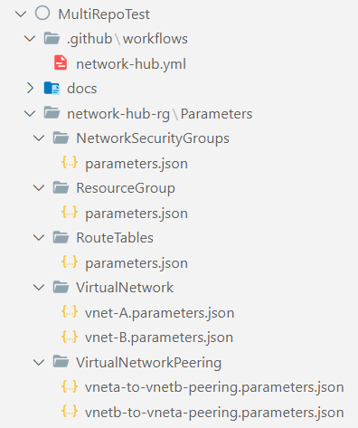

This section shows you how you can orchestrate a deployment using multiple resource modules.

> **Note:** For the sake of any of the below examples, we assume you leverage Bicep as your primary DSL.

---

### _Navigation_

- [Upstream workloads](#upstream-workloads)
- [Orchestration overview](#orchestration-overview)
- [Template-orchestration](#template-orchestration)
  - [How to start](#how-to-start)
  - [Examples](#examples)
- [Pipeline-orchestration](#pipeline-orchestration)
    - [Summary](#summary)
    - [Repo structure](#repo-structure)
    - [YAML pipeline](#yaml-pipeline)
    - [Notes](#notes)

---

# Upstream workloads

There are several open-source repositories that leverage the CARML library today. Alongside the examples, we provide you with below, the referenced repositories are a good reference on how you can leverage CARML for larger solutions.

| Repository | Description |
| - | - |
| [AVD Accelerator](https://github.com/Azure/avdaccelerator) | AVD Accelerator deployment automation to simplify the setup of AVD (Azure Virtual Desktop) |
| [AKS Baseline Automation](https://github.com/Azure/aks-baseline-automation) | Repository for the AKS Landing Zone Accelerator program's Automation reference implementation |
| [DevOps Self-Hosted](https://github.com/Azure/DevOps-Self-Hosted) | - Create & maintain images with a pipeline using the Azure Image Builder service <p> - Deploy & maintain Azure DevOps Self-Hosted agent pools with a pipeline using Virtual Machine Scale Set|

# Orchestration overview

When it comes to environment deployment leveraging modules, we can differentiate two different orchestrations:

 - **_Template-orchestration_**: These types of deployments reference individual modules from a 'main/environment' Bicep or ARM/JSON template and use its capabilities to pass parameters & orchestrate the deployments. By default, deployments are run in parallel by the Azure Resource Manager while accounting for all dependencies defined. Furthermore, the deploying pipeline only needs one deployment job that triggers the template's deployment.

   

 - **_Pipeline-orchestration_**: This approach uses the platform specific pipeline capabilities (for example, pipeline jobs) to trigger the deployment of individual modules, where each job deploys one module. By defining dependencies in between jobs you can make sure your resources are deployed in order. Parallelization is achieved by using a pool of pipeline agents that run the jobs, while accounting for all dependencies defined.
Both the _template-orchestration_ as well as _pipeline-orchestration_ may run a validation and subsequent deployment on the bottom-right _Azure_ subscription. This subscription, in turn, should be the subscription where you want to host your environment. However, you can extend the concept and for example, deploy the environment first to an integration and then a production subscription.

   

# Template-orchestration

The _template-orchestrated_ approach means using a _main_ or so-called _master template_ for deploying resources in Azure. This template will only contain nested deployments, where the modules - instead of embedding their content into the _master template_ - will be referenced by the _master template_.

With this approach, modules need to be stored in an available location, where the Azure Resource Manager (ARM) can access them. This can be achieved by storing the modules templates in an accessible location like _local_, _Template Specs_ or the _Bicep Registry_.

In an enterprise environment, the recommended approach is to store these templates in a private environment, only accessible by enterprise resources. Thus, only trusted authorities can have access to these files.

## How to start

Once you start building a solution using this library you may wonder how best to start. Following you can find some points that can accelerate your experience:

- Use the [VS-Code extension](https://marketplace.visualstudio.com/items?itemName=ms-azuretools.vscode-bicep) for Bicep to enable DSL-native features such as auto-complete. Metadata implemented in the modules are automatically loaded through the extension.
- Use the readme
  - If you don't know how to use an object/array parameter you can check if the module's ReadMe file specifies any 'Parameter Usage' block for set parameter ([example](https://github.com/Azure/ResourceModules/blob/main/arm/Microsoft.AnalysisServices/servers/readme.md#parameter-usage-tags)) - or - check the module's `Deployment Examples` ([example](https://github.com/Azure/ResourceModules/blob/main/arm/Microsoft.AnalysisServices/servers/readme.md#deployment-examples)).
  - In general, take note of the `Deployment Examples` specified in each module's ReadMe file as they provide you with rich & tested examples of how set module can be deployed ([example](https://github.com/Azure/ResourceModules/blob/main/arm/Microsoft.AnalysisServices/servers/readme.md#deployment-examples)). An easy way to get started is to copy one of the examples and then adjust to it your needs.
- Note the outputs that are returned by each module.
  - If an output you need isn't available, you have 2 choices:
    1. Add the missing output to the module
    1. Reference the deployed resource using the `existing` keyword (Note: You cannot reference the same resource as both a new deployment & `existing`. To make this work, you have to move the `existing` reference into it's own `.bicep` file).

## Examples

<details>
<summary>Referencing <b>local files</b></summary>

The following example shows how you could orchestrate a deployment of multiple resources using local module references. In this example, we will deploy a resource group with a contained NSG and use the same in a subsequent VNET deployment.

```bicep
targetScope = 'subscription'

// ================ //
// Input Parameters //
// ================ //

// RG parameters
@description('Optional. The name of the resource group to deploy')
param resourceGroupName string = 'validation-rg'

@description('Optional. The location to deploy into')
param location string = deployment().location

// NSG parameters
@description('Optional. The name of the vnet to deploy')
param networkSecurityGroupName string = 'BicepRegistryDemoNsg'

// VNET parameters
@description('Optional. The name of the vnet to deploy')
param vnetName string = 'BicepRegistryDemoVnet'

@description('Optional. An Array of 1 or more IP Address Prefixes for the Virtual Network.')
param vNetAddressPrefixes array = [
  '10.0.0.0/16'
]

@description('Optional. An Array of subnets to deploy to the Virual Network.')
param subnets array = [
  {
    name: 'PrimarySubnet'
    addressPrefix: '10.0.0.0/24'
    networkSecurityGroupName: networkSecurityGroupName
  }
  {
    name: 'SecondarySubnet'
    addressPrefix: '10.0.1.0/24'
    networkSecurityGroupName: networkSecurityGroupName
  }
]

// =========== //
// Deployments //
// =========== //

// Resource Group
module rg '../arm/Microsoft.Resources/resourceGroups/deploy.bicep' = {
  name: 'registry-rg'
  params: {
    name: resourceGroupName
    location: location
  }
}

// Network Security Group
module nsg '../arm/Microsoft.Network/networkSecurityGroups/deploy.bicep' = {
  name: 'registry-nsg'
  scope: resourceGroup(resourceGroupName)
  params: {
    name: networkSecurityGroupName
  }
  dependsOn: [
    rg
  ]
}

// Virtual Network
module vnet '../arm/Microsoft.Network/virtualNetworks/deploy.bicep' = {
  name: 'registry-vnet'
  scope: resourceGroup(resourceGroupName)
  params: {
    name: vnetName
    addressPrefixes: vNetAddressPrefixes
    subnets: subnets
  }
  dependsOn: [
    nsg
    rg
  ]
}
```

</details>

<details>
<summary>Referencing a <b>Private Bicep Registry</b></summary>

The following example shows how you could orchestrate a deployment of multiple resources using modules from a private Bicep Registry. In this example, we will deploy a resource group with a contained NSG and use the same in a subsequent VNET deployment.

> **Note**: the preferred method to publish modules to the Bicep registry is to leverage the [CI environment](./The%20CI%20environment.md) provided in this repository. However, this option may not be applicable to all scenarios (ref e.g., the [Consume library](./Getting%20started%20-%20Scenario%202%20Consume%20library.md) section). As an alternative, the same [Publish-ModuleToPrivateBicepRegistry.ps1](https://github.com/Azure/ResourceModules/blob/main/utilities/pipelines/resourcePublish/Publish-ModuleToPrivateBicepRegistry.ps1) script leveraged by the publishing step of the CI environment pipeline can also be run locally.

```bicep
targetScope = 'subscription'

// ================ //
// Input Parameters //
// ================ //

// RG parameters
@description('Optional. The name of the resource group to deploy')
param resourceGroupName string = 'validation-rg'

@description('Optional. The location to deploy into')
param location string = deployment().location

// NSG parameters
@description('Optional. The name of the vnet to deploy')
param networkSecurityGroupName string = 'BicepRegistryDemoNsg'

// VNET parameters
@description('Optional. The name of the vnet to deploy')
param vnetName string = 'BicepRegistryDemoVnet'

@description('Optional. An Array of 1 or more IP Address Prefixes for the Virtual Network.')
param vNetAddressPrefixes array = [
  '10.0.0.0/16'
]

@description('Optional. An Array of subnets to deploy to the Virual Network.')
param subnets array = [
  {
    name: 'PrimarySubnet'
    addressPrefix: '10.0.0.0/24'
    networkSecurityGroupName: networkSecurityGroupName
  }
  {
    name: 'SecondarySubnet'
    addressPrefix: '10.0.1.0/24'
    networkSecurityGroupName: networkSecurityGroupName
  }
]

// =========== //
// Deployments //
// =========== //

// Resource Group
module rg 'br/modules:microsoft.resources.resourcegroups:0.4.735' = {
  name: 'registry-rg'
  params: {
    name: resourceGroupName
    location: location
  }
}

// Network Security Group
module nsg 'br/modules:microsoft.network.networksecuritygroups:0.4.735' = {
  name: 'registry-nsg'
  scope: resourceGroup(resourceGroupName)
  params: {
    name: networkSecurityGroupName
  }
  dependsOn: [
    rg
  ]
}

// Virtual Network
module vnet 'br/modules:microsoft.network.virtualnetworks:0.4.735' = {
  name: 'registry-vnet'
  scope: resourceGroup(resourceGroupName)
  params: {
    name: vnetName
    addressPrefixes: vNetAddressPrefixes
    subnets: subnets
  }
  dependsOn: [
    nsg
    rg
  ]
}
```

The example assumes you are using a [`bicepconfig.json`](https://docs.microsoft.com/en-us/azure/azure-resource-manager/bicep/bicep-config) configuration file like:

```json
{
    "moduleAliases": {
        "br": {
            "modules": {
                "registry": "<registryName>.azurecr.io",
                "modulePath": "bicep/modules"
            }
        }
    }
}
```

</details>

<details>
<summary>Referencing <b>Template-Specs</b></summary>

The following example shows how you could orchestrate a deployment of multiple resources using template specs. In this example, we will deploy a NSG and use the same in a subsequent VNET deployment.

> **Note**: the preferred method to publish modules to template-specs is to leverage the [CI environment](./The%20CI%20environment.md) provided in this repository. However, this option may not be applicable to all scenarios (ref e.g., the [Consume library](./Getting%20started%20-%20Scenario%202%20Consume%20library.md) section). As an alternative, the same [Publish-ModuleToTemplateSpec.ps1](https://github.com/Azure/ResourceModules/blob/main/utilities/pipelines/resourcePublish/Publish-ModuleToTemplateSpec.ps1) script leveraged by the publishing step of the CI environment pipeline can also be run locally.

```bicep
targetScope = 'subscription'

// ================ //
// Input Parameters //
// ================ //

// RG parameters
@description('Optional. The name of the resource group to deploy')
param resourceGroupName string = 'validation-rg'

@description('Optional. The location to deploy into')
param location string = deployment().location

// Network Security Group parameters
@description('Optional. The name of the vnet to deploy')
param networkSecurityGroupName string = 'TemplateSpecDemoNsg'

// Virtual Network parameters
@description('Optional. The name of the vnet to deploy')
param vnetName string = 'TemplateSpecDemoVnet'

@description('Optional. An Array of 1 or more IP Address Prefixes for the Virtual Network.')
param vNetAddressPrefixes array = [
  '10.0.0.0/16'
]

@description('Optional. An Array of subnets to deploy to the Virual Network.')
param subnets array = [
  {
    name: 'PrimarySubnet'
    addressPrefix: '10.0.0.0/24'
    networkSecurityGroupName: networkSecurityGroupName
  }
  {
    name: 'SecondarySubnet'
    addressPrefix: '10.0.1.0/24'
    networkSecurityGroupName: networkSecurityGroupName
  }
]

// =========== //
// Deployments //
// =========== //

// Resource Group
module rg 'ts/modules:microsoft.resources.resourcegroups:0.4.735' = {
  name: 'rgDeployment'
  params: {
    name: resourceGroupName
    location: location
  }
}

// Network Security Group
module nsg 'ts/modules:microsoft.network.networksecuritygroups:0.4.735' = {
  name: 'nsgDeployment'
  scope: resourceGroup(resourceGroupName)
  params: {
    name:  networkSecurityGroupName
  }
    dependsOn: [
    rg
  ]
}

// Virtual Network
module vnet 'ts/modules:microsoft.network.virtualnetworks:0.4.735' = {
  name: 'vnetDeployment'
  scope: resourceGroup(resourceGroupName)
  params: {
    name:  vnetName
    addressPrefixes: vNetAddressPrefixes
    subnets : subnets
  }
  dependsOn: [
    rg
    nsg
  ]
}
```

The example assumes you are using a [`bicepconfig.json`](https://docs.microsoft.com/en-us/azure/azure-resource-manager/bicep/bicep-config) configuration file like:

```json
{
    "moduleAliases": {
        "ts": {
            "modules": {
                "subscription": "<<subscriptionId>>",
                "resourceGroup": "artifacts-rg"
            }
        }
    }
}
```

</details>
<p>

# Pipeline-orchestration

The modules provided by this repo can be orchestrated to create more complex infrastructures and as such reusable solutions or products. This approach leverages the main 'ResourceModules' repository alongside its contained modules & pipeline templates to deploy resources. Each pipeline job deploys one instance of a resources and their order is controlled by specifying dependencies in the pipeline itself.

<details>
<summary>GitHub Sample solution for <b>multi-repository approach</b></summary>

### Summary

1. Below you can find an example which uses makes use of multiple repositories to orchestrate the deployment (also known as a _multi-repository_ approach) in GitHub
1. It fetches the _public_ **Azure/ResourceModules** repo for consuming bicep modules and uses the parameter files present in the _private_ **Contoso/MultiRepoTest** repo for deploying infrastructure
1. This example is creating a Resource group, an NSG and a VNet -
    1. Job: **Deploy multi-repo solution**
        1. Checkout 'Azure/ResourceModules' repo at root of the agent
        1. Set environment variables for the agent
        1. Checkout 'contoso/MultiRepoTest' repo containing the parameter files in a nested folder - "MultiRepoTestParentFolder"
        1. Deploy resource group in target Azure subscription
        1. Deploy network security group
        1. Deploy virtual network A

### Repo structure

   

### YAML pipeline

```YAML
name: 'Multi-Repo solution deployment'

on:
  push:
    branches:
      - main
    paths:
      - 'network-hub-rg/Parameters/**'
      - '.github/workflows/network-hub.yml'

env:
  AZURE_CREDENTIALS: ${{ secrets.AZURE_CREDENTIALS }}
  removeDeployment: false
  variablesPath: 'global.variables.yml'

jobs:
  job_deploy_multi_repo_solution:
    runs-on: ubuntu-20.04
    name: 'Deploy multi-repo solution'
    steps:
      - name: 'Checkout ResourceModules repo at the root location'
        uses: actions/checkout@v2
        with:
          repository: 'Azure/ResourceModules'
          fetch-depth: 0

     - name: Set environment variables
        uses: ./.github/actions/templates/setEnvironmentVariables
        with:
          variablesPath: ${{ env.variablesPath }}

      - name: 'Checkout MultiRepoTest repo in a nested MultiRepoTestParentFolder'
        uses: actions/checkout@v2
        with:
          repository: 'contoso/MultiRepoTest'
          fetch-depth: 0
          path: 'MultiRepoTestParentFolder'

      - name: 'Deploy resource group'
        uses: ./.github/actions/templates/validateModuleDeployment
        with:
          templateFilePath: './arm/Microsoft.Resources/resourceGroups/deploy.bicep'
          parameterFilePath: './MultiRepoTestParentFolder/network-hub-rg/Parameters/ResourceGroup/parameters.json'
          location: '${{ env.defaultLocation }}'
          resourceGroupName: '${{ env.resourceGroupName }}'
          subscriptionId: '${{ secrets.ARM_SUBSCRIPTION_ID }}'
          managementGroupId: '${{ secrets.ARM_MGMTGROUP_ID }}'
          removeDeployment: $(removeDeployment)

      - name: 'Deploy network security group'
        uses: ./.github/actions/templates/validateModuleDeployment
        with:
          templateFilePath: './arm/Microsoft.Network/networkSecurityGroups/deploy.bicep'
          parameterFilePath: './MultiRepoTestParentFolder/network-hub-rg/Parameters/NetworkSecurityGroups/parameters.json'
          location: '${{ env.defaultLocation }}'
          resourceGroupName: '${{ env.resourceGroupName }}'
          subscriptionId: '${{ secrets.ARM_SUBSCRIPTION_ID }}'
          managementGroupId: '${{ secrets.ARM_MGMTGROUP_ID }}'
          removeDeployment: $(removeDeployment)

      - name: 'Deploy virtual network A'
        uses: ./.github/actions/templates/validateModuleDeployment
        with:
          templateFilePath: './arm/Microsoft.Network/virtualNetworks/deploy.bicep'
          parameterFilePath: './MultiRepoTestParentFolder/network-hub-rg/Parameters/VirtualNetwork/vnet-A.parameters.json'
          location: '${{ env.defaultLocation }}'
          resourceGroupName: '${{ env.resourceGroupName }}'
          subscriptionId: '${{ secrets.ARM_SUBSCRIPTION_ID }}'
          managementGroupId: '${{ secrets.ARM_MGMTGROUP_ID }}'
          removeDeployment: $(removeDeployment)
```

### Notes

> 1. 'Azure/ResourceModules' repo has been checked out at the root location intentionally because GitHub Actions expect the underlying utility scripts and variables at a specific location
> 1. 'contoso/MultiRepoTest' repo has been checked out in a nested folder called as "MultiRepoTestParentFolder" to distinguish it from the folders from the other repo in the agent but can be downloaded at the root location too if desired

</details>
