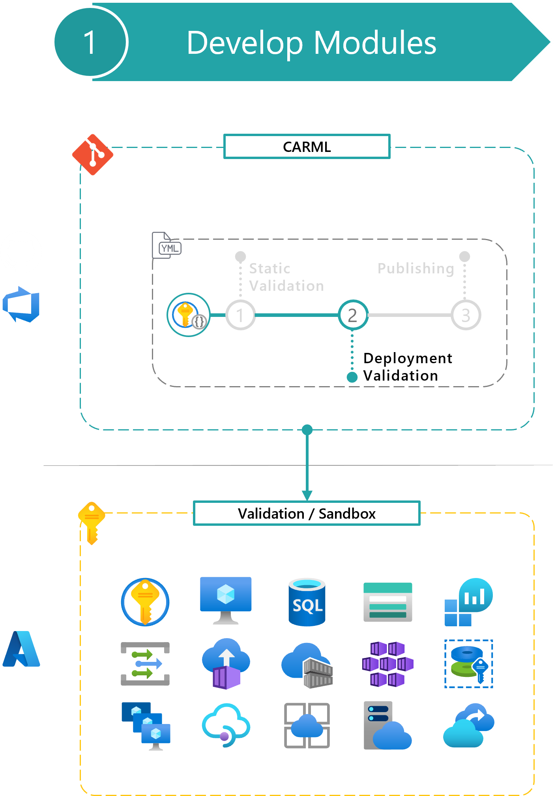

This section provides an overview of the principles the deployment validation is built upon, how it is set up, and how you can interact with it.

- [Deployment validation steps](#deployment-validation-steps)
- [Template validation](#template-validation)
- [Azure deployment validation](#azure-deployment-validation)
    - [Output example](#output-example)
  - [Resource removal](#resource-removal)
    - [How it works](#how-it-works)
    - [Create a specialized removal procedure](#create-a-specialized-removal-procedure)
- [Verify the deployment validation of your module locally](#verify-the-deployment-validation-of-your-module-locally)



# Deployment validation steps

The deployment validation phase can be divided into three steps, running in sequence:

- **Template validation:** Tests the module template is valid before the actual deployment.
- **Azure deployment validation:** Performs the actual Azure deployments.
- **Resource removal:** Deletes deployed resources.

# Template validation

The template validation step performs a dry-run with each module test file in the module's `'.test'` folder (and its subfolders)

In particular, the step runs a `Test-AzDeployment` cmdlet (_the command may vary based on the template schema_) for each provided module test file to verify if the template could be deployed using them.

The intention of this test is to **fail fast**, before getting to the later deployment step. The template validation could fail either because the template is invalid, or because any of the module test files is configured incorrectly.

# Azure deployment validation

This step performs the actual Azure deployments using each available & configured module test file. The purpose of this step is to prove the module can be deployed in different configurations based on the different parameters provided. Deployments for the different variants happen in parallel.

If any of these parallel deployments require multiple/different/specific resource instances already present, these resources are deployed by the module test files before the module to validate. You can find additional information about this effort [here](./The%20library%20-%20Module%20design#module-test-files).

The module test files used in this stage should ideally cover as many configurations as possible to validate the template flexibility, i.e., to verify that the module can cover multiple scenarios in which the given Azure resource may be used. Using the example of the CosmosDB module, we may want to have one module test file for the minimum amount of required parameters, one module test file for each CosmosDB type to test individual configurations, and at least one module test file testing the supported extension resources such as RBAC & diagnostic settings.

> **Note:** Since every customer environment might be different due to applied Azure Policies or security policies, modules might behave differently and naming conventions need to be verified beforehand.

> **Note:** [Management-Group](https://docs.microsoft.com/en-us/azure/azure-resource-manager/management/azure-subscription-service-limits#management-group-limits) or [Subscription](https://learn.microsoft.com/en-us/azure/azure-resource-manager/management/azure-subscription-service-limits#subscription-limits) deployments may eventually exceed the limit of 800 and require you to remove some of them manually. If you are faced with any corresponding error message you can manually remove deployments on a Management-Group or Subscription Level on scale using one of our [utilities](./The%20CI%20environment%20-%20Deployment%20removal). The CI environment also comes with a [pipeline](./The%20CI%20environment%20-%20Deployment%20removal) that runs on a nightly basis to mitigate this limitation.

### Output example


## Resource removal

This paragraph describes how the removal of resources deployed by a module is performed and how to modify the default behavior if a specific module or resource type needs it.

The removal step is triggered after the deployment completes. It removes all resources deployed in the previous step. The reason is twofold:

- Make sure to keep the validation subscription cost as low as possible.
- Run test deployments from scratch at every run.

However, the removal step can be skipped in case further investigation on the deployed resource is needed. This can be controlled when running the module pipeline leveraging [Module pipeline inputs](./The%20CI%20environment%20-%20Pipeline%20design#module-pipeline-inputs).

> Note: The logic will consider all deployment names used during the deployment step - even those of retries.

### How it works

The removal process will delete all resources created by the deployment. The list of resources is identified by:

1. Recursively fetching the list of resource IDs created in the deployment(s) (identified via the deployment names(s) used).
1. Ordering the list based on resource IDs segment count (ensures child resources are removed first. E.g., `storageAccount/blobServices` comes before `storageAccount` as it has one more segments delimited by `/`).
1. Filtering out resources must remain even after the test concluded from the list. This contains, but is not limited to:
   1. Resources that are autogenerated by Azure and can cause issues if not controlled (e.g., the Network Watcher resource group that is autogenerated and shared by multiple module tests)
   1. Resources of specific resource types. This currently involves the following:
         - `Microsoft.Security/autoProvisioningSettings`
         - `Microsoft.Security/deviceSecurityGroups`
         - `Microsoft.Security/iotSecuritySolutions`
         - `Microsoft.Security/pricings`
         - `Microsoft.Security/securityContacts`
         - `Microsoft.Security/workspaceSettings`
1. Moving specific resource types to the top of the list (if a certain order is required). For example, `diagnosticSettings` need to be removed before the resource to which they are applied, even though they are no child-resources.

After a resource is removed (this happens after each resource in the list), if defined, the script will perform a **post removal operation**. This can be used for those resource types that require post-processing, like purging a soft-deleted Key Vault.

The procedure is initiated post-deployment by the script [`/utilities/pipelines/resourceRemoval/Initialize-DeploymentRemoval.ps1`](https://github.com/Azure/ResourceModules/blob/main/utilities/pipelines/resourceRemoval/Initialize-DeploymentRemoval.ps1) in the pipeline templates:
- (Azure DevOps) [`/.azuredevops/pipelineTemplates/jobs.validateModuleDeployment.yml`](https://github.com/Azure/ResourceModules/blob/main/.azuredevops/pipelineTemplates/jobs.validateModuleDeployment.yml)
- (GitHub) [`/.github/actions/templates/validateModuleDeployment/action.yml`](https://github.com/Azure/ResourceModules/blob/main/.github/actions/templates/validateModuleDeployment/action.yml)

It uses several helper scripts that can be found in its `helper` subfolder

### Create a specialized removal procedure

This paragraph is intended for CARML contributors who want to add a new module to the library. It contains instructions on how to customize the removal scripts if needed for any specific resource.

The default removal procedure works for most of the modules. As such, it is unlikely you'll have to change anything to enable your new module for post-deployment removal.

However, if you need to, you can define a custom removal procedure by:
1. Influencing the **order** in which resources are removed by prioritizing specific resource types.
    > **Example** _Diagnostic settings_ need to be removed before the resource to which they are applied.
1. Defining a **custom removal** action to remove a resource of a _specific resource type_.
    > **Example** A _Recovery Services Vault_ resource requires some protected items to be identified and removed before the vault itself can be removed.
1. Defining a **custom post-removal** action to be run after removing a resource of a _specific resource type_.
    > **Example** A _Key Vault_ resource needs to be purged when soft deletion is enforced.

Those methods can be combined independently.

To modify the resource types removal **order**:
1. Open the [`/utilities/pipelines/resourceRemoval/Initialize-DeploymentRemoval.ps1`](https://github.com/Azure/ResourceModules/blob/main/utilities/pipelines/resourceRemoval/Initialize-DeploymentRemoval.ps1) file.
1. Look for the following comment: `### CODE LOCATION: Add custom removal sequence here`
1. Add a case value that matches your resource type
1. In the case block, update the `$removalSequence` variable value to accommodate your module requirements
1. Remember to add the `break` statement.

To define a **custom removal** action:
1. Open the [`/utilities/pipelines/resourceRemoval/helper/Invoke-ResourceRemoval.ps1`](https://github.com/Azure/ResourceModules/blob/main/utilities/pipelines/resourceRemoval/helper/Invoke-ResourceRemoval.ps1) file.
1. Look for the following comment: `### CODE LOCATION: Add custom removal action here`
1. Add a case value that matches the resource type you want to customize the removal action for
1. In the case block, define the resource-type-specific removal action

To add a **custom post-removal** step:
1. Open the [`/utilities/pipelines/resourceRemoval/helper/Invoke-ResourcePostRemoval.ps1`](https://github.com/Azure/ResourceModules/blob/main/utilities/pipelines/resourceRemoval/helper/Invoke-ResourcePostRemoval.ps1) file.
1. Look for the following comment: `### CODE LOCATION: Add custom post-removal operation here`
1. Add a case value that matches the resource type you want to add a post-removal operation for
1. In the case block, define the resource-type-specific post-removal action

# Verify the deployment validation of your module locally

This paragraph is intended for CARML contributors or more generally for those leveraging the CARML CI environment and want to update or add a new module to the library.

You can leverage the below snippet to leverage the 'Test-ModuleLocally.ps1' script to verify if your module will comply with the deployment validation step before pushing to source control.

```powershell
#########[ Function Test-ModulesLocally.ps1 ]#############
$pathToRepository = '<pathToClonedRepo>'
. "$pathToRepository\utilities\tools\Test-ModuleLocally.ps1"

# REQUIRED INPUT FOR TESTING
$TestModuleLocallyInput = @{
    templateFilePath              = '<Path to a module deploy.bicep>'
    parameterFilePath            = '<Optional path to a module parameter.json>'
    PesterTest                    = $false
    DeploymentTest                = $true
    ValidationTest                = $true
    ValidateOrDeployParameters    = @{
        Location          = '<ReplaceWith-TargetLocation>'
        ResourceGroupName = 'validation-rg'
        SubscriptionId    = '<ReplaceWith-TargetSubscriptionId>'
        ManagementGroupId = '<ReplaceWith-TargetManagementGroupName>'
    }
    AdditionalTokens              = @{
        'deploymentSpId' = '<ReplaceWith-SPNObjectId>'
        'tenantId'       = '<ReplaceWith-TargetTenantId>'
    }
}

Test-ModuleLocally @TestModuleLocallyInput -Verbose
```

> You can use the `Get-Help` cmdlet to show more options on how you can use this script.
