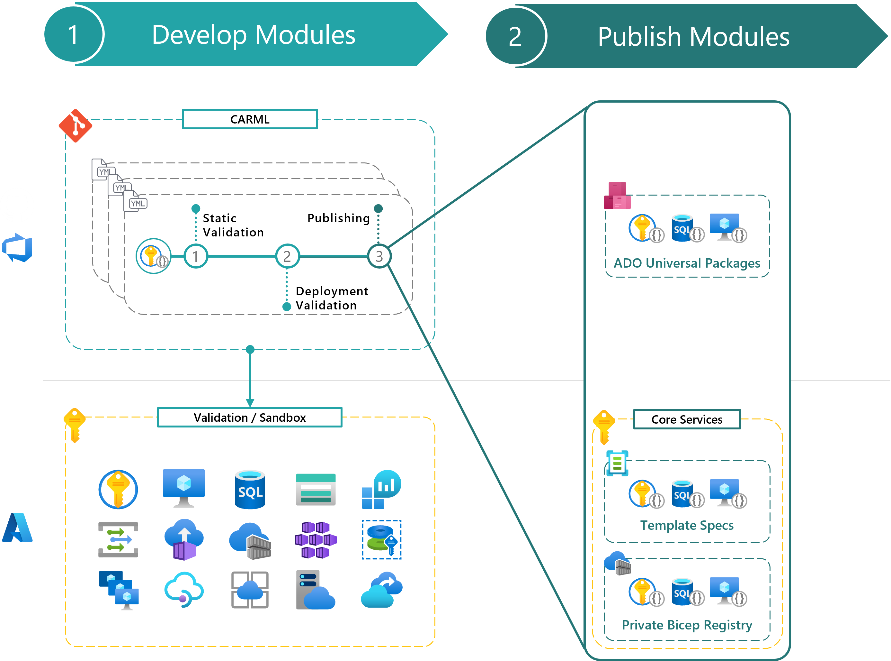
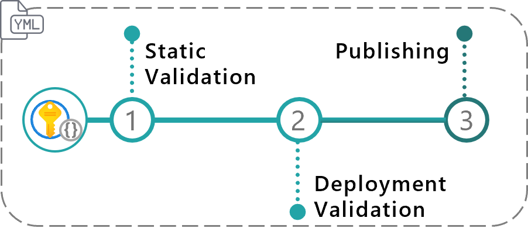
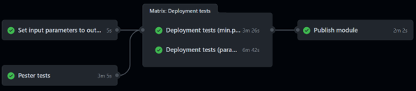
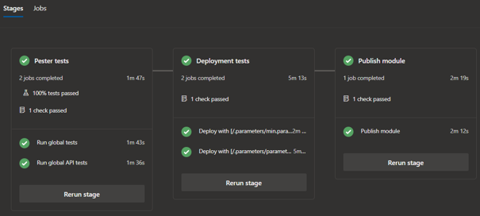
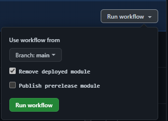
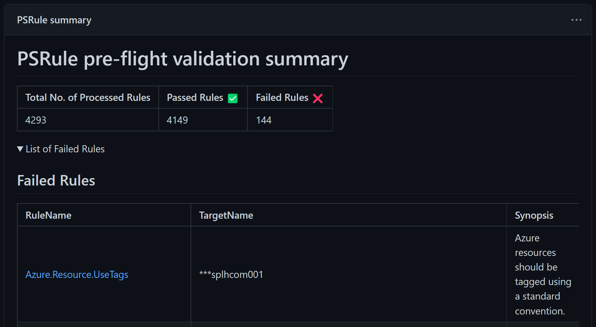

This section provides an overview of the design principles applied to the CARML CI environment pipelines.

---

### _Navigation_

- [Module Pipelines](#module-pipelines)
  - [Pipeline phases](#pipeline-phases)
    - [DevOps-Tool-specific design](#devops-tool-specific-design)
  - [Module pipeline inputs](#module-pipeline-inputs)
- [Platform pipelines](#platform-pipelines)
  - [ReadMe pipeline](#readme-pipeline)
  - [Wiki pipeline](#wiki-pipeline)
  - [PSRule Pre-Flight validation pipeline](#psrule-pre-flight-validation-pipeline)

---

# Module Pipelines

The repository hosts one pipeline for each module in the CARML library.

The purpose of each module pipeline is twofold:

1. **Validation**: To ensure the modules hosted by the CARML library are valid and can perform the intended deployments.
1. **Publishing**: To publish _versioned_ and already validated modules to one or multiple target locations, from where they can be referenced by solutions consuming them.

As such, each pipeline can be mapped to `Phases 1 and 2` described in the [Deployment flow](./The%20context%20-%20CARML%20CI%20environment#deployment-flow) section.

The following paragraphs provide an overview of the different phases and shared logic the module pipelines use.

- [Pipeline phases](#pipeline-phases)
- [Module pipeline inputs](#module-pipeline-inputs)

## Pipeline phases

This paragraph provides an overview of the three phases performed by each module pipeline. Further details about the implementation and design of each phase are provided on the dedicated pages linked below.

1. **Static Validation**: Runs a set of static Pester tests on the module and its templates to ensure they comply with the design principles of CARML. Further details for this phase are provided on the corresponding wiki page - see the [Static validation](./The%20CI%20environment%20-%20Static%20validation) section.
1. **Deployment Validation**: An actual Azure deployment is run in a sandbox subscription leveraging a predefined set of module test files, each validating a different configuration of the same Azure resource in parallel. The test suite is cleaned up by default, removing all test resources post-deployment. Further details for this phase are provided on the corresponding wiki page - see the [Deployment validation](./The%20CI%20environment%20-%20Deployment%20validation) section.
1. **Publishing**: Runs only if the previous steps are successful. A new module version is published to all configured target locations such as template specs, private Bicep registry and Azure DevOps Universal Packages. Published module versions can then be referenced by solutions using them. Further details for this phase are provided on the corresponding wiki page - see the [Publishing](./The%20CI%20environment%20-%20Publishing) page.

   

### DevOps-Tool-specific design

GitHub

GitHub workflows map each pipeline phase to a dedicated composite action, to maximize code reusability.
The mapping to the specific composite action is provided below:

| Composite Action | Pipeline phase |
| - | - |
| **Initialize pipeline** | Prepare the pipeline by (for example) publishing pipeline variables, collecting test files, etc. |
| **Module / Static validation** | Static validation |
| **Module / PSRule validation** | PS-Rule validation (with one job per template test file) |
| **Module / Deployment validation** | Deployment validation (with one job per template test file) |
| **publishModule** | Publishing |

In addition, workflows leverage the following composite actions:

| Composite Action | Description |
| - | - |
| **getWorkflowInput** | This action allows fetching workflow input values from the module's workflow file, even if the pipeline was not triggered via a `workflow_dispatch` action. Without it, we would not be able to process the contained information and would need to duplicate the configuration as workflow variables. Such input values are for example, the removal switch `removeDeployment`. |
| **setEnvironment** | This action sets up GitHub runners with relevant PowerShell modules required for specific jobs. It then parses the settings file ([`settings.yml`](https://github.com/Azure/ResourceModules/blob/main/settings.yml)) and sets the key-value pairs in the `variables` list as environment variables. |

Technical documentation for each composite action, such as required input and output variables, is included in each `action.yml` file located in path `.github/actions/templates`.

Azure DevOps

Azure DevOps pipelines map each pipeline phase to a dedicated pipeline template, to maximize code reusability.
The mapping to the specific YAML template file is provided below:

| Template Name | Pipeline phase |
| - | - |
| **jobs.validateModulePester.yml** | Static validation |
| **jobs.validateModuleDeployment.yml** | Deployment validation |
| **jobs.publishModule.yml** | Publishing |

Technical documentation for each template, such as required input and output variables, is included in each `.yml` file located in path `.azuredevops/pipelineTemplates`.

## Module pipeline inputs

Each module pipeline comes with the following runtime parameters (which are identical for GitHub & AzureDevOps):

- `'Branch'` dropdown: A dropdown to select the branch to run the pipeline from.
- `'Execute static validation'` switch: Can be enabled or disabled. It controls whether the static tests jobs are executed during the pipeline run.
  > **Note:** This switch cannot be used to bypass the publishing requirements, where both static tests & deployment validation jobs must be successful.
- `'Execute deployment validation'` switch: Can be enabled or disabled. It controls whether the deployment validation jobs are executed during the pipeline run.
- `'Remove deployed module'` switch: Can be enabled or disabled. It controls whether the test-deployed resources are removed after the deployment validation jobs. It is enabled by default.
  > **Note:** This switch cannot be used to bypass the publishing requirements, where both the static tests & deployment validation jobs must be successful.
- `'Publish prerelease module'` switch: Can be enabled or disabled. It allows publishing a `pre-release` version for the corresponding module when running the pipeline from a different branch than `main | master`. It is disabled by default. For further information of how the input is processed refer to the [Publishing Guide](./The%20CI%20environment%20-%20Publishing) dedicated page.

  

---

# Platform pipelines

In addition to module pipelines, the repository includes several platform pipelines covering further tasks as described below.

- [ReadMe pipeline](#readme-pipeline)
- [Wiki pipeline](#wiki-pipeline)
- [PSRule Pre-Flight validation pipeline](#psrule-pre-flight-validation-pipeline)
- [Deployment history cleanup](./The%20CI%20environment%20-%20Deployment%20history%20cleanup)

## ReadMe pipeline

The repository includes two major ReadMe files that should stay in sync with the available modules.

The first can be found in the repository root (`README.md`) and the second in the modules folder (`modules/README.md`).

The ReadMe pipeline is triggered each time changes are pushed to the `main` branch and only if a template in the `modules` folder is being altered. The pipeline leverages the script documented on the [GitHub ReadMe module table update](./The%20CI%20environment%20-%20GitHub%20ReadMe%20module%20table%20update) page.

Once triggered, the pipeline crawls through the library and updates the tables in each corresponding ReadMe file, creating links to the corresponding pipeline runs and updating the list of entries.

## Wiki pipeline

The purpose of the wiki pipeline is to sync any files from the `docs/wiki` folder to the wiki repository. It is triggered each time changes are pushed to the `main` branch and only if files in the `docs/wiki` folder are altered.

> **Note:** Any changes performed directly on the wiki via the UI will be overwritten by this pipeline.

## PSRule Pre-Flight validation pipeline

The purpose of the PSRule Pre-Flight validation pipeline is to validate Azure resources deployed by module validation pipeline tests, by leveraging [PSRule for Azure](https://azure.github.io/PSRule.Rules.Azure/about/).
PSRule for Azure is aligned to the [Well-Architected Framework (WAF)](https://learn.microsoft.com/en-us/azure/architecture/framework/). Tests, called _Rules_, check the configuration of Azure resources against WAF principles.

The pipeline, currently only available as a [GitHub workflow](https://github.com/Azure/ResourceModules/blob/main/.github/workflows/platform.librarycheck.psrule.yml), runs weekly on the whole library, providing as output the list of non-compliant resources and corresponding failing rules, if any.

### Configuration settings

PSRule options set for the CARML repository are configured in the [ps-rule.yaml](https://github.com/Azure/ResourceModules/blob/main/ps-rule.yaml) file.

Documentation for all configuration options is available at the following links:
- https://aka.ms/ps-rule/options
- https://aka.ms/ps-rule-azure/options

### Baselines

A [baseline](https://azure.github.io/PSRule.Rules.Azure/working-with-baselines/) is a standard PSRule artifact that combines rules and configuration. The PSRule Pre-Flight validation pipeline uses the default baseline to analyze module test resources.

For the list of all rules included see [Azure.Default baseline](https://azure.github.io/PSRule.Rules.Azure/en/baselines/Azure.Default/).
To view a list of rules by Azure resources see [Rules by resource](https://azure.github.io/PSRule.Rules.Azure/en/rules/resource/).

### Exclusions and suppression rules

Not all baseline rules may be valid for some of the test Azure resources deployed by the module validation pipelines.

For example, resources deployed by the min tests, aim to validate only the required input parameters for each module.
Therefore, optional features such as diagnostic settings are not configured in those tests. Since enabling logging is a general recommendation for most of the resources supporting them, missing diagnostic settings usually trigger incopliance of PSRule checks, e.g., [Azure.KeyVault.Logs](https://azure.github.io/PSRule.Rules.Azure/en/rules/Azure.KeyVault.Logs/). For this reason, these checks are excluded from being evaluated for resources deployed by min tests.

PSRule allows skipping rules on two levels:

- **Exclusions**: Can be leveraged to exclude specific baseline rules from being evaluated for any resource.
   - [ps-rule.yaml](https://github.com/Azure/ResourceModules/blob/main/ps-rule.yaml): Lists the name of specific rules to exclude under the option [Rule.Exclude](https://microsoft.github.io/PSRule/v2/concepts/PSRule/en-US/about_PSRule_Options/#ruleexclude)
- **Suppression Groups**: PSRule can use [Suppression Groups](https://microsoft.github.io/PSRule/v2/concepts/PSRule/en-US/about_PSRule_SuppressionGroups/) to suppress rules based on a condition. Suppression groups can be leveraged when some of the rules in the baseline are not relevant under specific conditions, e.g., only for specific resources. They are stored in the `.ps-rule` repo root folder in `.yaml` format. In particular:
   - [.ps-rule\dep-suppress.Rule.yaml](https://github.com/Azure/ResourceModules/blob/main/.ps-rule/dep-suppress.Rule.yaml): Lists rules to be ignored for resources deployed as dependencies
   - [.ps-rule\min-suppress.Rule.yaml](https://github.com/Azure/ResourceModules/blob/main/.ps-rule/min-suppress.Rule.yaml): Lists rules to be ignored for resources deployed by the min tests
   - [.ps-rule\na-suppress.Rule.yaml](https://github.com/Azure/ResourceModules/blob/main/.ps-rule/na-suppress.Rule.yaml): Lists rules to be ignored for resources not supporting Tags
### Output

To better outline failed rules and allow fixing incompliant resources quickly, the pipeline leverages the script [utilities\pipelines\PSRuleValidation\Set-PSRuleGitHubOutput.ps1](https://github.com/Azure/ResourceModules/blob/main/utilities/pipelines/PSRuleValidation/Set-PSRuleGitHubOutput.ps1) to aggregate PSRule output into Custom Markdown content and display it to the Actions run summary page.

