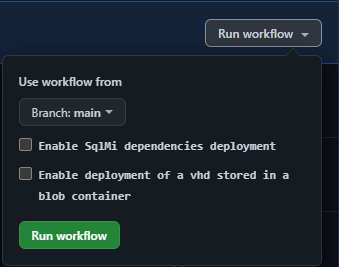

This section provides an overview of the design principles applied to the CARML CI environment pipelines.

---

### _Navigation_

- [Module Pipelines](#module-pipelines)
  - [Pipeline phases](#pipeline-phases)
    - [DevOps-Tool-specific design](#devops-tool-specific-design)
  - [Module pipeline inputs](#module-pipeline-inputs)
- [Platform pipelines](#platform-pipelines)
  - [Dependencies pipeline](#dependencies-pipeline)
    - [Dependencies pipeline inputs](#dependencies-pipeline-inputs)
    - [Resources deployed by the dependencies pipeline](#resources-deployed-by-the-dependencies-pipeline)
      - [**1st level resources**](#1st-level-resources)
      - [**2nd level resources**](#2nd-level-resources)
      - [**3rd level resources**](#3rd-level-resources)
      - [**4th level resources**](#4th-level-resources)
      - [**5th level resources**](#5th-level-resources)
    - [Required secrets and keys](#required-secrets-and-keys)
  - [ReadMe pipeline](#readme-pipeline)
  - [Wiki pipeline](#wiki-pipeline)

---

# Module Pipelines

The repository hosts one pipeline for each module in the CARML library.

The purpose of each module pipeline is twofold:

1. **Validation**: To ensure the modules hosted by the CARML library are valid and can perform the intended deployments.
1. **Publishing**: To publish _versioned_ and already validated modules to one or multiple target locations, from where they can be referenced by solutions consuming them.

As such, each pipeline can be mapped to `Phases 1 and 2` described in the [Deployment flow](./The%20context%20-%20CARML%20CI%20environment#deployment-flow) section.

The following paragraphs provide an overview of the different phases and shared logic the module pipelines use.

- [Pipeline phases](#pipeline-phases)
- [Module pipeline inputs](#module-pipeline-inputs)

## Pipeline phases

This paragraph provides an overview of the three phases performed by each module pipeline. Further details about the implementation and design of each phase are provided on the dedicated pages linked below.

1. **Static Validation**: Runs a set of static Pester tests on the module and its templates to ensure they comply with the design principles of CARML. Further details for this phase are provided on the corresponding wiki page - see the [Static validation](./The%20CI%20environment%20-%20Static%20validation) section.
1. **Deployment Validation**: An actual Azure deployment is run in a sandbox subscription leveraging a predefined set of parameter files, each validating a different configuration of the same Azure resource in parallel. The test suite is cleaned up by default, removing all test resources post-deployment. Further details for this phase are provided on the corresponding wiki page - see the [Deployment validation](./The%20CI%20environment%20-%20Deployment%20validation) section.
1. **Publishing**: Runs only if the previous steps are successful. A new module version is published to all configured target locations such as template specs, private Bicep registry and Azure DevOps Universal Packages. Published module versions can then be referenced by solutions using them. Further details for this phase are provided on the corresponding wiki page - see the [Publishing](./The%20CI%20environment%20-%20Publishing) page.

   

### DevOps-Tool-specific design

GitHub

GitHub workflows map each pipeline phase to a dedicated composite action, to maximize code reusability.
The mapping to the specific composite action is provided below:

| Composite Action | Pipeline phase |
| - | - |
| **validateModulePester** | Static validation |
| **validateModuleDeployment** | Deployment validation |
| **publishModule** | Publishing |

In addition, workflows leverage the following composite actions:

| Composite Action | Description |
| - | - |
| **getWorkflowInput** | This action allows fetching workflow input values from the module's workflow file, even if the pipeline was not triggered via a `workflow_dispatch` action. Without it, we would not be able to process the contained information and would need to duplicate the configuration as workflow variables. Such input values are for example, the removal switch `removeDeployment`. |
| **setEnvironmentVariables** | This action parses the variables file ([`global.variables.yml`](https://github.com/Azure/ResourceModules/blob/main/global.variables.yml)) and sets the key-value pairs in the `variables` list as environment variables. |

Technical documentation for each composite action, such as required input and output variables, is included in each `action.yml` file located in path `.github/actions/templates`.

Azure DevOps

Azure DevOps pipelines map each pipeline phase to a dedicated pipeline template, to maximize code reusability.
The mapping to the specific YAML template file is provided below:

| Template Name | Pipeline phase |
| - | - |
| **jobs.validateModulePester.yml** | Static validation |
| **jobs.validateModuleDeployment.yml** | Deployment validation |
| **jobs.publishModule.yml** | Publishing |

Technical documentation for each template, such as required input and output variables, is included in each `.yml` file located in path `.azuredevops/pipelineTemplates`.

## Module pipeline inputs

Each module pipeline comes with the following runtime parameters:

- `'Branch' dropdown`: A dropdown to select the branch to run the pipeline from.
- `'Remove deployed module' switch`: Can be enabled or disabled and controls whether the test-deployed resources are removed after testing. It is enabled by default.
- `'Publish prerelease module' switch`: Can be enabled or disabled and allows publishing a prerelease version for the corresponding module when running the pipeline from a branch different than `main|master`. It is disabled by default. For further information of how the input is processed refer to the [Publishing](./The%20CI%20environment%20-%20Publishing) dedicated page.

  

---

# Platform pipelines

In addition to module pipelines, the repository includes several platform pipelines covering further tasks as described below.

- [Dependencies pipeline](#dependencies-pipeline)
- [ReadMe pipeline](#readme-pipeline)
- [Wiki pipeline](#wiki-pipeline)

## Dependencies pipeline

In order to successfully run module pipelines to validate and publish CARML modules to the target environment, certain Azure resources need to be deployed beforehand.

For example, any instance of the \[Virtual Machine] module needs an existing virtual network to be connected to and a Key Vault hosting its required local admin credentials to be referenced.

The dependencies pipeline covers this requirement and is intended to be run before using the module pipelines.

The pipeline leverages resource parameters from the `utilities\pipelines\dependencies` subfolder and either one of the following pipelines:
- GitHub workflow: [`.github\workflows\platform.dependencies.yml`](https://github.com/Azure/ResourceModules/blob/main/.github\workflows\platform.dependencies.yml)
- Azure DevOps pipeline: [`.azuredevops\platformPipelines\platform.dependencies.yml`](https://github.com/Azure/ResourceModules/blob/main/.azuredevops\platformPipelines\platform.dependencies.yml)

### Dependencies pipeline inputs

The dependencies pipeline comes with the following runtime parameters:

- `'Branch' dropdown`: A dropdown to select the branch to run the pipeline from.
- `'Enable SqlMI dependency deployment' switch`: Can be enabled or disabled and controls whether the dependencies for the \[SQL managed instance] module are configured during deployment. It is disabled by default.
- `'Enable deployment of a vhd stored in a blob container' switch`: Can be enabled or disabled and controls whether including the baking of a VHD and subsequent backup to a target storage blob container during the deployment. This is a dependency for the \[Compute Images] and \[Compute Disks] modules. This task requires up to two hours completion and is disabled by default.

  

### Resources deployed by the dependencies pipeline

The resources deployed by the dependencies pipeline need to be in place before testing all the modules.

> Note: Some dependency resources (e.g., \[storage account], \[Key Vault] and \[event hub namespace]) require a globally unique resource name. By default, the parameter files make use of the placeholder token `'<<namePrefix>>'` to make all resource names specific to an environment. Refer to [Parameter File Tokens Design](./The%20CI%20environment%20-%20Token%20replacement) for more details.

Since also dependency resources are in turn subject to dependencies with each other, resources are deployed in the following grouped order.

#### **1st level resources**

  1. Resource Group: leveraged by all modules.
     - '_validation-rg_': The resource group to which resources are deployed by default during the test deployment phase. This same resource group is also the one hosting the dependencies.
     - '_adp-\<<namePrefix\>>-az-locks-rg-001_': Dedicated resource group to be leveraged by the \[authorization locks] resource.

#### **2nd level resources**

This group of resources has a dependency only on the resource group which will host them. Resources in this group can be deployed in parallel.

  1. Storage account: This resource is leveraged by all resources supporting diagnostic settings on a storage account.
      >**Note**: This resource has a global scope name.
  1. Event hub namespace and Event hub: This resource is leveraged by all resources supporting diagnostic settings on an event hub.
      >**Note**: This resource has a global scope name.
  1. Log analytics workspaces: These resources are leveraged by all resources supporting diagnostic settings on LAW. Multiple instances are deployed:
      - '_adp-\<<namePrefix\>>-az-law-x-001_': Default LAW.
      - '_adp-\<<namePrefix\>>-az-law-aut-001_': Dedicated LAW to be leveraged by the \[automation account] resource.
      - '_adp-\<<namePrefix\>>-az-law-appi-001_': Dedicated LAW to be leveraged by the \[application insights] resource.
      - '_adp-\<<namePrefix\>>-az-law-sol-001_': Dedicated LAW to be leveraged by the \[operations management solutions] resource.
  1. User assigned identity: This resource is leveraged by the \[role assignment], \[Key Vault] and \[recovery services vault] dependency resources.
      > **Note**: The object ID of the \[user assigned identity] is needed by several dependency parameter files. However, before running the dependencies pipeline for the first time, the \[user assigned identity] resource does not exist yet, thus its object ID is unknown. For this reason, instead of the object ID value, some dependency parameter files contain the `"<<msiPrincipalId>>"` token, for which the correct value is retrieved and replaced by the pipeline at runtime.
  1. Shared image gallery and definition: These resources are leveraged by the \[image template] resource.
  1. Route table: This resource is leveraged by the virtual network subnet dedicated to test \[SQL managed instance].
      >**Note**: This resource is deployed and configured only if SQL-MI dependency resources are enabled.
  1. Route table: This resource is leveraged by a test subnet deployment of the \[Virtual Network] module.
  1. Action group: This resource is leveraged by \[activity log alert] and \[metric alert] resources.
  1. Application security group: This resource is leveraged by the \[network security group] resource.
  1. Policy assignment: This resource is leveraged by the \[policy exemption] resource.
  1. Proximity placement group: This resource is leveraged by a test deployment of the \[Availability set] module.

#### **3rd level resources**

This group of resources has a dependency on one or more resources in the group above. Resources in this group can be deployed in parallel.

  1. Storage Account Upload: An upload job to populate the storage account configured in `parameters.json` with a test script that can be referenced
  1. AVD host pool: This resource supports monitoring, hence it has a dependency on the \[storage account], \[log analytics workspace] and \[event hub] deployed in the group above. This resource is leveraged by the \[AVD application group] resource.
  1. Network Security Groups: This resource supports monitoring, hence it has a dependency on the \[storage account], \[log analytics workspace] and \[event hub] deployed in the group above. This resource is leveraged by different virtual network subnets. Multiple instances are deployed:
      - '_adp-\<<namePrefix\>>-az-nsg-x-apgw_': NSG with required network security rules to be leveraged by the \[application gateway] subnet.
      - '_adp-\<<namePrefix\>>-az-nsg-x-ase_': NSG with required network security rules to be leveraged by the \[app service environment] subnet.
      - '_adp-\<<namePrefix\>>-az-nsg-x-bastion_': NSG with required network security rules to be leveraged by the \[bastion host] subnet.
      - '_adp-\<<namePrefix\>>-az-nsg-x-sqlmi_': NSG with required network security rules to be leveraged by the \[sql managed instance] subnet.
        >**Note**: This resource is deployed and configured only if SQL-MI dependency resources are enabled.
      - '_adp-\<<namePrefix\>>-az-nsg-x-001_': default NSG leveraged by all other subnets.
  1. Application insight: This resource supports monitoring, hence it has a dependency on the \[storage account], \[log analytics workspace] and \[event hub] deployed in the group above. This resource is leveraged by the \[machine learning service] resource.
  1. Automation account: This resource supports monitoring, hence it has a dependency on the \[storage account], \[log analytics workspace] and \[event hub] deployed in the group above. This resource is leveraged by the \[log analytics workspace] resource.
  1. Public IP addresses: This resource supports monitoring, hence it has a dependency on the \[storage account], \[log analytics workspace] and \[event hub] deployed in the group above. Multiple instances are deployed:
      - '_adp-\<<namePrefix\>>-az-pip-x-apgw_': Leveraged by the \[application gateway] resource.
      - '_adp-\<<namePrefix\>>-az-pip-x-bas_': Leveraged by the \[bastion host] resource.
      - '_adp-\<<namePrefix\>>-az-pip-x-lb_': Leveraged by the \[load balancer] resource.
      - '_adp-\<<namePrefix\>>-az-pip-min-lb_': Leveraged by the \[load balancer] resource.
      - '_adp-\<<namePrefix\>>-az-pip-x-fw_': Leveraged by the \[Azure firewall] resource.
  1. Role assignment: This resource assigns the '_Contributor_' role on the subscription to the \[user assigned identity] deployed as part of the group above. This is needed by the \[image template] deployment.
  1. Key Vault: This resource supports monitoring, hence it has a dependency on the \[storage account], \[log analytics workspace] and \[event hub] deployed in the group above. Multiple instances are deployed:
      - '_adp-\<<namePrefix\>>-az-kv-x-001_': KV with required secrets, keys, certificates and access policies to be leveraged by all resources requiring access to a Key Vault key, secret and/or certificate, i.e., \[application gateway], \[azure NetApp file], \[azure SQL server], \[disk encryption set], \[machine learning service], \[virtual machine], \[virtual machine scale set], \[virtual network gateway connection].
      - '_adp-\<<namePrefix\>>-az-kv-x-pe_': KV to be leveraged by the \[private endpoint] resource.
      - '_adp-\<<namePrefix\>>-az-kv-x-sqlmi_': KV with required secrets, keys and access policies to be leveraged by the \[SQL managed instance] resource.
        >**Note**: This resource is deployed and configured only if SQL-MI dependency resources are enabled.
      >**Note**: This resource has a global scope name.
  1. Recovery services vault: This resource supports monitoring, hence it has a dependency on the \[storage account], \[log analytics workspace] and \[event hub] deployed in the group above. This resource is leveraged by the \[virtual machine] resource when backup is enabled.

#### **4th level resources**

This group of resources has a dependency on one or more resources in the groups above. Resources in this group can be deployed in parallel.

  1. AVD application group: This resource is leveraged by the \[AVD workspace] resource.
  1. Virtual Networks: This resource is depending on the route table and network security groups deployed above. Multiple instances are deployed:
      - '_adp-\<<namePrefix\>>-az-vnet-x-peer01_': Leveraged by the \[virtual network peering] resource.
      - '_adp-\<<namePrefix\>>-az-vnet-x-peer02_': Leveraged by the \[virtual network peering] resource.
      - '_adp-\<<namePrefix\>>-az-vnet-x-azfw_': Leveraged by the \[azure firewall] resource.
      - '_adp-\<<namePrefix\>>-az-vnet-x-aks_': Leveraged by the \[azure kubernetes service] resource.
      - '_adp-\<<namePrefix\>>-az-vnet-x-sqlmi_': Leveraged by the \[sql managed instance] resource.
        >**Note**: This resource is deployed and configured only if sqlmi dependency resources are enabled.
      - '_adp-\<<namePrefix\>>-az-vnet-x-001_': Hosting multiple subnets to be leveraged by \[virtual machine], \[virtual machine scale set], \[service bus], \[azure NetApp files], \[azure bastion], \[private endpoints], \[app service environment] and \[application gateway] resources.
  1. Azure Image Builder template: This resource triggers the build and distribution of a VHD in a storage account. The VHD file is copied to a known storage account blob container and leveraged by \[compute disks] and \[compute images] resources.
    >**Note**: This resource is deployed and configured only if the 'Enable deployment of a VHD stored in a blob container' option is selected.

#### **5th level resources**

This group of resources has a dependency on one or more resources in the groups above.

  1. Virtual Machine: This resource is depending on the \[virtual networks] and \[Key Vault] deployed above. This resource is leveraged by the \[network watcher] resource.
  1. Private DNS zone: This resource is depending on the \[virtual networks] deployed above. This resource is leveraged by the \[private endpoint] resource.

### Required secrets and keys

In addition to the above resources, the following secrets, keys and certificates are created in the Key Vaults deployed by the dependencies pipeline.

- Shared Key Vault '_adp-\<<namePrefix\>>-az-kv-x-001_'
  1. Key Vault secrets:
      - _administratorLogin_: For \[azure SQL server] .
      - _administratorLoginPassword_: For \[azure SQL server].
      - _vpnSharedKey_: For \[virtual network gateway connection].
      - _adminUserName_: For \[virtual machine].
      - _adminPassword_: For \[virtual machine].
  1. Key Vault keys:
      - _keyEncryptionKey_: For \[disk encryption set].
  1. Key Vault certificate:
      - _applicationGatewaySslCertificate_: For \[application gateway].

- SQL Mi Key Vault '_adp-\<<namePrefix\>>-az-kv-x-sqlmi_'
  1. Key Vault secrets:
      - _administratorLogin_: For \[SQL managed instance].
      - _administratorLoginPassword_: For \[SQL managed instance].
  1. Key Vault keys:
      - _keyEncryptionKeySqlMi_: For \[SQL managed instance].

## ReadMe pipeline

The repository includes two major ReadMe files that should stay in sync with the available modules.

The first can be found in the repository root (`README.md`) and the second in the modules folder (`modules/README.md`).

The ReadMe pipeline is triggered each time changes are pushed to the `main` branch and only if a template in the `modules` folder is being altered. The pipeline leverages the script documented in the [GitHub ReadMe module table update](./The%20CI%20environment%20-%20GitHub%20ReadMe%20module%20table%20update) page.

Once triggered, the pipeline crawls through the library and updates the tables in each corresponding ReadMe file, creating links to the corresponding pipeline runs and updating the list of entries.

## Wiki pipeline

The purpose of the wiki pipeline is to sync any files from the `docs/wiki` folder to the wiki repository. It is triggered each time changes are pushed to the `main` branch and only if files in the `docs/wiki` folder are altered.

> **Note:** Any changes performed directly on the wiki via the UI will be overwritten by this pipeline.
