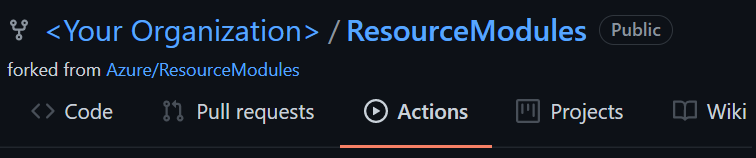
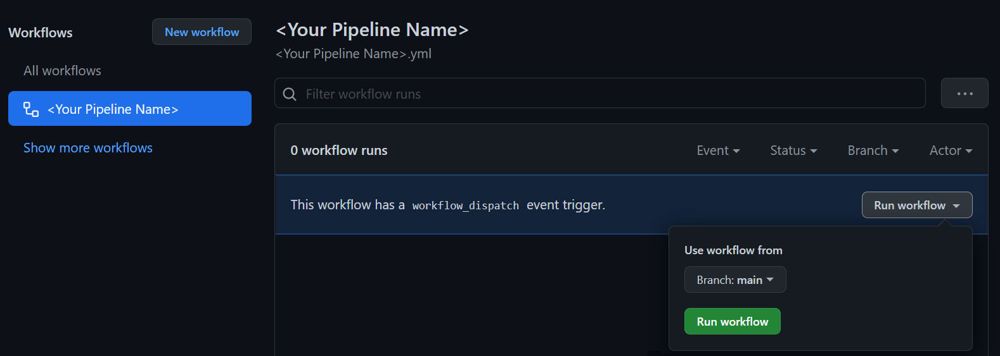
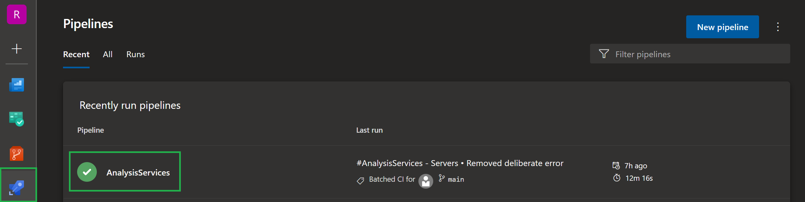
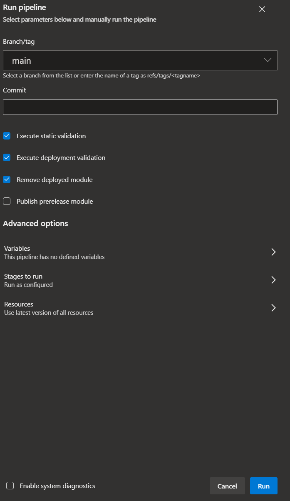
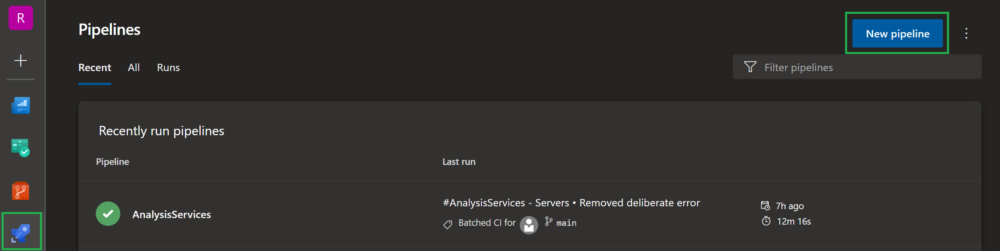
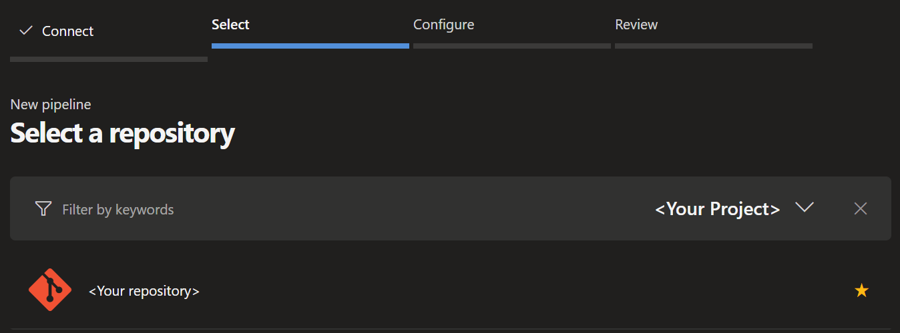
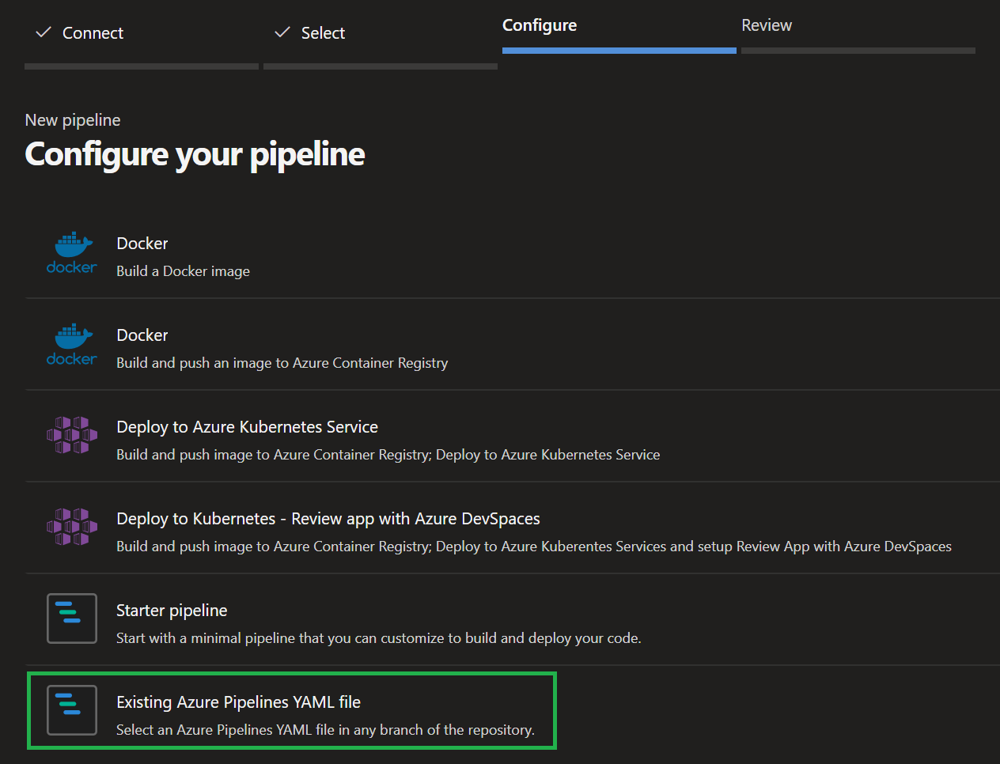
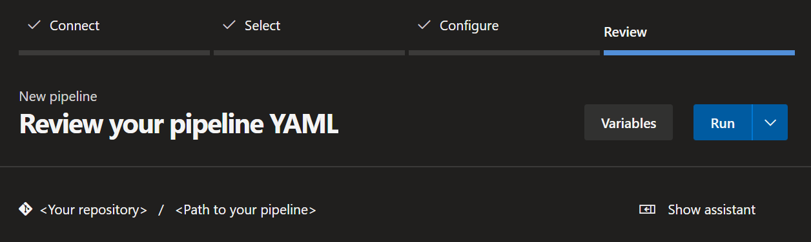

This section provides a guideline on how to use the CARML CI environment pipelines.

---

### _Navigation_

- [Operate the module pipelines](#operate-the-module-pipelines)
  - [Add a new module pipeline](#add-a-new-module-pipeline)
- [Operate the dependencies pipeline](#operate-the-dependencies-pipeline)
  - [Add a new dependency](#add-a-new-dependency)
- [DevOps-Tool-specific guidance](#devops-tool-specific-guidance)
  - [GitHub workflows](#github-workflows)
    - [Trigger a workflow](#trigger-a-workflow)
    - [Register a workflow](#register-a-workflow)
  - [Azure DevOps pipelines](#azure-devops-pipelines)
    - [Trigger a pipeline](#trigger-a-pipeline)
    - [Register a pipeline](#register-a-pipeline)

---

# Operate the module pipelines

To validate updates to a module template, you can perform the following steps:

1. (Optionally) Update the module's parameter files to reflect your changes.
1. Push the local changes to the repository (using a branch that is not [main\|master]).
1. On the DevOps platform, navigate to your pipelines and select the pipeline that was registered for the module you updated.
1. Select the branch with your updated template.
1. (Optionally) disable the `Remove deployed module` input parameter in case you don't want to apply the default behavior and want to skip the deletion of the test-deployed resources to check them post-deployment.
1. (Optionally) adjust the `Publish prerelease module` flag in case you want to publish a prerelease version of your updated module from your development branch.
   > **Note:** The module version is assigned a prerelease suffix
1.  Trigger the pipeline.

Once the pipeline concludes, it will either be in a green (success) or red (failed) state, depending on how the module performed.

Pipeline logs are available for troubleshooting and provide detailed information in case of failures. If errors occur in the [Static validation](./The%20CI%20environment%20-%20Static%20validation) phase, you may only see the failed test and need to `expand` the error message. How this looks like depends on the [DevOps platform](#devops-tool-specific-guidance) you use.

## Add a new module pipeline

To add a new module pipeline we recommend to create a copy of a currently existing module pipeline and adjust all module-specific properties, e.g. triggers and module paths. The registration of the pipeline depends on the [DevOps platform](#devops-tool-specific-guidance) you're using.

# Operate the dependencies pipeline

The dependencies pipeline must be triggered manually and deploys a set of resources we reference as part of our module tests (e.g. Virtual Networks, Log Analytics Workspace, Key Vaults).

To run the dependencies pipeline you can perform the following steps:

1. Before executing the pipeline for the first time make sure to update the following values:

   | File | Parameter | Description |
   | - | - | - |
   | `utilities\pipelines\dependencies\Microsoft.KeyVault\vaults\parameters\parameters.json` | `accessPolicies.value[0].objectId` | The 'Backup Management Service' needs access to back up the keys and secrets, along with the associated VMs. The Enterprise Application's object ID is unique per tenant. |
1. (Optionally) Verify if you are good with the dependency resource names by checking dependency parameter files stored in path `utilities\pipelines\dependencies`. If not, make the necessary updates to you local branch and push the local changes to the repository.
   > **Note:** If you want to rename any dependency resources, make sure to update any references to their name in the module parameter files too.
1. On the DevOps platform, navigate to the dependencies pipeline.
1. Select the branch you intend to run.
1. (Optionally) Enable the `'Enable SqlMI dependency deployment' switch` to include the deployment of the dependencies for the [SQL managed instance] module.
1. (Optionally) Enable the `'Enable deployment of a vhd stored in a blob container' switch` to include the deployment of the dependencies for the [Compute Images] and [Compute Disks] modules.
   > Note: This option requires up to two hours completion.
1.  Trigger the pipeline.

By default, i.e., by keeping the optional flags disables, the dependencies pipeline may take up to 30 minutes to run.

> **Note:** For details about the dependencies pipeline design please refer to the dedicated [Dependencies pipeline design](./The%20CI%20environment%20-%20Pipeline%20design.md#dependencies-pipeline) section.

## Add a new dependency

Depending on what you want to test in your module pipeline, you may want to include additional resources to your dependencies pipeline. If so, make sure to include an additional parameter file for each service you require under `utilities/pipelines/dependencies`. Once done, you need to add the deployment to the pipeline itself making sure to deploy the new resources in the correct order. The implementation depends on the [DevOps platform](#devops-tool-specific-guidance) you're using.

---

# DevOps-Tool-specific guidance

This section provides a step-by-step guideline on how to operate the pipelines based on the specific chosen DevOps platform, GitHub or Azure DevOps.

## GitHub workflows

This section focuses on _GitHub_ Actions & Workflows.

GitHub workflows

  ### Trigger a workflow

  To trigger a workflow in _GitHub_:

  1. Navigate to the 'Actions' tab in your repository.

     

  1. Select the pipeline of your choice from the list on the left, followed by 'Run workflow' to the right. You can then select the branch of your choice and confirm the execution by clicking on the green 'Run workflow' button.

     

  >**Note**: Depending on the pipeline you selected you may have additional input parameters you can provide aside from the branch. An outline can be found in the [Module pipeline inputs](./The%20CI%20environment%20-%20Pipeline%20design#module#module-pipeline-inputs) section.

  ### Register a workflow

  To register a workflow in _GitHub_ you have to create the workflow file (`.yml`) and store it inside the folder `.github/workflows`.
  > ***Note:*** Once merged to [main\|master], GitHub will automatically list the new workflow in the 'Actions' tab. Workflows are not registered from a branch unless you specify a temporal push trigger targeting your branch.

## Azure DevOps pipelines

This section focuses on _Azure DevOps_ pipelines.

Azure DevOps pipelines

  ### Trigger a pipeline

  To trigger a pipeline in _Azure DevOps_:

  1. Navigate to the 'Pipelines' section (blue rocket) and select the pipeline you want to trigger.

     

  1. Once selected, click on the 'Run pipeline' button on the top right.

     

  1. Now you can trigger the pipeline by selecting the 'Run' button on the bottom right.

     

  >**Note**: Depending on the pipeline you selected you may have additional input parameters you can provide aside from the branch. An outline can be found in the [Module pipeline inputs](./The%20CI%20environment%20-%20Pipeline%20design#module#module-pipeline-inputs) section.

  ### Register a pipeline

  To register a pipeline in _Azure DevOps_:

  1. Create a workflow file (.yml) and upload it to a repository of your choice (e.g. in _Azure DevOps_ or _GitHub_).

  1. Navigate to the 'Pipelines' section (blue rocket) and select the 'New pipeline' button on the top right.

     

  1. Next, select the repository-type you stored your template in. _Azure DevOps_ will then try to fetch all repositories you have access to.

     

  1. Now we have to select the particular repository to get the pipeline file from.

     

  1. Following, choose 'Existing Azure Pipelines YAML file' on the bottom of the list.

     

  1. The previous action will open a new blade that asks you for the branch you stored the pipeline file in (e.g. `master`) and then asks for the relative path (from root of the repository) of the pipeline file.

     

  1. Finally, _Azure DevOps_ should show you the pipeline file you created. The last thing you have to do is to either select 'Run' on the top right (which will save & run the pipeline), or click the little arrow next to it and just save the pipeline.

  1. Once saved you can also re-name / move the pipeline in the same view. However, this only works once you saved the pipeline at least once.

     

