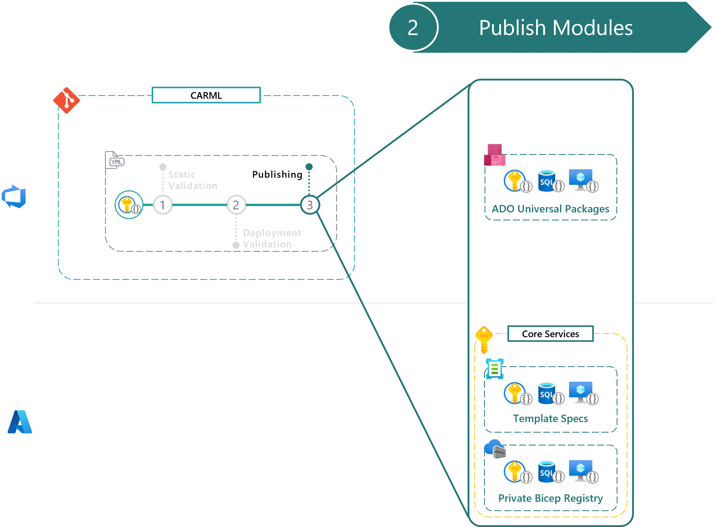
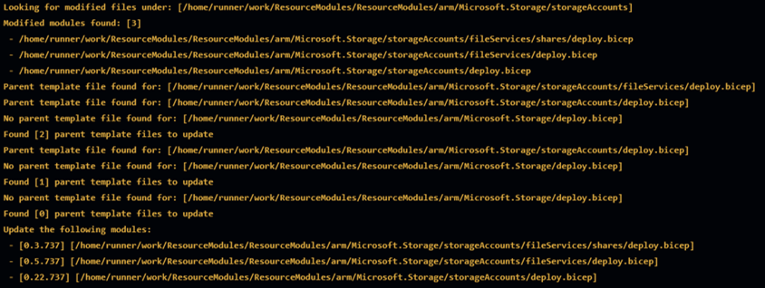

This section provides an overview of the principles the publishing is built upon, how it is set up, and how you can interact with it.

- [Publishing overview](#publishing-overview)
  - [Module identifiers](#module-identifiers)
- [How it works](#how-it-works)
  - [Example scenario](#example-scenario)
  - [Output example](#output-example)



# Publishing overview
The publishing phase concludes each module's pipeline. If all previous tests succeed (i.e., no phase failed) and the pipeline is run in the `main` or `master` branch, a new module version is published to all configured target locations. Currently, we support the following target locations:

- _[Template Specs](https://learn.microsoft.com/en-us/azure/azure-resource-manager/templates/template-specs?tabs=azure-powershell)_
- _[Bicep Registry](https://learn.microsoft.com/en-gb/azure/azure-resource-manager/bicep/private-module-registry)_
- _[Azure DevOps Universal Packages](https://learn.microsoft.com/en-us/azure/devops/artifacts/concepts/feeds?view=azure-devops)_.
   > Note: this is only available if using Azure DevOps pipelines.

Besides the publishing phase's runtime, there is also the possibility to set the switch `Publish prerelease module`. This switch makes it possible to publish a prerelease version in every workflow run that is not based on `main` or `master`. This can be controlled when running the module pipeline leveraging [Module pipeline inputs](./The%20CI%20environment%20-%20Pipeline%20design#module-pipeline-inputs).

> **Note**: The `version` used for publishing any artifact is the same for all three target locations, which reduces the maintenance effort.

> **Note:** The orchestration options described in the [solution creation](./Solution%20creation) section work differently well with the publishing locations we offer in CARML. To help you select the best location for your use case, we provide further information [here](./Solution%20creation#publish-location-considerations) section.

## Module identifiers

The names of published modules differ slightly depending on the location they are published to & settings you may have configured. This is rooted in the different requirements per target location. In the following you can find the rules applied for each:

<details>
<summary>Template Specs</summary>

**Actions**

The final name is different based on the `useApiSpecsAlignedName` setting in the `settings.yml` file. The main difference is, that based on the module's path, the actual resource type identifier will be fetched from the `utilities/src/apiSpecsList.json` file. Following you can find the general flow and distinct differences in either case:

1. (if `useApiSpecsAlignedName` is `true`)
   1. Recover the original API Specs reference for the module from the `utilities/src/apiSpecsList.json` file
   1. Replace `microsoft` with `ms`
1. Remove the root folder name `modules` from provided module reference
1. Make lowercase
1. Replace all `\` or `/` with `.`
1. Remove all duplications in the path. For example, in an identifier like `virtualNetworks/virtualNetworkPeerings` we'd trim down to `virtualNetworks/peerings` to shorten the path (as there is a maximum character limit for template specs)

**Examples**

| Module Path | `useApiSpecsAlignedName` | Result |
| - | - | - |
| `/recovery-services/vault` | `true` | `ms.recoveryservices.vaults` |
| | `false` | `recovery-services.vault` |
| `/recovery-services\vault\replication-fabric\replication-protection-container\replication-protection-container-mapping` | `true` | `ms.recoveryservices.vaults.replicationfabrics.replicationprotectioncontainers.mappings` |
| | `false` | `recovery-services.vault.replication-fabric.replication-protection-container.mapping` |

</details>

<details>
<summary>Private Bicep Registry (Azure Container Registry)</summary>

**Actions**

The final name is different based on the `useApiSpecsAlignedName` setting in the `settings.yml` file. The main difference is, that based on the module's path, the actual resource type identifier will be fetched from the `utilities/src/apiSpecsList.json` file. Following you can find the general flow and distinct differences in either case:

1. (if `useApiSpecsAlignedName` is `true`)
   1. Recover the original API Specs reference for the module from the `utilities/src/apiSpecsList.json` file
1. Remove the root folder name `modules` from provided module reference
1. Make lowercase
1. Replace all `\` or `/` with `.`
1. Add the `bicep/modules` prefix

**Examples**

| Module Path | `useApiSpecsAlignedName` | Result |
| - | - | - |
| `/recovery-services/vault` | `true` | `bicep/modules/microsoft.recoveryservices.vaults` |
| | `false` | `bicep/modules/recovery-services.vault` |
| `/recovery-services\vault\replication-fabric\replication-protection-container\replication-protection-container-mapping` | `true` | `bicep/modules/microsoft.recoveryservices.vaults.replicationfabrics.replicationprotectioncontainers.replicationprotectioncontainermappings` |
| | `false` | `bicep/modules/recovery-services.vault.replication-fabric.replication-protection-container.replication-protection-container-mapping` |

</details>

<details>
<summary>Azure DevOps Universal Packages</summary>

**Actions**


The final name is different based on the `useApiSpecsAlignedName` setting in the `settings.yml` file. The main difference is, that based on the module's path, the actual resource type identifier will be fetched from the `utilities/src/apiSpecsList.json` file. Following you can find the general flow and distinct differences in either case:

1. (if `useApiSpecsAlignedName` is `true`)
   1. Recover the original API Specs reference for the module from the `utilities/src/apiSpecsList.json` file
1. Remove the root folder name `modules` from provided module reference
1. Make lowercase
1. Replace all `\` or `/` with `.`

**Examples**

| Module Path | `useApiSpecsAlignedName` | Result |
| - | - | - |
| `/recovery-services/vault` | `true` | `microsoft.recoveryservices.vault` |
| | `false` | `recovery-services.vault` |
| `/recovery-services\vault\replication-fabric\replication-protection-container\replication-protection-container-mapping` | `true` | `microsoft.recoveryservices.vault.replicationfabric.replicationprotectioncontainer.replicationprotectioncontainermapping` |
| | `false` | `recovery-services.vault.replication-fabric.replication-protection-container.replication-protection-container-mapping` |

</details>

<p>

# How it works

The publishing works as follows:

1. The script [`utilities/pipelines/resourcePublish/Get-ModulesToPublish.ps1`](https://github.com/Azure/ResourceModules/blob/main/utilities/pipelines/resourcePublish/Get-ModulesToPublish.ps1) gets all changed module files, including child modules, and handles the logic of propagating the appropriate module version to be used:
   1. The major (`x.0`) and minor (`0.x`) version are set based on the `version.json` file in the module folder.
   1. The patch (`0.0.x`) version is calculated based on the number of commits on the `HEAD` ref (aka. git height). This will cause the patch version to never reset to 0 with major and/or minor increment, as specified for [semver](https://semver.org/).
   1. The module is published with a `major.minor.patch` version (`x.y.z`). For Template Specs and Bicep Registry only, a `major` version (`x`), a `major.minor` version (`x.y`) and a `latest` version are also updated, allowing a consumer to:
      - Reference the latest version of a major, i.e., the latest minor and patch of a major version.
         > Example: Using Template Specs, the reference to a `major` could look like: `ts/modules:resources.resource-group:1` which means that the template will always consume whatever the potentially overwritten/updated version `1` contains.
      - Reference the latest version of a minor, i.e., the latest patch of a minor version.
         > Example: Using the Bicep registry, the reference to a `major.minor` could look like: `br/modules:resources.resource-group:0.4` which means that the template will always consume whatever the potentially overwritten/updated version `0.4` contains.
   1. For a changed child module, the direct parent hierarchy is also registered for an update, following the same procedure as above.
   1. The list of module files paths and their versions are passed on as a array list.
1. The [Get-ModulesMissingFrom*.ps1](https://github.com/Azure/ResourceModules/tree/main/utilities/pipelines/resourcePublish) scripts further check if a given module is missing from the corresponding target location (e.g., Azure Container Registry) and adds each missing entry to to aforementioned array - using the version specified in the module's `version.json` file.
1. The different publishing scripts run (Artifact, Template Spec or Bicep Registry) and publish the module to the respective target location for each item on the list.

## Example scenario

Let's look at an example run where we would do a patch change on the `fileShares` module:
1. A new branch is created for further development of the `fileShare` module. Let's assume the new branch started from commit `500` on the default branch and the `version.json` of the `fileShare` module contains major and minor `0.3`.
1. Bug-fixes, documentation, and security updates are added to the `fileShare` module by the author. The `version.json` file is not changed in either the child or parent module folders.
1. The author runs a manual workflow based on their development branch, with the 'Publish prerelease module' option enabled.
1. A prerelease run of publishing triggers after test and validation of the module.
   - For the child and parent modules, the module version's major and minor version is read from the `version.json` file in the module folder respectively. Being unchanged, it still contains the version `0.3`.
   - The patch is calculated based on the total number of commits in history on the branch (independent on the module). The new branch started from commit `500` on the default branch and 1 commit has been pushed, so the total number of commits on the new branch is `501`.
   - As the pipeline is not running based on the 'default branch', a prerelease segment (`-prerelease`) is added to the version.
   - The version results in being `0.3.501-prerelease`. The child and parent modules may have different major and minor versions, but the patch version will be the same in this case. Other unmodified child modules of `storageAccount` will not be republished and remain with the existing version.
1. Sequential commits on the branch and runs of the module pipeline, with the 'publish prerelease' option enabled results in the following versions being published:
   - `0.3.502-prerelease`
   - `0.3.503-prerelease`
   - ...
   - `0.3.506-prerelease`
1. When the branch is merged to the default branch, the only thing that changes is the patch version and the removal of the `-prerelease` segment.
   - The number of commits will at this point be calculated based on the number of commits on the default branch.
   - Assuming the development branch started from commit 500 on the default branch, and the author added 6 commits on the development branch, the prerelease versions will reach `0.3.506-prerelease`.
   - Meanwhile, there can be changes (let's say 2 squashed PR merges) on the default branch that is pushing its number of commits in history further.
   - If the PR for the changes to `fileShare` is squash merged as commit number 503, the patch version on the child and parent module is then `503`, resulting in a version `0.3.503` being published.
1. The merge triggers cascading updates in the following way:
   - The module is published with a `major.minor.patch` version. In addition, only for Template Specs and Bicep Registry, the module is also published with `major.minor` and `major` version updates, allowing consumers to target the latest major or latest minor version respectively.
   - All parent module are published following the steps mentioned above.

```
                  \         \
C499 -> C500 ---> C501 ---> C502 ---> C503 (503)
        \                            /
         D1 --> D2 --> D3 ... --> D6
        (501)  (502)  (503)      (506)
```
`Cx` - Commits on main,
`Dx` - Commits on development branch,
`(x)` - Calculated patch version

## Output example


