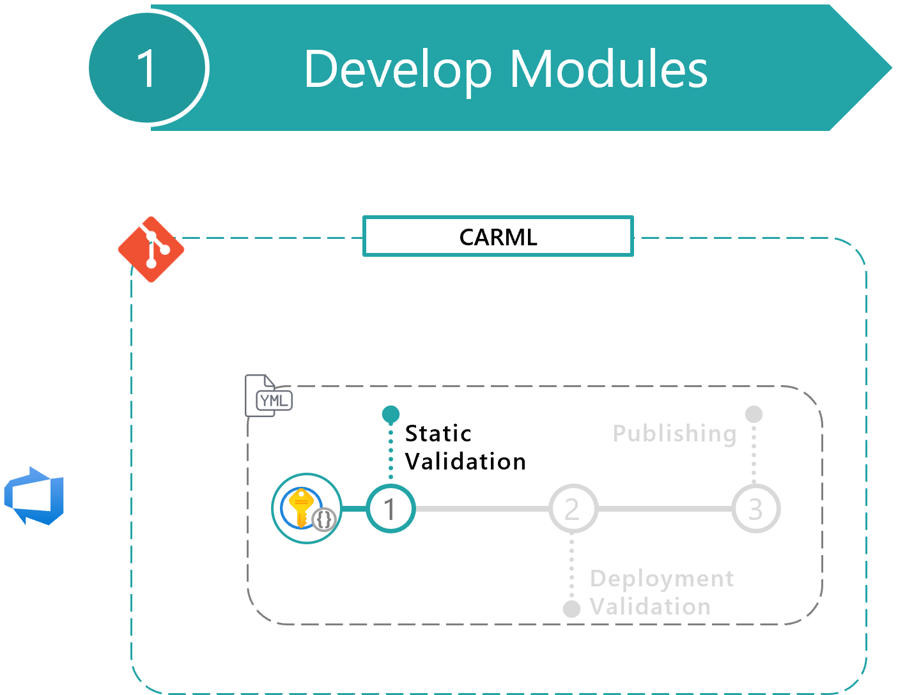
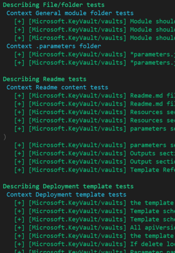

This section provides an overview of the principles the static validation is built upon, how it is set up, and how you can interact with it.

- [Static code validation](#static-code-validation)
  - [Output example](#output-example)
  - [Additional resources](#additional-resources)
- [API version validation](#api-version-validation)
- [Verify the static validation of your module locally](#verify-the-static-validation-of-your-module-locally)



---

# Static code validation

All module Unit tests are performed with the help of [Pester](https://github.com/pester/Pester) to ensure that the modules are configured correctly, documentation is up to date, and modules don't turn stale.

The following activities are performed by the [`utilities/pipelines/staticValidation/module.tests.ps1`](https://github.com/Azure/ResourceModules/blob/main/utilities/pipelines/staticValidation/module.tests.ps1) script.

## Outline

- **File/folder tests**
  - **General module folder tests**
    1. Module should contain a [` main.json ` / ` main.bicep `] file.
    1. Module should contain a [` README.md `] file.
    1. Module should contain a [` .test `] folder.
    1. Module should contain a [` version.json `] file.
  - **.test folder**
    1. Folder should contain one or more test files.
    1. JSON test files in the `.test` folder should be valid json.
- **Pipeline tests**
    1. Module should have a GitHub workflow.
    1. Module workflow should have trigger for cross-module references, if any.
    1. Module should have an Azure DevOps pipeline.
    1. Module pipeline should have trigger for cross-module references, if any.
- **Module tests**
  - **Readme content tests**
    1. `README.md` file should not be empty.
    1. `Set-ModuleReadMe` script should not apply any updates.
  - **Compiled ARM template tests**
    1. Compiled ARM template should be latest.
  - **General template tests**
    1. The template file should not be empty.
    1. Template schema version should be the latest.
    1. Template schema should use HTTPS reference.
    1. All apiVersion properties should be set to a static, hard-coded value.
    1. The template file should contain required elements [schema], [contentVersion], [resources].
    1. If delete lock is implemented, the template should have a lock parameter with an empty default value.
    1. Parameter names should be camel-cased (no dashes or underscores and must start with lower-case letter).
    1. Variable names should be camel-cased (no dashes or underscores and must start with lower-case letter).
    1. Output names should be camel-cased (no dashes or underscores and must start with lower-case letter).
    1. CUA ID deployment should be present in the template.
    1. The Location should be defined as a parameter, with the default value of [resourceGroup().Location] or global for ResourceGroup deployment scope.
    1. Location output should be returned for resources that use it.
    1. Resource Group output should exist for resources that are deployed into a resource group scope.
    1. Resource name output should exist.
    1. Resource ID output should exist.
    1. All parameters in parameters files exist in template file (`main.json`).
    1. All required parameters in template file (`main.json`) should exist in parameters files.
    1. All non-required parameters in template file should not have description that start with "Required.".
  - **Metadata content tests**
    1. template file should have a module name specified.
    1. template file should have a module description specified.
- **Test file tests**
  - **General test file**
    1. Bicep test deployment name should contain [`-test-`].
    1. Bicep test deployment should have parameter [`serviceShort`].
    1. JSON test deployment name should contain [`-test-`].
    1. JSON test deployment should have parameter [`serviceShort`].
  - **Token usage**
    1. [Tokens] Test file should not contain the plain value for token guid.
- **API version tests**
    1. In used resource type should use one of the recent API version(s). Currently using .

## Output example



## Additional resources

- [Pester wiki](https://github.com/pester/Pester/wiki)
- [Pester on GitHub](https://github.com/pester/Pester)
- [Pester Installation and Update](https://pester.dev/docs/introduction/installation)

# API version validation

In this phase, Pester analyzes the API version of each resource type deployed by the module.

In particular, each resource's API version is compared with those currently available on Azure. This test has a certain level of tolerance (does not enforce the latest version): the API version in use should be one of the 5 latest versions available (including preview versions) or one of the the 5 latest non-preview versions.

This test also leverages the [`utilities/pipelines/staticValidation/module.tests.ps1`](https://github.com/Azure/ResourceModules/blob/main/utilities/pipelines/staticValidation/module.tests.ps1) script.

To test the API versions, the test leverages the file `utilities/src/apiSpecsList.json` file as a reference for all API versions available for any used Provider Namespace & Resource Type.

> **NOTE:** If this file does not exist, the API tests will be skipped.

> **NOTE:** This functionality has a dependency on the [AzureAPICrawler](https://www.powershellgallery.com/packages/AzureAPICrawler) PowerShell module.

The pipeline `platform.apiSpecs.yml` updates this file using the script `utilities/tools/platform/Set-ApiSpecsFile.ps1` and, once registered, runs on a weekly schedule. Upon execution, the script installs & imports the `AzureAPICrawler` module, fetches all available API versions for all Resource Types via the module and updates the JSON file according to the latest information.

# Verify the static validation of your module locally

This paragraph is intended for CARML contributors or more generally for those leveraging the CARML CI environment and having the need to update or add a new module to the library.

Refer to the below snippet to leverage the 'Test-ModuleLocally.ps1' script and verify if your module will comply to the static validation before pushing to source control.

```powershell
#########[ Function Test-ModulesLocally.ps1 ]#############
$pathToRepository = '<pathToClonedRepo>'
. "$pathToRepository\utilities\tools\Test-ModuleLocally.ps1"

# REQUIRED INPUT FOR TESTING
$TestModuleLocallyInput = @{
    templateFilePath              = "$pathToRepository\modules\authorization\role-definition\main.bicep"
    PesterTest                    = $true
    DeploymentTest                = $false
    ValidationTest                = $false
}

Test-ModuleLocally @TestModuleLocallyInput -Verbose
```

> You can use the `Get-Help` cmdlet to show more options on how you can use this script.
