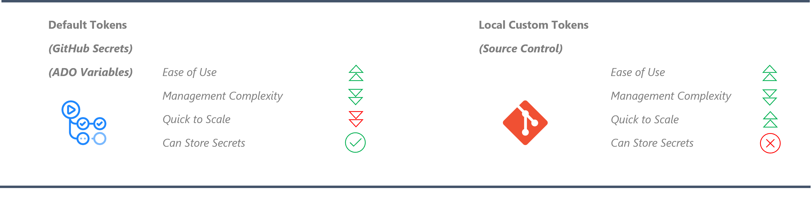
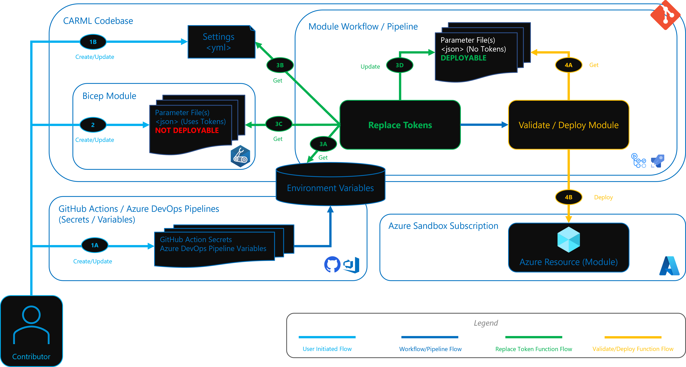

This section provides details on the tokens replacement functionality that enables the use of tokens inside module test files instead of plain text strings.

---

### _Navigation_

- [Description](#description)
- [Token Types](#token-types)
  - [Default Tokens](#default-tokens)
  - [(Optional) Local Custom Tokens](#optional-local-custom-tokens)
- [How it works](#how-it-works)
  - [How tokens are replaced in a module test file](#how-tokens-are-replaced-in-a-module-test-file)

---

# Description

Tokens allow you to test deploying modules in your own environment (i.e., using tokens for your naming conventions), or apply other customizations to your resources (i.e., injecting a subscription ID inside a Resource ID string).

The [module pipelines](./The%20CI%20environment%20-%20Pipeline%20design#module-pipelines) leverage a token replacement function that enables module test files to contain tokens (i.e., `[[subscriptionId]]`, `[[tenantId]]`) instead of using static values. This helps with the following:

- Allows the repository to be portable without having static values from where it was cloned.
- Enables dynamic updates of the tokens from single locations without having to modify all files.
- Not adding more environment variables to workflows/pipelines whenever new tokens are required for the environment.

# Token Types

There are 2 types of tokens that can be applied on a module test file:

## Default Tokens

These are tokens constructed from environment variables, which are defined in the workflow (Pipeline). Review [Getting Started - GitHub specific prerequisites](./Getting%20Started) for more information on these environment variables.

- `[[subscriptionId]]`: Will point to the Azure subscription.
- `[[managementGroupId]]`: Will point to the Azure an Azure Management Group.
- `[[tenantId]]`: Will point to the Azure Tenant ID.

## (Optional) Local Custom Tokens

These are tokens defined in the Git Repository inside a [settings.yml](https://github.com/Azure/ResourceModules/blob/main/settings.yml) file. This allows creating tokens that are local and updatable via Source Control mechanisms. Here is an example on where these tokens are stored. You can add key-value pairs as required:

```yml
localToken_tokenA: 'foo'
localToken_tokenB: 'bar'

```

> **Note:** The CI pipelines automatically removes the `localToken_` prefix from the name when processing the tokens replacement. This means that your actual token name is `tokenA` and NOT `localToken_tokenA`.

Let's say you'd want to use this token inside a Key Vault module test file, to deploy the Key Vault with a name that contains this token:

```json
"parameters": {
    "name": {
        "value": "[[tokenA]]-keyVault-[[tokenB]]"
    }
}
```

Once the Key Vault is deployed, you'll notice that the Key Vault name in Azure will be `foo-keyVault-bar`

The token prefix `'[['` and suffix `']]'` in the above example are also configurable in the [settings.yml](https://github.com/Azure/ResourceModules/blob/main/settings.yml) file and are used to identify the tokens in the files.

The solution comes with one predefined local token `namePrefix`. This token is leveraged in most of the parameter & test files for deployments. It allows using a consistent naming prefix that is applied to all resources being tested. There are two ways this token can be set and one will take precedence over the other:

1. By updating the value of `localToken_namePrefix` in the [settings.yml](https://github.com/Azure/ResourceModules/blob/main/settings.yml), which then becomes `namePrefix` when the pipelines run.

1. Creating a GitHub Secret / ADO variable called `TOKEN_NAMEPREFIX`, which then becomes `namePrefix` when the pipelines run. If created as a secret or ADO variable, it is only applied if the `localToken_namePrefix` in the [settings.yml](https://github.com/Azure/ResourceModules/blob/main/settings.yml) is left empty.


When validating modules through the CI environment, you must update it to a custom value as described in the [Update default nameprefix](./Getting%20started%20-%20Scenario%202%20Onboard%20module%20library%20and%20CI%20environment#31-update-default-nameprefix) paragraph. This is done to avoid conflicts with resources requiring a globally unique name, such as storage accounts or Key Vaults.

> **Note**: Do not store sensitive information in this location as they will be present in your Git History. Follow best [practices and guidelines](https://learn.microsoft.com/en-us/azure/azure-resource-manager/templates/best-practices#security-recommendations-for-parameters) on how to handle secrets in template deployments.

# How it works

The below image compares the different token types that can be used for module test file tokens:



## How tokens are replaced in a module test file

The below diagram illustrates the Token Replacement Functionality via the [validate module deployment](https://github.com/Azure/ResourceModules/blob/main/.github/actions/templates/validateModuleDeployment/action.yml) Action/Template.



- **1A.** The user creates default tokens as [GitHub Secrets](https://docs.github.com/en/actions/security-guides/encrypted-secrets#creating-encrypted-secrets-for-a-repository) or [Azure DevOps Pipeline Variables](https://learn.microsoft.com/en-us/azure/devops/pipelines/library/?view=azure-devops), that are injected as environment variables.
- **1B.** The user can also create local custom Tokens in the [settings.yml](https://github.com/Azure/ResourceModules/blob/main/settings.yml). Tokens start with `localTokens_` and then followed by the actual token name (e.g. `tokenA`). This prefix gets removed by the CI leaving the original token name
- **2.** The module test files can now be tokenized as per required value. And the token format can look like `[[tokenA]]`. Example:

  ```json
  "adminPassword": {
    "reference": {
        "keyVault": {
            "id": "/subscriptions/[[subscriptionId]]/resourceGroups/validation-rg/providers/Microsoft.KeyVault/vaults/[[tokenA]]-keyVault"
        },
        "secretName": "[[tokenB]]"
    }
  }
  ```
- **3A.** The Replace Tokens function gets the default tokens from the environment variables.
  > Default Tokens are harder to scale as they are explicitly defined in deploy/validate task, workflows and pipelines, and these components must be updated as you create more tokens.

- **3B.** The Replace Tokens function gets local custom tokens from the [settings.yml](https://github.com/Azure/ResourceModules/blob/main/settings.yml).
  > Local Tokens are easier to scale as you just need to define them in this file without adding new environment variables or modifying workflows or tasks.

- **3C.** The Replace Tokens function gets the module test file (tokenized and not deployable) and then all tokens are processed for replacement.

- **3D.** The updated module test file is then saved, replacing the tokenized version. This file is now 'deployable'.

- **4A.** The Validate/Deploy function retrieves the latest updated module test file.

- **4B.** The Validate/Deploy function validates the deployment artifacts for the module before deploying it to the Azure Sandbox Subscription.
