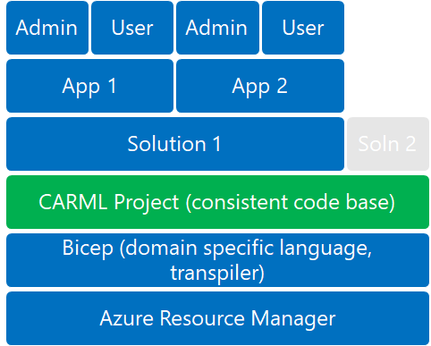
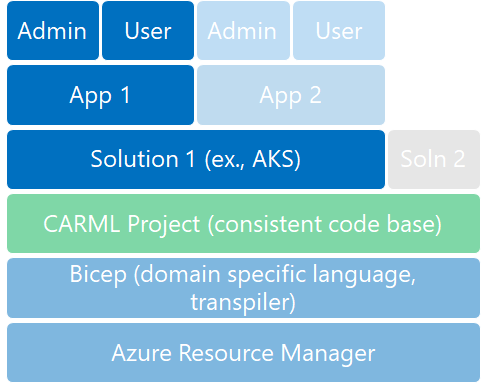
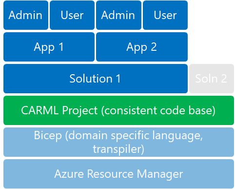
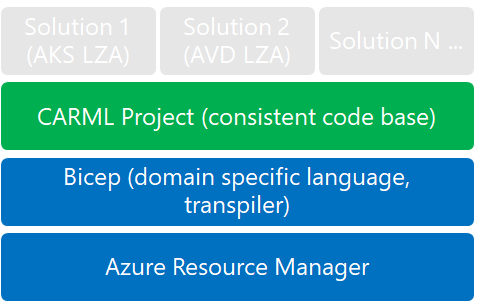

CARML can be represented as a key layer of a logical technology stack. This article provides an overview of the different personas using/interacting with the CARML repository and various layers if its technology stack.

### _Navigation_

- [Logical layers](#logical-layers)
- [Personas](#personas)
  - [Solution Consumer](#solution-consumer)
    - [Typical activities of a Solution Consumer](#typical-activities-of-a-solution-consumer)
    - [How does a Solution Consumer benefit from CARML?](#how-does-a-solution-consumer-benefit-from-carml)
  - [Solution Developer](#solution-developer)
    - [Typical activities of a Solution Developer](#typical-activities-of-a-solution-developer)
    - [How does a Solution Developer benefit from CARML?](#how-does-a-solution-developer-benefit-from-carml)
  - [Module Developer](#module-developer)
    - [Typical activities of a Module Developer](#typical-activities-of-a-module-developer)
    - [How does a Module Developer benefit from CARML?](#how-does-a-module-developer-benefit-from-carml)

# Logical layers

This chapter explains how the different layers of the technology stack (see below) and the solutions developed based on it rely on each other.

In bottom-up order, the layers are:

- **Azure Resource Manager**: At the bottom, you can see the engine, powering Azure. This layer takes API level interactions and makes changes to or reads data from Azure's management plane. To directly interact with the ARM, one would need to learn and directly leverage its REST API.
- **Bicep**: Microsoft's new proprietary DSL (domain specific language). To build solutions based on Bicep, one would need to know all the relevant details of the DSL itself as well as all Azure resource types involved in the solution(s) to be developed.
- **CARML**: This module library offers a consistent code base of tested, reliable and ready-to-deploy Bicep modules. To build complex, multi-module solutions based on CARML, one would need to get familiar with the library, have a good understanding of Bicep, but wouldn't need to know all details of all Azure resources, or how to author feature-rich templates for deploying the resources required by the solution.
- **Solutions**: this layer represents a complex solution in Azure, that provides a meaningful functionality for its users. A solution can be something like an Azure Kubernetes Services (AKS) environment, that can host containers to run applications. In this model, to build a custom solution, one would need to be familiar with the modules provided by the CARML library.
- **Applications**: an application/workload run in a cloud environment, such as an AKS platform, etc. In case of application/workload, we can typically differentiate **administrators** and **end users**.

# Personas

In the context of CARML, we differentiate three personas:

- Solution Consumer
- Solution Developer
- Module Developer

## Solution Consumer

A **Solution Consumer** is an indirect persona. This person is rather a cloud administrator and not necessarily a developer. The focus of this persona is on **implementing and managing an end-to-end solution** (application/workload), rather than building one. A Solution Consumer can benefit from CARML's modules via a complex, multi-module solution that leverages a Bicep registry, a package, etc.; perhaps even a wizard or a click-to-deploy button.
This persona will need to understand the required and optional configuration data (parameters) and will need to understand the architecture and "opinion" behind the solution.

This persona isn't consuming CARML directly, but is consuming CARML via a solution that relies on it:

- Examples:
  - Existing CARML solutions (These links provide examples of real world solutions using CARML):
    - [AKS Landing Zone Accelerator](https://github.com/Azure/AKS-Landing-Zone-Accelerator)
    - [AVD Landing Zone Accelerator](https://github.com/Azure/avdaccelerator)
    - [DevOps Self-Hosted](https://github.com/Azure/DevOps-Self-Hosted)

  - An internally developed multi-module solution for internal application or workload pattern

> **Note**: Solution Consumers are not to be confused with end users. Solution Consumers are cloud administrators, deploying a complex solution and administering an application installed into such a cloud environment. An end user is someone who will use the application or workload hosted in the cloud for his/her work (ex., information worker or application developer).

### Typical activities of a Solution Consumer

- Clone or reference a multi-module solution (ex., AKS Landing Zone Accelerator).
- Understand the reference architecture, key decisions.
- Update parameters to include organization and environment specific data.
- Deploy the template(s) of the multi-module solution.

### How does a Solution Consumer benefit from CARML?

- Start with known good reference implementations.
- Consume Microsoft and organization-specific guidance.
- Improve time to value for workload administrators and users.

## Solution Developer

A **Solution Developer** is not a user. Their focus is on using CARML to **build end-to-end solutions** that are opinionated. These solutions will be published (publicly and/or privately) for consumption by others and will be used many times by many organizations/teams, in many environments/subscriptions/landing zones.
A Solution Developer uses the CARML library (its public or organization/customer specific implementation), with a chosen preference for using its modules via Bicep registry (public, private), or template specs, or direct reference, or using Git submodules, etc. Solution Developers might benefit the most from overcoming the learning curve - because of the standardization and scale they can achieve with CARML.

- Modules: Use an existing code base to develop and test multi-module solutions (ex., a Landing Zone Accelerator, or an internal platform/workload team). This might also lead to creating/updating modules.
- Continuous Integration: Use the provided CI environment to improve multi-module development and testing. This might also lead to improving CI.

### Typical activities of a Solution Developer

- Create (develop, run integration tests for and publish) multi-module solutions for specific reference patterns (workloads, applications, environments).
- If necessary, can modify (develop, run unit tests for and publish) existing modules to implement organization-specific standards - however, applying significant modifications or creating new modules, also qualifies this persona as [Module Developer](#module-developer).

### How does a Solution Developer benefit from CARML?

- Codify reference patterns (guidance, decisions, governance).
- Focus on the requirements of the reference patterns.
- Can adopt the toolkit's infra-as-code guidance.
- Simplify downstream usage for application/workload teams.

## Module Developer

A **Module Developer** is not a user. Their focus is on CARML itself. A Module Developer is tasked with improving the library - for their organization/customer or the whole world (open source community). They might want to add organization/company specifics to the library (either via conventions, parameters, extensions, or CI-specific changes). They might also implement/improve generic things, in a way that could be contributed back upstream, into the CARML open source repository for the greater public. A Module Developer is tasked with helping the CARML Solution Developer (see previous).

- Modules: Create new. Update existing.
- Continuous Integration: Improve the unit testing in the CI.
- Sample 1: A simple resource, with supported extension resources, deploys fast.
- Sample 2: A complex resource, with supported extension resources and child resources.

### Typical activities of a Module Developer

- Create, update modules for Azure resources.
- Incorporate new resource providers or new capabilities, and extensions to existing resource providers.
- Improve the CARML repository's documentation.
- Improve continuous integration for testing/publishing CARML modules.
- Requires in depth knowledge of CARML, Bicep, ARM, DevOps and infra-as-code.

### How does a Module Developer benefit from CARML?

- Contributes to building and maintaining a common code base. Particularly beneficial to customers that have an Enterprise or Distributed Operating model.
